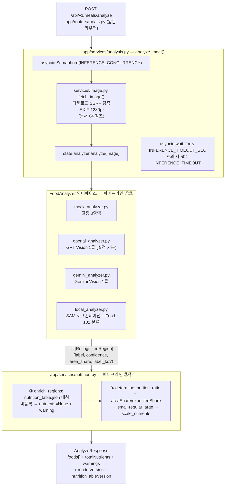

# 식단 분석 파이프라인 — 교체 가능성이 설계의 중심

> 한식 전환이 "모델 파일 + 테이블 교체"만으로 되어야 한다는 제약에서 출발한 구조

## 왜 필요했나

이 서비스의 심장은 **식사 사진 → 영양소**다. 이게 안 되면 부족분 계산도, 도시락 추천도,
보호자 알림도 전부 동작하지 않는다.

그런데 시작 시점에 **어떤 모델을 쓸지 확정할 수 없었다.** 자체 모델(SAM + Food-101)은 GPU가
필요한데 인스턴스가 없었고, 상용 Vision API는 비용을 몰랐다. 한식 데이터셋도 없었다.

**모델이 바뀌어도 파이프라인이 살아남는 구조**가 먼저 필요했다.

## 무슨 문제가 있었나

"모델을 나중에 바꾼다"는 말은 쉬운데, 실제로는 인식 방식마다 출력 형태가 다르다.

- **SAM + Food-101** — 세그멘테이션(픽셀 마스크)과 분류(라벨)가 **2단계로 분리**
- **GPT Vision / Gemini** — 이미지 한 장을 보고 **한 번의 호출**로 음식명과 면적 비중을 함께 반환

이 둘을 같은 코드가 소비하게 만들지 않으면, 백엔드를 바꿀 때마다 영양 계산 로직까지 다시 써야 한다.

## 어떤 선택지가 있었고, 무엇을 선택했나

### 4단계를 통짜로 vs 인터페이스로 분리

파이프라인을 4단계로 정의하고, **어디가 교체 대상인지를 먼저 못박았다.**

```
① 세그멘테이션: 음식별 영역 + 면적          [불변]
② 크롭 → 분류: 메뉴명 + confidence          [교체 대상 1]
③ 정적 영양 테이블 매칭: 메뉴명 → 1인분 영양소 [교체 대상 2]
④ 면적 비중 → 양 배율 → 스케일               [불변]
```

| 후보 | 장점 | 단점 |
|---|---|---|
| 백엔드별로 파이프라인 전체를 각각 구현 | 각 모델에 최적화 가능 | **영양 로직이 N벌 복제된다.** 배율 규칙 하나 고치려면 N군데 |
| **①② 를 `FoodAnalyzer` 인터페이스 뒤로, ③④ 를 `nutrition.py`로** | 영양 로직 1벌 | 인터페이스 계약을 최소공배수로 잡아야 함 |

두 번째를 택하고, **계약을 `RecognizedRegion(label, confidence, area_share, label_ko?)` 하나로 고정**했다.

핵심은 **면적을 픽셀이 아니라 비중(`area_share`)으로 정의**한 것이다.
SAM은 픽셀 마스크를 주고 GPT는 "이 음식이 상 전체의 몇 %"를 준다. 픽셀로 계약하면 GPT 백엔드가
계약을 못 지킨다. **비중으로 잡으니 양쪽 다 표현 가능**하고, ④의 배율 계산도 해상도와 무관해진다.

결과적으로 백엔드 4종(`mock` / `openai` / `gemini` / `local`)이 **환경변수 하나로 전환**되고,
③④ 코드는 백엔드가 무엇이든 동일하게 돈다.

### 양(portion)을 어떻게 정할 것인가

사진만으로 "얼마나 먹었는지"는 알 수 없다. 무게를 재는 센서가 없다.

| 후보 | 문제 |
|---|---|
| 사용자가 직접 조금/보통/많이 선택 | **어르신 조작을 늘린다.** 이 프로젝트의 대전제와 충돌 |
| 절대 부피를 추정 | 단일 카메라로는 깊이 정보가 없어 신뢰 불가 |
| **상차림 내 상대 면적으로 추정** | 절대량은 못 구하지만 "평소보다 많이/적게"는 잡힌다 |

세 번째를 택했다. 음식마다 **통상 면적 비중(`expected_share`)** 을 테이블에 두고,
실제 면적 비중과의 비율로 판정한다.

```
ratio = areaShare / expectedShare
ratio < 0.8   → small   ×0.65
0.8 ~ 1.2     → regular ×1.0
ratio > 1.2   → large   ×1.35
```

**트레이드오프를 명시적으로 수용했다.** 이 값은 절대 정확도를 목표로 하지 않는다.
목표는 "매일 먹는 양의 변화를 추세로 보는 것"이고, 그 용도에는 상대 추정으로 충분하다.
배율 3단계는 앱 화면의 "조금/보통/많이"와 1:1 대응이라 사용자에게 설명 가능한 값이기도 하다.

### 총합을 원값으로 vs 반올림 후 값으로

`foods[]`의 영양소 합이 `totalNutrients`와 안 맞으면 앱 화면에서 바로 티가 난다.

배율 적용 전 원값으로 총합을 따로 계산하면 **반올림 누적 차이**로 어긋난다.
그래서 **음식별 값을 먼저 확정(소수 1자리 반올림)하고 그 값을 합산**한다.
계약 하네스가 이 일치를 검증한다.

## 작업 내용



- `01_아키텍처_설계결정.md` — 전체 구조와 결정 근거
- `03_분석_파이프라인_구현.md` — 4단계·백엔드 4종·배율/테이블 매칭 상세
- `10_현재_분석_플로우_실측.md` — 설계도와 실제 구동의 차이를 실측으로 대조

## 결과 — 측정으로 검증

- 백엔드 4종을 **환경변수 하나(`ANALYZER_BACKEND`)로 전환**. ③④ 코드 변경 0
- `mock` 고정값을 **배율 3분기가 모두 나오도록** 설계 (ratio 1.0 / 1.25 / 0.72) —
  키 없이도 배율 경로 전체가 테스트·대시보드에서 보인다
- **mock 모드에서도 이미지 다운로드·SSRF 검증은 실제 수행.** 인식 결과만 고정.
  그래야 하네스의 에러 계약 검증(502/422)이 의미가 있다
- `pytest 75 passed`, 계약 하네스 34/34

## 남은 한계

- **`local`(SAM + Food-101) 백엔드는 코드만 완성돼 있고 실제 GPU 추론 검증을 못 했다.**
  torch·모델 미설치 상태라 import 격리와 후처리 numpy 단위 테스트까지만 확인
- 설계도에는 "FoodSAM"이라 적혀 있지만 실제 구현은 **Meta 공식 SAM**이다.
  FoodSAM은 pip 패키지가 아니고 설치가 복잡해 `FoodSamSegmenter`를 스텁으로 두고 인터페이스만 분리
- `expected_share` 값이 **경험적**이다. 실제 상차림 통계로 보정하지 않았다

## 경험을 통해 배운 점

- **인터페이스 계약을 어느 수준으로 잡느냐가 교체 가능성을 결정한다는 것.**
  면적을 픽셀로 계약했다면 GPT 백엔드를 못 붙였다
- 못 하는 것을 인정하고 **목적에 맞는 근사**를 고르는 게 나을 때가 있다는 것.
  절대 그램 수를 포기하고 상대 비중을 택했더니 사용자 조작이 0이 됐다
- 가짜(mock) 구현도 **설계가 필요하다는 것.** 고정값을 아무렇게나 뒀으면 배율 분기 3종을
  키 없이 검증할 수 없었다
