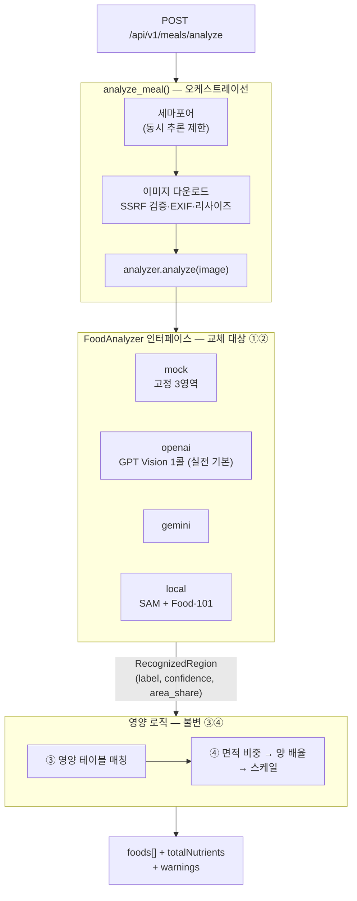

# 식단 분석 파이프라인 — 교체 가능성이 설계의 중심

> 어떤 모델을 쓸지 확정할 수 없던 상황에서, 모델이 바뀌어도 살아남는 구조를 먼저 만든 작업

## 왜 필요했나

- 이 서비스의 심장은 **식사 사진 → 영양소** — 이게 안 되면 부족분 계산·도시락 추천·보호자 알림이 전부 멈춘다
- 시작 시점에 **어떤 모델을 쓸지 확정 불가** — 자체 모델(SAM+Food-101)은 GPU 인스턴스가 없었고, 상용 Vision API는 비용 미상
- 그래서 **모델 교체를 전제로 한 파이프라인 구조**가 먼저 필요했다

## 무슨 문제가 있었나

- 인식 방식마다 출력 형태가 다르다 — SAM은 픽셀 마스크+라벨의 **2단계**, GPT Vision은 **1회 호출**로 음식명+면적 비중
- 같은 코드가 둘을 소비하게 만들지 않으면, 모델을 바꿀 때마다 영양 계산 로직까지 다시 써야 한다

## 어떤 선택지가 있었고, 무엇을 선택했나

### 파이프라인 통짜 vs 인터페이스 분리

- 4단계(① 세그멘테이션 → ② 분류 → ③ 영양 테이블 매칭 → ④ 양 배율)로 정의하고, **교체 대상(①②)만 인터페이스 뒤로** 분리
- 계약을 `RecognizedRegion(label, confidence, area_share)` 하나로 고정 — **영양 로직은 1벌만** 유지

### 면적을 픽셀로 vs 비중으로

- 픽셀로 계약하면 GPT 백엔드가 계약을 못 지킨다 — **비중(area_share)이 양쪽 다 표현 가능한 최소공배수**
- 배율 계산이 해상도와 무관해지는 부수 효과까지

### 양(portion) — 사용자에게 묻기 vs 상대 면적 추정

- "조금/보통/많이"를 물으면 **어르신 조작이 늘어 대전제와 충돌**
- 통상 면적 대비 비율로 small(×0.65) / regular(×1.0) / large(×1.35) 판정
- 절대량 대신 **"평소 대비 추세"를 목표**로 한 명시적 트레이드오프

## 결과 — 측정으로 검증

- 백엔드 4종(mock/GPT/Gemini/자체 모델)을 **환경변수 하나로 전환**, 영양 로직 변경 0줄
- mock 고정값을 **배율 3분기가 모두 나오도록 설계** — API 키 없이도 배율 경로 전체가 테스트에서 검증
- mock 모드에서도 **이미지 다운로드·SSRF 검증은 실제 수행** — 에러 계약(502/422) 검증이 성립
- pytest 105 passed · 계약 하네스 34/34

## 남은 한계

- local(SAM+Food-101) 백엔드는 **코드만 완성** — GPU 인스턴스가 없어 실추론은 미검증
- 통상 면적 값이 경험적 — 실제 상차림 통계로 보정하지 않았다

## 경험을 통해 배운 점

- **인터페이스 계약의 수준이 교체 가능성을 결정한다**는 것 — 픽셀로 계약했다면 GPT를 못 붙였다
- 못 하는 것을 인정하고 **목적에 맞는 근사**를 고르는 게 나을 때가 있다는 것 — 절대량을 포기하자 사용자 조작이 0이 됐다
- **가짜(mock) 구현에도 설계가 필요하다**는 것 — 아무 고정값이었다면 배율 분기를 키 없이 검증하지 못했다
