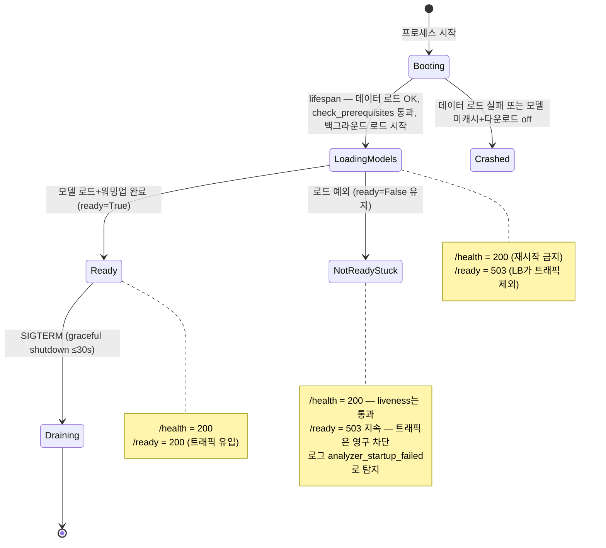

# AI 서버 운영 설계 — 추론 서버가 죽는 네 가지 방식을 막기

> 콜드스타트 · GPU 메모리 · 이벤트 루프 · 타임아웃 계층

## 왜 필요했나

AI 추론 서버는 일반 API 서버와 **고장 나는 방식이 다르다.**
요청당 수 GB 메모리를 쓰고, 모델 로딩에 수십 초가 걸리고, 추론은 동기 블로킹이다.

일반 웹 서버처럼 짜면 **"느린 것"이 "죽은 것"으로 오판**되어 인스턴스가 재시작되는
최악의 루프에 빠진다. 배포 전에 이 네 가지를 각각 다뤄야 했다.

## 무슨 문제가 있었나

### ① 콜드스타트 — 모델 로딩 동안 서버는 무엇을 해야 하나

SAM 체크포인트는 약 2.4GB다. 로드에 수십 초가 걸린다.
그동안 로드밸런서가 트래픽을 보내면 **전부 실패하거나 무한 대기**한다.

### ② GPU 메모리 — 동시 추론 폭주와 멀티워커 함정

async 서버는 요청을 무한히 받아들인다. **동시 요청 수 = 동시 추론 수**가 되면
동시 2~3건만으로 CUDA OOM이 나고 **진행 중인 모든 요청이 함께 죽는다.**

더 흔한 함정은 `uvicorn --workers 4`다. 워커마다 모델을 별도 로드해 **GPU 메모리가 N배**로 들고
기동 자체가 실패한다.

### ③ 이벤트 루프 블로킹 — async 안의 동기 추론

torch 추론은 **동기 블로킹** 연산이다. `async def` 핸들러 안에서 직접 호출하면
그 수 초~수십 초 동안 **이벤트 루프 전체가 멈춘다.** `/health`조차 응답하지 못한다.

FastAPI가 스레드풀로 우회해 주지도 않는다 — 그건 일반 `def` 핸들러만 해당된다.
`async def`로 선언하고 안에서 블로킹하는 것이 가장 위험하다.

### ④ 타임아웃 — 하나만 두면 어디가 느린지 모른다

파이프라인은 이미지 다운로드 → 추론 → 응답 순으로 **서로 다른 외부 자원**에 의존한다.
타임아웃이 하나면 원인을 구분할 수 없고, 없으면 느린 자원 하나가 세마포어를 무한 점유한다.

## 어떤 선택지가 있었고, 무엇을 선택했나

### 콜드스타트 — 기동을 막는다 vs 준비 상태를 분리한다

| 후보 | 장점 | 단점 |
|---|---|---|
| 모델 로드가 끝나야 서버 기동 | 단순 | **기동 시간이 수십 초.** 헬스체크 타임아웃에 걸려 배포 실패 |
| **백그라운드 로드 + 헬스체크 이원화** | 프로세스는 즉시 살고, 준비되면 트래픽 수용 | 엔드포인트가 둘로 늘고 배포 설정이 필요 |

두 번째를 택하고 **`/health`(프로세스 생존)와 `/ready`(모델 로드 완료)를 분리**했다.
로드 중에는 `/ready`가 503을 반환해 **콜드스타트 트래픽을 차단**한다.
로드 직후 더미 이미지로 **워밍업 추론**까지 돌려, 첫 실사용자가 첫 추론의 지연을 겪지 않게 했다.

문서에 **"배포 환경의 readiness probe는 `/health`가 아니라 `/ready`에 연결할 것"** 을 명시했다.
이걸 안 적으면 이원화한 의미가 사라진다.

### GPU 메모리 — 큐잉 vs 세마포어

동시 추론을 제한해야 하는데, 어디서 제한할지가 문제였다.

| 후보 | 문제 |
|---|---|
| 외부 큐(Celery/Redis) 도입 | **무상태 원칙과 충돌**하고 인프라가 늘어난다. MVP에 과함 |
| **`asyncio.Semaphore`로 프로세스 내 제한** | 인스턴스 하나 안에서만 유효하지만, 애초에 인스턴스당 GPU 1장이라 그게 맞는 경계 |

세마포어를 lifespan에서 만들고 **분석 오케스트레이션이 반드시 그 문을 지나게** 했다.
기본값 1(`INFERENCE_CONCURRENCY`).

**중요한 선택 하나** — mock·gemini 백엔드도 **같은 경로를 지나게** 했다.
GPU를 안 쓰는 백엔드는 제한할 이유가 없지만, 경로를 분리하면 **로컬에서 검증되지 않는 코드 경로**가
생긴다. 코드를 단일화해 mock 테스트가 세마포어 경로까지 상시 통과하게 했다.

멀티워커 함정은 **Dockerfile에 단일 워커를 박아** 막았다.

### 타임아웃 — 계층별로 3개, 상태코드도 구분

| 계층 | 값 | 초과 시 |
|---|---|---|
| 이미지 다운로드 | 10s | **502** `IMAGE_FETCH_FAILED` |
| LLM/Vision 호출 | 30s | **502** `LLM_CALL_FAILED` |
| 분석 전체(세마포어 대기 포함) | 60s | **504** `INFERENCE_TIMEOUT` |

따로 둔 이유가 셋이다.

1. **의미가 다르다** — 10초는 "이미지 호스트가 느리다"(원인은 업스트림),
   60초는 "이 서버의 처리 능력 초과". 백엔드의 대응이 502와 504에서 달라진다
2. **바깥이 안쪽의 합보다 커야 한다** — 60초 안에 다운로드 10초 + 추론 + 세마포어 대기가 들어간다.
   안쪽이 더 길면 바깥이 항상 먼저 터져 하위 타임아웃이 무의미해진다
3. **전체 타임아웃이 세마포어 대기를 포함해야** 폭주 시 무한 대기가 아니라 명시적 504로 끝난다.
   그래서 `wait_for`가 세마포어 획득까지 통째로 감싼다

## 작업 내용

- `06_무상태_운영_설계.md` — lifespan · 헬스체크 · 동시성 · 로깅 · Docker 2종
- `07_AI서버_고려사항_총정리.md` — 15개 항목을 문제 → 방치 시 → 해결 → 한계로 정리

## 결과 — 측정으로 검증

- **고려사항 15개 × 해결 장치 × 잠그는 테스트**를 표로 대응시켰다.
  "위험을 코드 한 곳에 응집시키고 그 지점을 테스트로 잠근다"가 공통 패턴
- `/health`·`/ready` 이원화 — `tests/test_health.py` + 하네스 health 그룹으로 고정
- 세마포어 경로가 **mock 테스트에서 상시 통과** (경로 단일화 덕분)
- 응답에 `processingMs`를 실어 **"느려졌다"를 숫자로 말할 수 있게** 함
- 참조 데이터는 `frozen=True` dataclass로 로드 — **로드 후 재할당이 코드로 막힌다**
- 로드 실패 시 **기동 자체가 실패**(fail-fast). 데이터 없이 뜬 서버가 조용히 틀린 답을 내지 않게

## 남은 한계

- ~~**부하 테스트를 못 했다**~~ → **완료**(탭 2 · 검증 5). 다만 **GPU 경로는 여전히 미검증**이다
- GPU 인스턴스가 없어 **콜드스타트 실측(로딩 몇 초, 워밍업 몇 초)이 없다**
- 관측이 **로그와 응답 필드 수준**이다. 메트릭 수집·대시보드가 없어 추세를 못 본다

## 경험을 통해 배운 점

- 추론 서버는 **"느린 것"과 "죽은 것"을 구분할 수 있게 만들어야 한다는 것.**
  `/ready` 분리와 타임아웃 계층이 전부 그 목적이다
- 안전장치를 **모든 경로가 지나게** 만들어야 검증된다는 것. GPU 전용 경로에만 세마포어를 뒀다면
  로컬 테스트에서 한 번도 안 밟혔을 것이다
- 상태코드가 **다음 행동을 결정한다는 것.** 502(재시도 의미 있음)와 504(서버 과부하)를
  구분해 줘야 백엔드가 올바르게 대응한다
