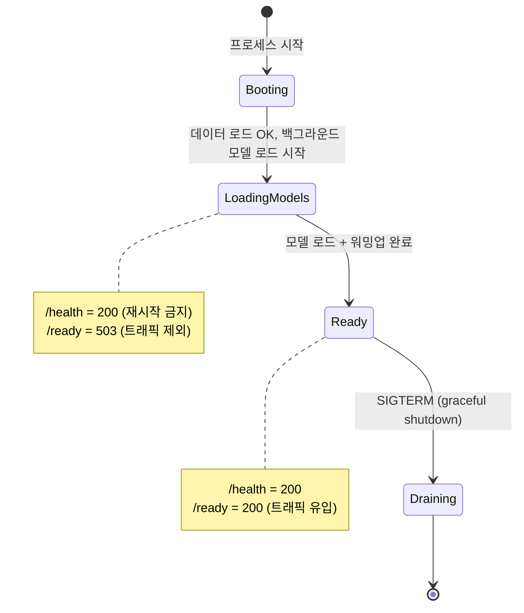

# AI 서버 운영 설계 — 추론 서버가 죽는 네 가지 방식을 막기

> 일반 웹 서버처럼 짜면 "느린 것"이 "죽은 것"으로 오판되어 인스턴스가 재시작되는 루프에 빠진다

## 왜 필요했나

- AI 추론 서버는 **고장 나는 방식이 다르다** — 요청당 수 GB 메모리, 모델 로딩 수십 초, 추론은 동기 블로킹
- 배포 전에 네 가지 고장 방식을 각각 막아야 했다

## 무슨 문제가 있었나

- **콜드스타트** — SAM 체크포인트 약 2.4GB 로드 동안 들어온 트래픽은 전부 실패 또는 무한 대기
- **GPU 메모리** — 동시 요청 수 = 동시 추론 수가 되면 2~3건 만에 CUDA OOM, 진행 중 요청까지 전멸
- **이벤트 루프** — async 핸들러 안의 동기 추론이 루프 전체를 멈춰 `/health`조차 응답 불가
- **타임아웃** — 하나뿐이면 원인 구분 불가, 없으면 느린 자원 하나가 세마포어를 무한 점유

## 어떤 선택지가 있었고, 무엇을 선택했나

### 콜드스타트 — 기동을 막기 vs 준비 상태 분리

- `/health`(프로세스 생존)와 `/ready`(모델 로드 완료)를 분리 — 로드 중엔 `/ready`가 503으로 트래픽 차단
- 로드 직후 더미 이미지로 **워밍업 추론** — 첫 사용자가 첫 추론의 지연을 겪지 않게

### GPU 동시성 — 외부 큐 vs 세마포어

- Celery/Redis는 무상태 원칙과 충돌하고 MVP에 과함 → `asyncio.Semaphore`로 프로세스 내 제한
- **mock 백엔드도 같은 경로를 지나게 단일화** — 로컬 테스트에서 세마포어 경로가 상시 검증된다
- 멀티워커 함정(워커마다 모델 로드 → GPU 메모리 N배)은 Dockerfile에 **단일 워커를 박아** 차단

### 타임아웃 — 계층별 3개 + 상태코드 구분

- 다운로드 10s → **502** · LLM 호출 30s → **502** · 분석 전체 60s → **504**
- **바깥이 안쪽의 합보다 크게** — 안쪽이 더 길면 바깥이 항상 먼저 터져 계층이 무의미해진다
- 전체 타임아웃이 **세마포어 대기까지 포함** — 폭주 시 무한 대기 대신 명시적 504

## 결과 — 측정으로 검증

- 고려사항 **15개 × 해결 장치 × 잠그는 테스트**를 표로 대응 — 위험을 한 곳에 응집시키고 그 지점을 테스트로 잠근다
- 응답에 `processingMs`를 실어 "느려졌다"를 **숫자로** 말할 수 있게
- 참조 데이터 로드 실패 시 **기동 자체가 실패**(fail-fast) — 데이터 없이 뜬 서버가 조용히 틀린 답을 내지 않게
- 이 장치들은 이후 **부하·동시성 검증에서 전부 실측으로 증명** (AI 모델 검증 탭 참고)

## 남은 한계

- GPU 인스턴스가 없어 **콜드스타트 실측**(로딩·워밍업 시간)은 없다
- 관측이 로그·응답 필드 수준 — 메트릭 수집·대시보드는 부재

## 경험을 통해 배운 점

- 추론 서버는 **"느린 것"과 "죽은 것"을 구분할 수 있게** 만들어야 한다는 것 — `/ready` 분리와 타임아웃 계층이 전부 그 목적
- 안전장치는 **모든 경로가 지나야 검증된다**는 것 — GPU 전용 경로에만 뒀다면 로컬에서 한 번도 안 밟혔다
- **상태코드가 소비자의 다음 행동을 결정한다**는 것 — 502(재시도)와 504(과부하)를 구분해야 백엔드가 올바르게 대응한다
