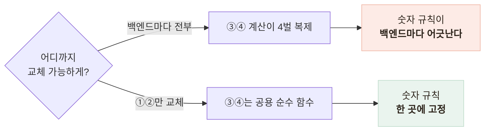
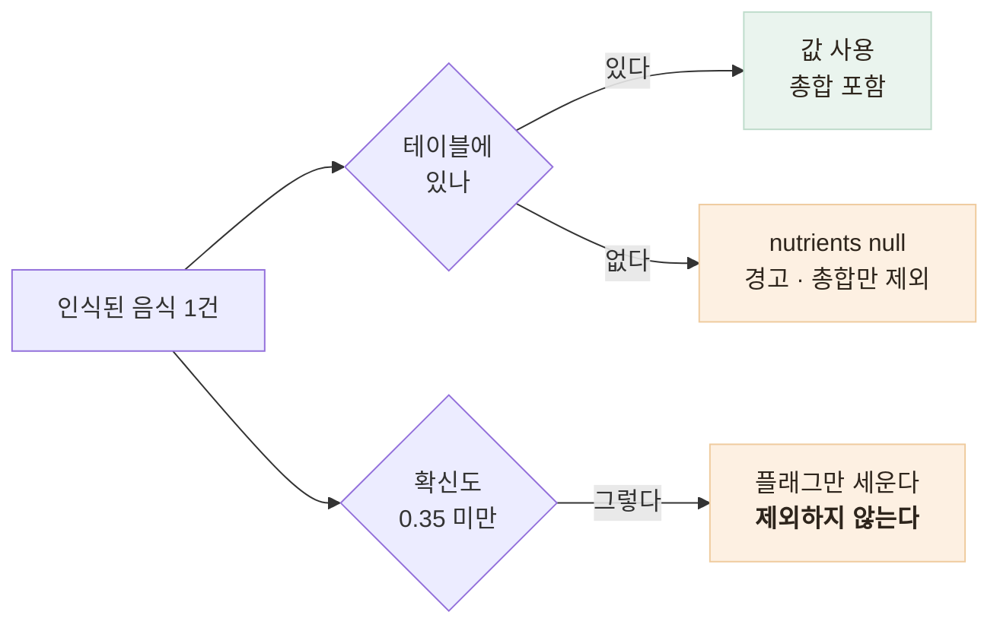

# 사진 한 장에서 영양소까지 — 4단계 파이프라인과 계약 설계

> 인식 모델이 바뀌어도 화면에 뜨는 숫자의 계산 규칙은 흔들리지 않게 만든 경계 설계

<!-- 사진 자리: 앱의 식사 분석 결과 화면 — 음식 목록과 조금/보통/많이 판정, 음식별 영양소와 총합이 함께 보이는 스크린샷 -->

## 한눈에

| | |
|---|---|
| **문제** | 인식 모델을 갈아 끼울 때 화면 숫자의 계산 규칙까지 흔들릴 수 있었다 |
| **판단** | 인식 ①②는 인터페이스 뒤로, 계산 ③④는 공용 순수 함수로 고정 |
| **근거** | 면적을 **비중 0~1** 로 계약해야 백엔드 후보 양쪽이 살아남았다 |
| **결과** | 라우터는 3줄 바인딩, 백엔드 전환은 환경변수 하나 |

## 갈림길

사진 한 장에서 음식과 먹은 양, 영양소가 나와야 부족분 계산과 도시락 추천, 보호자 알림이 전부 동작한다. 인식 모델은 바뀔 것이 예정되어 있었으니 **위험한 쪽은 인식이 아니라 계산**이었다.

| 후보 | 내용 | 판단 |
|---|---|---|
| A | 모듈 4개를 오케스트레이터가 4번 호출 | 폐기 — GPT는 ①②를 한 번에 하니 강제 분리가 억지 |
| B | 백엔드마다 파이프라인 전체 구현 | 폐기 — 배율·미등록 규칙이 4벌로 갈라진다 |
| **C** | ①②는 인터페이스 뒤, ③④는 공용 함수 | 채택 — 부담이 전부 **계약 설계**로 몰린다 |
| D | 영양소까지 LLM에 위임 | 폐기 — 수치가 재현되지 않으면 감사가 성립하지 않는다 |

## 계약 한 줄이 후보를 갈랐다

C의 부담은 ①②가 무엇을 내보내는지에 몰렸고, 그중 결정적인 것은 면적의 단위였다.

| 후보 | 상태 | 판단 |
|---|---|---|
| 픽셀 면적 | 자체 모델은 지킬 수 있다 | 폐기 — GPT 백엔드가 못 지켜 **후보 절반이 탈락** |
| **비중 0~1** | 양쪽 다 표현 가능 | 채택 — ④가 원하는 것도 상 안에서의 비율이었다 |

배율은 면적 비중을 기대치와 비교해 3분기하고, 이 분기가 앱 화면의 조금·보통·많이와 1:1 계약이다.

| 구간 | 판정 | 배율 |
|---|---|---|
| `ratio < 0.8` | small | ×0.65 |
| `0.8 ~ 1.2` | regular | ×1.0 |
| `ratio > 1.2` | large | ×1.35 |

## 실패를 제거가 아니라 표시로 바꿨다

음식 하나가 영양 테이블에 없다는 이유로 분석 전체를 실패시키면 어르신은 아무 결과도 받지 못한다. 서버는 근거만 실어 보내고 표시 여부는 화면 맥락을 아는 앱이 판단한다.

## 남은 한계

| 항목 | 상태 |
|---|---|
| 라벨 규약 | 느슨한 지향뿐 — 낯선 라벨은 미등록 경고로 흡수하는 것이 전부다 |
| 기대 면적 기준값 | 경험치이고 실제 상차림 통계로 보정하지 않았다 |
| 음식별 값의 정확도 | 총합 일치는 테스트로 고정했지만 견줄 대조군이 없다 |

## 배운 점

- 인터페이스 계약을 어느 수준으로 잡느냐가 **교체 가능성**을 결정한다는 것
- 경계값처럼 아무도 안 보는 규칙을 명시해 두는 일이 디버깅 시간을 가장 많이 줄인다는 것
- 부분 실패를 에러가 아니라 표시로 바꾸면 서버는 단순해지고 화면은 풍부해진다는 것
