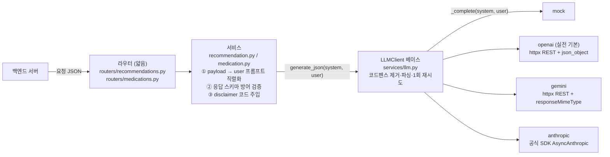

# LLM 연동 계층 — 비결정 출력을 계약으로 묶기

> 모델은 우리 API 계약을 모른다. 그 간극을 어디서 메울 것인가

## 왜 필요했나

부족 영양소 기반 **추천 문구**, 약별 **주의사항**, 식사 **코멘트** — 세 기능이 LLM 출력이다.
그런데 이 응답은 백엔드가 받아 **그대로 DB에 저장하고 앱이 화면에 그린다.**

**형태가 한 번만 틀려도 화면이 깨진다.** LLM은 확률적으로 코드펜스를 붙이거나 필드를 빼먹는다.

그리고 이건 **건강 관련 문구**다. "고혈압이시네요" 같은 진단성 표현이 나가면 안 된다.

## 무슨 문제가 있었나

- **provider마다 JSON 강제 방식이 다르다** — OpenAI는 `response_format`, Gemini는 `responseMimeType`,
  Anthropic Opus는 **sampling 파라미터를 아예 안 받는다**(전달하면 400)
- **키가 없으면 서버가 뜨지 않는 문제** — 개발·CI에서 키 없이도 mock 모드·health·대시보드는 동작해야 한다
- **재시도가 여러 곳에 생기면 비용이 폭주한다** — 서비스에서도 재시도, provider에서도 재시도하면
  실패 1건이 호출 4건이 된다
- **의료 고지 문구를 LLM이 매번 다르게 쓴다**

## 어떤 선택지가 있었고, 무엇을 선택했나

### 재시도·파싱을 provider마다 vs 베이스 클래스에 한 번

| 후보 | 문제 |
|---|---|
| provider별로 각자 파싱·재시도 | **정책이 provider마다 달라진다.** OpenAI는 2회, Gemini는 3회 같은 상황이 조용히 생김 |
| **베이스 클래스에 한 번, provider는 `_complete()`만 구현** | provider 추가가 쉬워지고 정책이 구조적으로 통일됨 |

두 번째를 택했다. provider는 **"텍스트 1회 호출"만** 구현한다.
`코드펜스 제거 → json.loads → 실패 시 1회 재시도 → 재실패 502`가 한 곳에만 존재한다.

**"1회 재시도 후 502" 정책이 provider마다 달라질 수 없는 구조**를 만든 것이다.
재시도 주체를 하나로 못박아 비용 폭주도 함께 막았다.

### 키 미설정을 기동 시점에 vs 호출 시점에

| 후보 | 문제 |
|---|---|
| 팩토리에서 키 검사, 없으면 기동 실패 | **키 없이는 아무것도 못 한다.** mock 모드·CI·대시보드가 전부 막힘 |
| **호출 시점에 503** | 기동은 항상 성공, 실제로 필요할 때만 실패 |

두 번째. **서버 기동은 항상 성공해야 한다**는 원칙을 세웠다.

> 다만 이 원칙이 나중에 **반대 방향의 사고**를 만들었다. 챗봇 쪽에서 "키가 없으면 가짜로 동작"하게
> 뒀다가 운영에서 가짜 응답이 사용자에게 나갔다(트러블슈팅 7). **개발 편의를 위한 관대한 기본값이
> 운영까지 따라가면 안 된다**는 것을 그때 배웠다.

### 의료 고지를 LLM에게 맡기는가

**맡기지 않았다.** `disclaimer`는 `constants.py`의 상수를 **코드에서 주입**한다.
LLM 출력에 뭐가 오든 무시한다.

이유는 단순하다 — **법적 고지 문구가 모델의 표현 변화에 좌우되면 안 된다.**
하네스가 이 문구에 "참고용"·"임의"가 포함되는지 검증한다.

### mock LLM을 고정 fixture로 vs 입력 반영형으로

고정 응답을 돌려주면 "입력이 문구에 반영되는가"를 테스트할 수 없다.

서비스가 user 프롬프트를 요청 데이터의 `json.dumps`로 구성한다는 규약을 이용해,
**mock이 입력의 부족 영양소 키와 약 이름을 응답에 반영**하게 했다.
덕분에 **키 없이도 "단백질이 부족하면 문구에 단백질이 나오는가"까지 검증**된다.

## 작업 내용

- `05_LLM_연동_구현.md` — provider 4종 추상화, 프롬프트 설계, 방어적 파싱
- `09_LLM_응답_개선.md` — 프롬프트 구조화, 속도, 톤 정비
- `13_호출별_비용_표시.md` — contextvars 기반 요청 단위 usage 집계

## 결과 — 측정으로 검증

- provider **4종**(mock/openai/gemini/anthropic)이 `generate_json(system, user) -> dict` 하나로 통일
- 재시도 상한이 실제로 지켜지는지 **일부러 깨진 출력을 내는 `GarbageLLM`을 주입**해
  `calls == 2`를 단언 — 내부 호출 횟수는 블랙박스 테스트로는 못 잡는 것이라 화이트박스로 고정
- 프롬프트를 `기본 원칙 → 판단 우선순위 → 출력 규칙 → Few-shot → 출력 형식` 골격으로 재작성.
  **판단 우선순위를 명시**(안전·정확성 > 지병 > 기피음식 > 부족 영양소)
- **요청 단위 usage 집계** — 공유 인스턴스에 저장하면 동시 요청끼리 값이 섞이므로
  `contextvars`로 코루틴별 격리. 재시도하면 `calls: 2`로 토큰·비용이 합산된다
- `pytest 75 passed`

## 남은 한계

- **비진단 원칙 검사가 정규식이다.** "고혈압이신 것 같네요" 같은 우회 표현은 못 잡는다.
  LLM-as-judge를 쓰면 잡히지만 그건 또 다른 비결정적 판정자다
- **출력 품질을 사람이 평가한 기록이 없다.** 형식은 테스트로 잠갔지만 "문구가 좋은가"는 주관 평가
- Anthropic provider는 **실사용 검증이 얕다.** OpenAI 기준으로만 실측했다

## 경험을 통해 배운 점

- 비결정적 출력은 **결정적인 층으로 감싸야 한다는 것.** 파싱·재시도·검증·상수 주입이 전부 그 층이다
- 정책은 **구조로 강제해야 지켜진다는 것.** "재시도는 1회"를 문서에 적는 것과
  베이스 클래스에 한 번만 구현하는 것은 결과가 다르다
- 안전에 관한 것은 **LLM에게 맡기지 않는다는 것.** 고지 문구는 상수여야 한다
