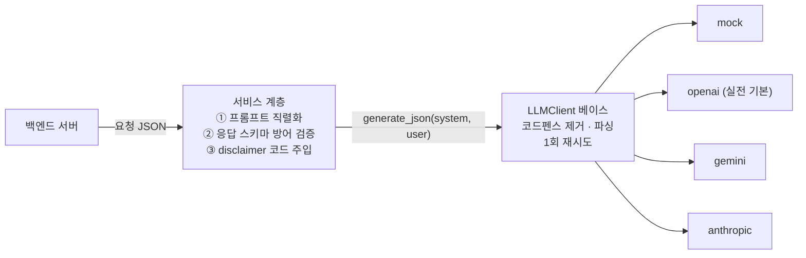

# LLM 연동 계층 — 비결정 출력을 계약으로 묶기

> 모델은 우리 API 계약을 모른다. 그 간극을 어디서 메울 것인가

## 왜 필요했나

- 추천 문구·복약 주의사항·식사 코멘트가 LLM 출력 — 이 응답은 **DB에 저장되고 앱 화면에 그대로 그려진다**
- **형태가 한 번만 틀려도 화면이 깨진다** — LLM은 확률적으로 코드펜스를 붙이거나 필드를 빼먹는다
- 건강 문구라 "고혈압이시네요" 같은 **진단성 표현이 나가면 안 된다**

## 무슨 문제가 있었나

- provider마다 JSON 강제 방식이 다름 — OpenAI는 `response_format`, Gemini는 `responseMimeType`, Anthropic은 일부 파라미터에 400
- 키가 없으면 서버가 안 뜨는 구조면 개발·CI·대시보드가 전부 막힘
- 재시도가 여러 곳에 생기면 실패 1건이 호출 4건 — **비용 폭주**
- 의료 고지 문구를 LLM이 매번 다르게 씀

## 어떤 선택지가 있었고, 무엇을 선택했나

### 재시도·파싱을 provider마다 vs 베이스 클래스에 한 번

- provider 4종(mock/openai/gemini/anthropic)은 **"텍스트 1회 호출"만** 구현
- `코드펜스 제거 → 파싱 → 1회 재시도 → 재실패 502`가 베이스 클래스 한 곳에만 존재
- **"재시도는 1회" 정책이 provider마다 달라질 수 없는 구조** — 문서에 적는 것과 구조로 강제하는 것은 결과가 다르다

### 키 미설정 — 기동 실패 vs 호출 시점 503

- **서버 기동은 항상 성공**해야 개발·CI가 돈다 → 호출 시점에만 503
- 다만 이 "관대한 기본값" 원칙을 챗봇에 그대로 가져갔다가 **운영 사고**를 겪었다 (트러블슈팅 · 가짜 AI)

### 의료 고지 — LLM에게 맡기는가

- **맡기지 않았다** — `disclaimer`는 상수를 코드에서 주입, LLM 출력은 무시
- **법적 고지 문구가 모델의 표현 변화에 좌우되면 안 된다**

## 결과 — 측정으로 검증

- provider 4종이 `generate_json(system, user) → dict` 하나로 통일
- 재시도 상한은 **일부러 깨진 출력을 내는 GarbageLLM을 주입**해 `calls == 2` 단언 — 내부 호출 횟수는 화이트박스로만 잡힌다
- 프롬프트를 `기본 원칙 → 판단 우선순위 → 출력 규칙 → Few-shot → 출력 형식` 골격으로 구조화
- 토큰·비용은 `contextvars`로 **요청 단위 격리 집계** — 공유 인스턴스면 동시 요청끼리 값이 섞인다

## 남은 한계

- 비진단 원칙 검사가 정규식 — "고혈압이신 것 같네요" 같은 우회 표현은 못 잡는다
- 출력 품질(문구가 좋은가)은 사람이 평가한 기록이 없다

## 경험을 통해 배운 점

- 비결정적 출력은 **결정적인 층으로 감싸야 한다**는 것 — 파싱·재시도·검증·상수 주입이 전부 그 층이다
- **정책은 구조로 강제해야 지켜진다**는 것
- 안전에 관한 것은 **LLM에게 맡기지 않는다**는 것 — 고지 문구는 상수여야 한다
