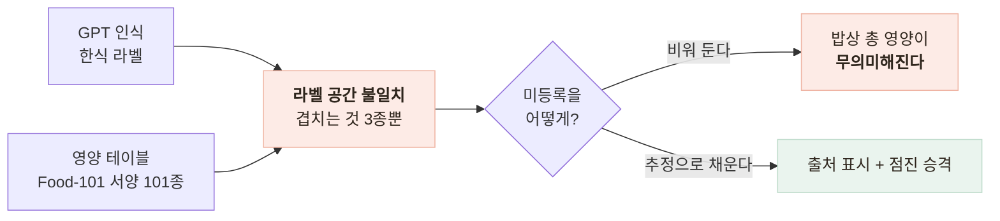
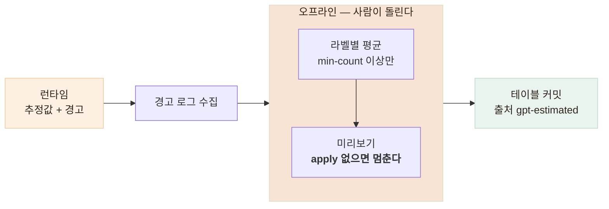

# 한식이 전부 "영양 정보 미등록"으로 떨어졌다 — 하이브리드와 점진 승격

> 인식은 되는데 영양소가 안 붙던 문제를 3단 폴백과 오프라인 승격으로 푼 기록

<!-- 사진 자리: 같은 한식 밥상 사진의 개선 전후 분석 결과 비교 — 전부 "미등록"이던 화면과 추정값이 채워진 화면 -->

## 한눈에

| | |
|---|---|
| **문제** | 실사진 테스트에서 한식 밥상이 거의 다 영양 정보 미등록으로 떨어졌다 |
| **원인** | 인식은 정확했고, 테이블이 Food-101 기준이라 **라벨 공간이 안 겹쳤다** |
| **판단** | 테이블 우선 → 추정 폴백 → 검증된 것만 오프라인 승격 |
| **결과** | 회귀 72 passed, 건당 0.68원 → 0.92원으로 1원 미만 유지 |

## 갈림길 — 인식은 정확했다

처음에는 모델을 의심했지만 GPT는 제육볶음과 잡곡밥을 제대로 알아봤다. 어긋난 것은 모델과 테이블을 잇는 **키**였다.

| 후보 | 내용 | 판단 |
|---|---|---|
| a | GPT 추정값을 무조건 사용 | 폐기 — 테이블의 큐레이션과 **감사 가능성**을 잃는다 |
| b | 미등록은 계속 비워 둠 | 폐기 — 밥상의 총 영양이 무의미해진다 |
| **c** | 테이블 우선 → 추정 폴백 → 승격 | 채택 — 지금 채워지는 값과 나중에 믿을 값을 다 안 버린다 |

## 3단 폴백 — 출처를 표시해 공존시켰다

| 조건 | 출처 | 처리 |
|---|---|---|
| 테이블에 라벨이 있다 | `table` | 큐레이션 값 — **테이블이 항상 우선** |
| 없지만 영양소 5개 키가 다 온다 | `estimated` | 값 사용 + 추정 경고 |
| 둘 다 아니다 | 없음 | `nutrients: null` + 미등록 경고, 총합 제외 |

- 추정값도 배율과 총합에 똑같이 들어간다 — 규칙이 출처에 따라 달라지면 안 된다
- 5개 키 중 하나만 빠지면 전체 무효로 본다 — **부분 채택**이 더 위험하다

## 승격을 오프라인 도구로 뺐다

무상태 서버가 런타임에 테이블 파일을 쓸 수는 없었다. 그래서 사람이 도구를 돌려 커밋하는 반자동으로 뒀다.

| 실측 | 결과 |
|---|---|
| 햄버거 밥상 | hamburger·french_fries는 테이블, soda는 추정 97.5kcal + 경고 |
| 미리보기 (min-count 2) | 매운 돼지불고기는 2회 관측으로 추가 대상, bibimbap은 이미 있어 제외 |

## 라벨이 흔들리면 승격이 죽는다

같은 음식이 매번 다른 이름으로 오면 관측이 쪼개져 승격이 영영 일어나지 않는다. 그래서 한식 어휘 24종을 프롬프트에 넣되 **우선 사용 정도의 soft constraint**로 뒀다. 어휘를 닫으면 라벨은 안정되지만 새 음식과 추정 폴백이 함께 죽는다.

- `steamed_rice → rice` 는 넣고 `tofu_stew → stew` 는 안 넣었다 — 합치면 정보를 잃는다

## 남은 한계

| 항목 | 상태 |
|---|---|
| 추정값 | 큐레이션 테이블보다 정확도와 감사성이 낮다 |
| 승격 트리거 | 수동 — 사람이 돌리지 않으면 테이블은 그대로다 |
| 식약처 DB 대조 | 없다 — 이 구조는 한식 테이블로 갈 때까지의 다리다 |

## 배운 점

- 증상이 인식 실패로 보여도 진짜 원인은 **모델과 데이터를 잇는 키**일 수 있다는 것
- 정확도와 커버리지가 충돌하면 출처를 표시해 **공존**시키는 편이 나을 때가 있다는 것
- 무엇을 합치지 않을지 먼저 정해야 지표가 목적을 대신하지 않는다는 것
