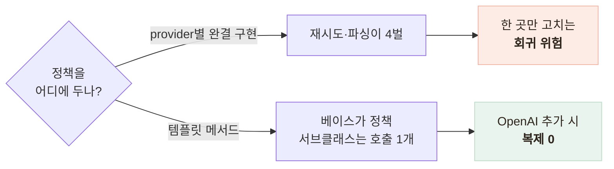
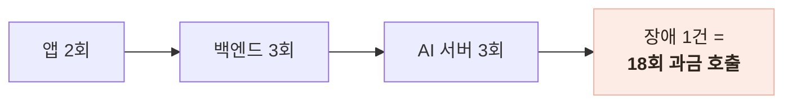

# 지병·복약을 반영한 AI 문구 생성 — 비결정 출력을 계약으로 묶기

> 같은 답이 오지 않는 LLM 위에서 응답 계약과 안전 문구를 지켜낸 설계

<!-- 사진 자리: 앱의 다음 끼니 추천 카드와 복약 주의 문구 화면 — 추천 메뉴 하나와 안내 문구, 하단 의료 고지가 함께 보이는 캡처 -->

## 한눈에

| | |
|---|---|
| **문제** | 문구는 사람에게 따뜻해야 하고, **기계에게는 형태가 고정**되어야 했다 |
| **판단** | 베이스가 재시도·파싱 정책을 갖고 서브클래스는 호출 하나만 구현 |
| **근거** | 재시도를 층마다 두면 장애 1건이 18회 과금 호출로 불어난다 |
| **결과** | provider를 추가해도 정책 코드 복제 0, 응답 3~4초 → 1.5~2.5초 |

## 갈림길 — provider를 어떻게 추상화하나

문구를 만드는 지점이 세 곳, provider 후보가 네 종이었다.

| 후보 | 내용 | 판단 |
|---|---|---|
| a | provider별로 완결 구현 | 폐기 — 정책이 4벌 복제되어 회귀 위험 |
| b | 프레임워크의 structured output | 폐기 — 의존성이 늘고 **에러 계약**을 다시 매핑해야 한다 |
| **c** | 추상 클래스 + 템플릿 메서드 | 채택 — 계층이 하나 늘어나는 것이 유일한 비용 |

## 재시도는 정확히 1회로 못 박았다

근거는 곱셈이다. 재시도가 여러 층에 흩어지면 장애 한 건이 청구서에 곱해져 실린다.

재호출 주체는 백엔드로 정하고, 서버의 1회는 형식 불량 교정만 맡는다. 키 검증도 기동이 아니라 **호출 시점에 503**으로 미뤘다 — 기동에서 끊으면 mock 분석과 헬스체크까지 함께 사라진다.

## 프롬프트 규칙은 안전 요구사항의 번역이다

판단 우선순위를 안전·정확성 > 지병 > 기피 음식 > 부족 영양소로 못 박아, 규칙이 충돌할 때 무엇이 이기는지 미리 정했다.

| 규칙 | 이유 |
|---|---|
| 지병 매핑 명시 — 고혈압은 저염, 연하곤란은 부드러운 식감 | 없으면 모델이 지병 코드를 자의적으로 해석한다 |
| 복약 중단·변경 권유 금지 | 읽고 임의로 약을 끊는 것이 최악의 시나리오다 |
| 의료 고지는 코드 상수로 주입 | 고지 존재가 **모델 온도에 좌우되는 구조**는 수용할 수 없다 |

## 검증은 비대칭으로, 속도는 출력에서

넘치는 쪽 손실은 작지만 **모자란 것을 불릴 수는 없다**. 그래서 검증을 비대칭으로 뒀다.

- 넘치면 조용히 자르고, 부족하거나 추천 본문이 없으면 502로 끊는다
- 복약의 부가 문구 누락은 502가 아니라 안전한 기본 문구로 폴백한다

지배 요인은 네트워크가 아니라 출력 토큰 생성 시간이었다. 출력 간결화를 주 레버로 두고 상한 700과 temperature 0.1을 함께 걸었다.

| 엔드포인트 | 개선 전 → 후 |
|---|---|
| 추천 | 약 3.2초 → 약 2.5초 |
| 복약 | 약 4.6초 → 약 2.0초 |
| 식사 코멘트 | 신규 — 약 1.5초 |

## 남은 한계

| 항목 | 상태 |
|---|---|
| 금칙어 필터 | 미구현 — 프롬프트 금지 규칙은 확률적 방어다 |
| 내용의 품질 | 형태까지만 검증한다 — 실제로 저염인지는 못 잡는다 |
| HTTP 클라이언트 재사용 | 수백 ms 여지가 있지만 지배 요인이 아니어서 보류 |

## 배운 점

- 비결정 출력을 다루는 방법은 신뢰가 아니라 **경계에서의 계약 강제**라는 것
- 재시도는 주체를 하나로 정해야 곱셈이 청구서로 오지 않는다는 것
- 반드시 있어야 하는 문장은 **생성에 맡기지 않아야** 한다는 것
