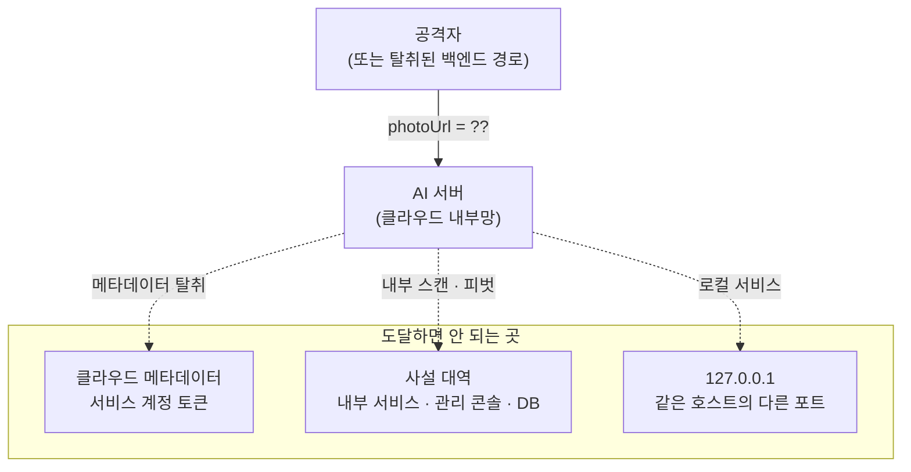

# 이미지 수집 계층 — SSRF 방어와 프라이버시

> 입력이 URL인 서버는, 공격자에게 자기 네트워크 위치를 빌려주는 서버다

## 왜 필요했나

- 계약상 사진은 업로드가 아니라 **URL 전달** — 백엔드가 GCS에 올리고 AI 서버는 URL만 받는다
- 무상태·대용량 회피를 위한 선택이었지만, 그 순간 **SSRF 공격 표면**이 생긴다
- 이 URL이 가리키는 것은 **어르신의 식사·생활이 담긴 민감 데이터** — 보안과 프라이버시를 같은 계층에서 다뤄야 했다

## 무슨 문제가 있었나

- **클라우드 메타데이터 탈취**가 최악 — 성공하면 클라우드 계정 자체가 위험
- DNS 리바인딩(검증 시점엔 공인, 연결 시점엔 사설 IP), `file://` 같은 비-HTTP 스킴까지

## 어떤 선택지가 있었고, 무엇을 선택했나

### 허용목록 vs 차단목록

- 허용목록만 두면 개발·테스트가 막혀 **결국 누군가 검증을 통째로 끄게 된다**
- 스킴 제한·사설 대역 차단은 **설정과 무관하게 항상**, 호스트 허용목록은 프로덕션 옵션으로 이원화
- 기준은 **"실수했을 때 어느 쪽이 덜 위험한가"**

### 리다이렉트 — 자동 추적 vs 수동 루프

- 자동 추적은 hop별 검증 지점이 없다 — 공인 URL이 사설 IP로 리다이렉트하면 그대로 뚫린다
- **최대 5 hop 수동 루프**로 매 hop 검증을 다시 태움

### 크기 제한 — 헤더 vs 스트림

- `Content-Length` 헤더는 속일 수 있다 — **스트리밍 중 누적 바이트**를 세어 초과 시 즉시 차단
- 다 받은 뒤에는 이미 늦다

## 결과 — 측정으로 검증

- 검증 계층화: 스킴 → 허용목록 → IP 리터럴 → **DNS 전체 해석**(A 레코드 하나라도 사설이면 차단, IPv4-mapped IPv6 재검사) → hop별 재검증 → 크기
- 하네스가 **실서버에 실제 악성 URL을 쏴서** 차단 확인 — 34/34
- **EXIF 메타데이터 제거** — 위치정보가 GPT로 넘어가지 않는다
- 로그는 화이트리스트 방식 — photoUrl·지병·약 이름을 남기지 않는다
- 에러 코드 원인별 구분 — DNS 실패 502(재시도 가능) vs 사설 IP 422(재시도 무의미)

## 남은 한계

- **DNS 리바인딩(TOCTOU)은 못 막았다** — IP 핀닝의 복잡도 대비 MVP 이득이 작다고 판단해 수용하고 문서화
- 프로덕션 허용목록을 켜면 이 경로 자체가 닫힌다 — 배포 체크리스트에 의존

## 경험을 통해 배운 점

- **입력 형식 하나가 공격 표면을 결정한다**는 것 — "업로드 대신 URL"을 고른 순간 SSRF가 따라왔다
- 방어는 한 겹이 아니라 **계층**이어야 한다는 것 — 각 겹이 서로 다른 공격을 막는다
- **막지 못한 것을 적는 것**이 막은 것을 적는 것만큼 중요하다는 것 — 안 적으면 다음 사람은 막혀 있다고 믿는다
