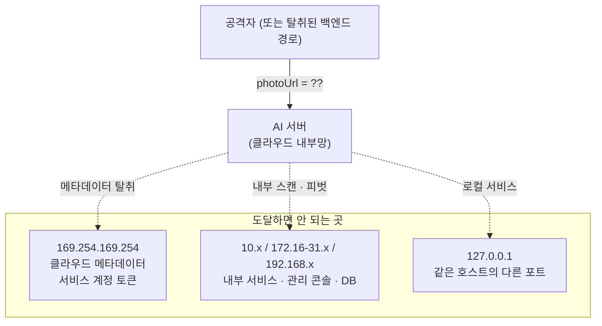

# 이미지 수집 계층 — SSRF 방어와 프라이버시

> 입력이 URL인 서버는, 공격자에게 자기 네트워크 위치를 빌려주는 서버다

## 왜 필요했나

계약상 사진은 업로드가 아니라 **URL 전달**이다. 백엔드가 GCS에 올리고 AI 서버는 URL만 받는다.
무상태 원칙과 대용량 업로드 회피를 위한 선택이었는데, **그 순간 SSRF 표면이 생긴다.**

**서버가 외부에서 받은 문자열을 URL로 해석해 자기 네트워크 위치에서 요청을 보낸다.**
공격자는 자기 브라우저로는 못 가는 곳을, 서버의 신뢰받는 위치를 빌려 접근한다.

## 무슨 문제가 있었나

AI 서버는 클라우드 내부망에 있다. `photoUrl`에 무엇을 넣느냐에 따라 도달할 수 있는 곳:

1. **클라우드 메타데이터 탈취** — 서비스 계정 토큰·임시 자격증명.
   성공하면 **클라우드 계정 자체가 위험해진다.** SSRF 중 가장 치명적
2. **내부 서비스 스캔·피벗** — 방화벽 뒤의 관리 콘솔·내부 API. 응답 시간 차이로 포트 스캔
3. **로컬 서비스 접근** — `127.0.0.1:6379`(Redis) 등
4. **DNS 리바인딩** — 검증 시점엔 공인 IP, 연결 시점엔 사설 IP로 해석되게 조작
5. **비-HTTP 스킴** — `file:///etc/passwd`, `gs://`, `ftp://`

그리고 이 URL이 가리키는 것은 **어르신의 식사·생활이 담긴 민감 데이터**다.
SSRF와 프라이버시를 같은 계층에서 다뤄야 했다.

## 어떤 선택지가 있었고, 무엇을 선택했나

### 호스트 허용목록 vs IP 대역 차단목록

| 후보 | 장점 | 단점 |
|---|---|---|
| 허용목록만 | 가장 안전, 우회 거의 불가 | **개발·테스트에서 임의 이미지 사용 불가.** 결국 누군가 검증을 통째로 끄게 된다 |
| 차단목록만 | 유연 | **놓친 대역이 곧 구멍.** 신규 예약 대역·IPv6 매핑을 계속 따라가야 함 |
| **차단목록을 항상, 허용목록을 프로덕션 옵션** | 개발 편의와 운영 안전을 분리 | 설정을 안 켜면 운영에서도 느슨해짐 |

**선택 기준은 "실수했을 때 어느 쪽이 덜 위험한가"** 였다.
스킴 제한과 사설·링크로컬 대역 차단은 **설정과 무관하게 항상** 적용되고,
`ALLOWED_IMAGE_HOSTS`는 프로덕션에서 `storage.googleapis.com`으로 좁히도록 문서에 명시했다.

### 리다이렉트를 httpx에 맡기는가 vs 수동 루프

httpx의 자동 추적을 쓰면 **hop별 검증 지점이 없다.**
검증을 통과한 공인 URL이 사설 IP로 리다이렉트하면 그대로 뚫린다.

`follow_redirects=False`로 끄고 **최대 5 hop 수동 루프**를 돌며 매 hop마다 검증을 다시 태운다.
코드가 길어지지만, 이게 없으면 앞의 검증이 무의미하다.

### 에러 코드를 하나로 vs 원인별로

**DNS 해석 실패는 502, 사설 IP는 422**로 구분했다.

전자는 "다운로드 실패"라 백엔드가 재시도할 수 있고,
후자는 "금지된 입력"이라 **재시도가 무의미**하다. 소비자의 다음 행동이 다르므로 코드도 달라야 한다.

### 크기 제한을 헤더로 vs 스트림으로

`Content-Length`만 믿으면 헤더를 속인 응답에 뚫린다.
**스트리밍 중 누적 바이트를 세어** 15MB를 넘으면 즉시 끊는다. **다 받은 뒤에는 이미 늦다.**

## 작업 내용

- `04_이미지_보안_SSRF_프라이버시.md` — 공격 시나리오 5종, 방어 계층, 수용한 한계

## 결과 — 측정으로 검증

- 검증 순서를 **스킴 → 허용목록 → IP 리터럴 → DNS 전체 해석 → 사설 대역 → hop별 재검증 →
  Content-Type → 누적 크기 → 디코드**로 계층화
- `getaddrinfo`의 **모든 결과를 검사**. A 레코드가 여러 개면 하나라도 사설이면 차단.
  IPv4-mapped IPv6(`::ffff:192.168.x.x`)는 매핑을 풀어 재검사
- 하네스가 **실서버에 실제 악성 URL을 쏴서** 차단을 확인 — 34/34, `--api-key` 시 37/37
- **EXIF 방위 정규화 후 메타데이터 제거** — 위치정보가 GPT로 넘어가지 않는다
- 로그는 **화이트리스트 방식** — photoUrl·지병·약 이름을 남기지 않는다
- `pytest 75 passed` (`tests/test_image_ssrf.py` 포함)

## 남은 한계

- **DNS 리바인딩(TOCTOU)을 완전히 막지 못했다.** 검증 시점과 httpx 연결 시점 사이에 재해석될 수 있다.
  IP 핀닝은 TLS SNI 처리 복잡도 대비 MVP 이득이 작다고 판단해 **수용하고 문서화**했다.
  프로덕션 허용목록을 켜면 이 경로 자체가 닫힌다
- 허용목록이 **기본값으로 켜져 있지 않다.** 배포 체크리스트에 의존한다
- 프라이버시는 **정책 수준**이라 로그 필드 제한 외에는 코드 리뷰로만 담보된다

## 경험을 통해 배운 점

- **입력 형식 하나가 공격 표면을 결정한다는 것.** "업로드 대신 URL"은 성능·무상태를 위한
  선택이었는데 그 순간 SSRF가 따라왔다
- 방어는 **한 겹이 아니라 계층**이어야 한다는 것. 스킴·IP 대역·허용목록·hop 검증·크기·타임아웃이
  각각 다른 공격을 막는다
- **막지 못한 것을 적는 것**이 막은 것을 적는 것만큼 중요하다는 것.
  DNS 리바인딩을 "안 막았다"고 쓰지 않으면 다음 사람은 막혀 있다고 믿는다
