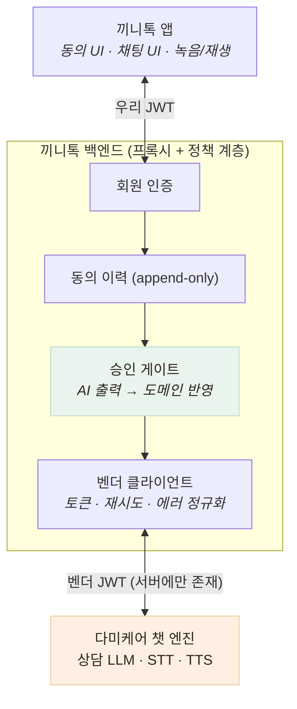

# 외부 LLM 챗봇 연동 — 외주 업체가 만든 AI를 우리 얼굴로 내보내기

> 건강 상담 LLM · STT · TTS 연동과, 그 출력을 믿지 않는 구조

## 왜 필요했나

- 어르신 건강 상태 수집은 설문이 아니라 **음성 대화**여야 한다 — 설문은 어르신이 못 쓴다
- 대화형 건강 상담 엔진을 직접 만들 수는 없어 벤더의 다미케어 챗 엔진을 연동
- **우리 서비스의 얼굴로 나가지만 우리가 만들지 않은 AI**를 붙이는 일

## 무슨 문제가 있었나

- **문서를 그대로 믿을 수 없었다** — 구현 전에 API를 직접 찔러 보니 STT 지원 포맷 미기재, 무응답 종결 횟수 상이(문서 2회 vs 실측 3회), 에러 포맷 3종 등 어긋남 발견
- **AI 출력이 도메인 진실을 오염시킬 수 있다** — 챗봇이 "당뇨가 있다고 말했다"고 판단한 게 곧바로 식단 판정에 반영되면 안 된다

## 어떤 선택지가 있었고, 무엇을 선택했나

### 앱이 벤더에 직접 붙는가 vs 서버가 중계하는가

- 직접 붙으면 **전 사용자가 공유하는 벤더 토큰이 앱에 내려간다** — APK를 뜯으면 추출되고 회수 불가
- 중계를 택하자 부가 효과 — 에러 3포맷 → 1포맷 정규화, 응급 안내 삽입, 토큰 한도 관측
- **401을 그대로 내리지 않는다** — 벤더 토큰 만료는 우리 문제인데 앱 인터셉터가 401을 받으면 **어르신을 로그아웃**시킨다. 503으로 변환

### AI가 만든 건강정보를 어디에 저장하는가

- 기존 건강 프로필에 바로 반영하면 **LLM 오인식이 곧바로 식단 판정을 바꾼다**
- 스냅샷 테이블에 **격리**하고 보호자 승인 후에만 반영 — **AI 출력과 도메인 진실 사이에 사람을 둔 설계**

## 결과 — 측정으로 검증

- 구현 전 실측으로 **문서 모순 3건 해소, 미문서화 동작 2건 발견**
- 어댑터에 **부팅 자가진단** — 첫 사용자 요청이 아니라 부팅 시점에 연결 가능 여부를 안다
- 동의를 **가입 트랜잭션에 포함** — "계정은 있는데 동의 기록이 없는" 사용자가 생기지 않게
- 실서버 왕복 실측 — 상담 응답 1.3~1.9초, STT 3.3초
- Jest 377 passed (챗봇 41개 포함)

## 남은 한계

- **보호자 검토·승격 화면이 없다** — 챗봇 결과가 아직 식단 판정에 반영되지 않는 상태 (의도적으로 안전한 쪽에 멈춤)
- 상담 품질(질문 순서·문맥 유지)은 정량 평가하지 못했다

## 경험을 통해 배운 점

- **문서는 가설이고 실측이 사실**이라는 것 — 찔러 보기 전에 코드를 썼다면 모순 3건이 구현에 녹았다
- 외부 AI는 **경계에서 격리한다**는 것 — 에러 포맷·토큰·출력 신뢰 전부 경계에서 정규화된다
- AI 출력과 도메인 진실 사이에 **사람을 두는 것은 미완성이 아니라 설계**라는 것
