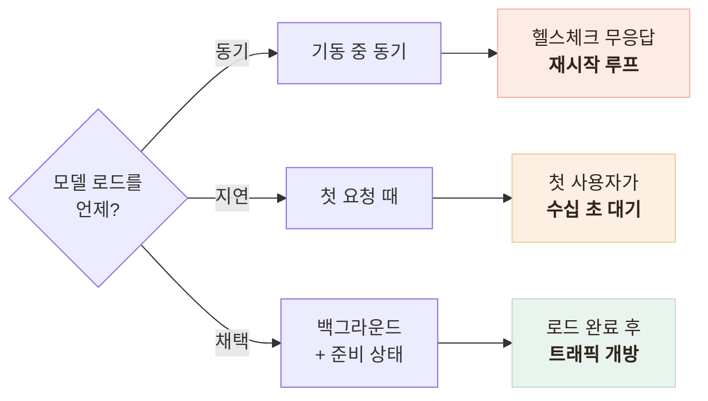
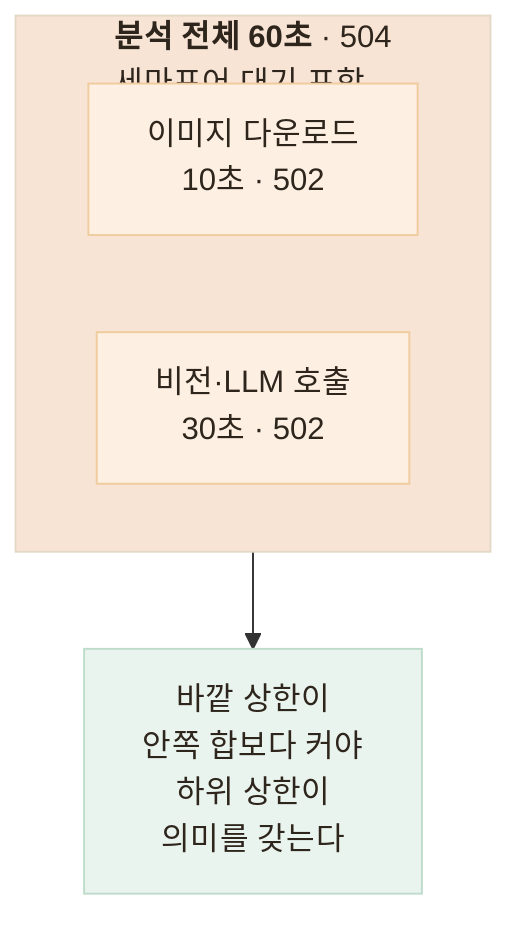

# 추론 서버가 죽는 네 가지 방식을 막기 — 콜드스타트·GPU 메모리·타임아웃

> 코드가 맞는 것과 서버가 살아 있는 것은 다른 문제라, 죽는 경로를 먼저 세어 보고 각각에 장치를 붙인 기록

<!-- 사진 자리: 콜드스타트 중 /health는 200이고 /ready는 503을 반환하는 두 응답을 나란히 놓은 터미널 캡처 -->

## 한눈에

| | |
|---|---|
| **문제** | 단위 테스트가 전부 통과해도 추론 서버는 다른 이유로 죽는다 |
| **판단** | 기능을 붙이기 전에 죽는 방식을 네 가지로 세고 각각에 장치를 짝지었다 |
| **근거** | 로드 수십 초, 동시 2~3개로 메모리 고갈, 워커 2개면 모델 2벌 로드 |
| **결과** | 준비 안 됨 503, 이미지 문제 502, 처리 능력 초과 504로 신호가 갈린다 |

## 갈림길 — 모델을 언제 로드할까

로컬 백엔드는 체크포인트 2.4GB와 분류기를 로드해 수십 초가 걸린다. 그동안 프로세스는 떠 있지만 서비스는 불가능해서, **로드 시점**이 첫 갈림길이었다.

| 후보 | 상태 | 판단 |
|---|---|---|
| 전부 동기 로드 | 폐기 | 헬스체크조차 못 받아 프로세스가 죽고 재시작만 반복된다 |
| 전부 지연 로드 | 폐기 | 첫 사용자가 대기하고 데이터 오류를 첫 요청에서야 만난다 |
| **데이터 동기 + 모델 백그라운드** | 채택 | `/health` 200과 `/ready` 503으로 트래픽을 막는다 |

자동 재시작은 일부러 넣지 않았다. 원인이 대부분 체크포인트 손상처럼 비회복성이라, 재시작을 걸면 루프만 돌면서 원인을 가린다.

## 나머지도 방식마다 장치를 짝지었다

| 죽는 방식 | 붙인 장치 |
|---|---|
| 콜드스타트 — 떠 있지만 일할 수 없다 | 준비 상태 분리 + 더미 이미지 1회 워밍업 |
| GPU 메모리 — 동시 2~3개로 전멸 | **세마포어 기본 1** — 워커를 늘리면 모델이 배로 로드된다 |
| 루프 블로킹 — 생존 판정 오판 | 동기 추론과 모델 로드를 별도 실행기로 오프로드 |
| 타임아웃 부재 — 세마포어 무한 점유 | 상한 3계층 |

원칙으로 정리하면 **동시성은 세마포어가, 처리량은 인스턴스 수가** 담당한다. 워커 수는 동시성 손잡이가 아니다.

## 타임아웃은 하나로는 부족하다

하나만 두면 어디가 느린지 알 수 없어 의미가 다른 세 지점을 각각 끊었다.

10초 초과는 이미지 호스트가 느리다는 뜻이고 60초 초과는 처리 능력 초과라 백엔드가 취할 조치가 다르다. 백엔드에는 "언젠간 응답"보다 **60초 내 확정 실패**가 낫다.

## 남은 한계

| 항목 | 상태 |
|---|---|
| 세마포어 범위 | 프로세스 내 제한 — 확장하면 전체 동시 추론은 인스턴스 수 × 1 |
| 대기열 | **길이 제한 없음** — 폭주 시 쌓이다 일괄 실패한다 |
| 60초 만료 | 이미 시작된 동기 추론은 취소되지 않아 계산이 버려진다 |
| GPU 실기동 | **미검증** — 콜드스타트·메모리 장치를 실제 GPU에서 재 보지 못했다 |

## 배운 점

- 장애 대응의 시작은 코드가 아니라 **죽는 경로를 먼저 나열하는 것**이라는 것
- 생존과 준비를 구분하지 않으면 **자동 복구 장치**가 오히려 서비스를 죽인다는 것
- 처리량 손잡이와 동시성 손잡이는 다른 것이라, 착각하면 기동조차 못 한다는 것
