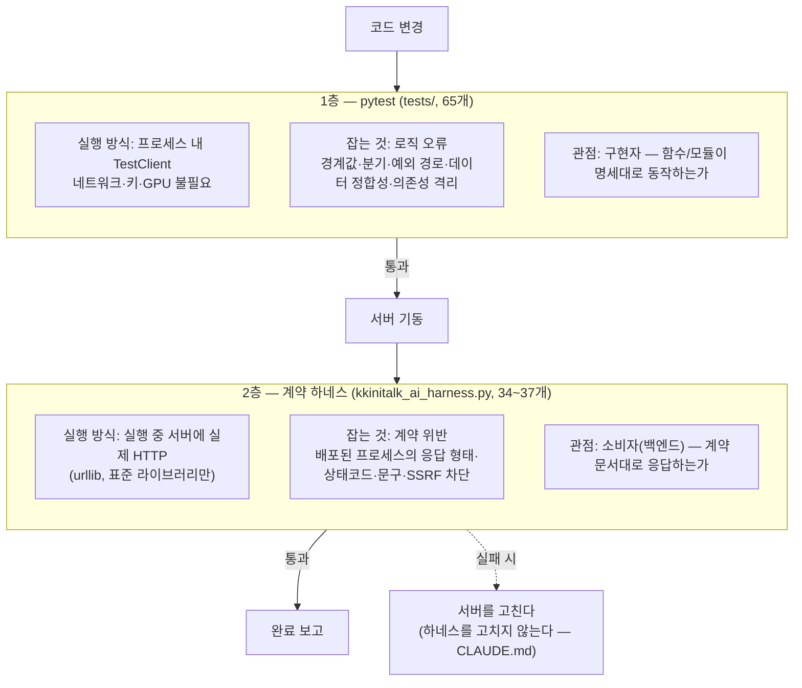

# 2층 검증 체계 — 서로 다른 결함을 잡는 두 개의 그물

> pytest와 계약 하네스는 원리적으로 다른 것을 못 잡는다

## 왜 필요했나

AI 서버는 **다른 팀원이 만드는 백엔드**가 소비한다. 응답 형태가 하나만 틀려도 앱 화면이 깨진다.
그리고 이 서버는 외부 API 키·GPU·네트워크에 의존한다.
**의존물 없이 검증할 수 있어야** CI가 돌고 협업자가 클론해서 바로 확인할 수 있다.

## 무슨 문제가 있었나

단위 테스트만으로는 **배포된 프로세스가 계약을 지키는지** 알 수 없다. 이런 결함이 통과한다.

- 미들웨어 순서 문제로 실서버에서만 401 응답 형태가 깨진다 (TestClient는 다른 경로를 탄다)
- uvicorn 기동 자체가 실패한다 (import 오류, lifespan 예외 — 프로세스 내 실행은 이걸 안 밟는다)
- 응답 JSON 직렬화 결과가 `null`이 아니라 **필드 누락**이다
- 실 네트워크 경유 다운로드에서 UA·리다이렉트 문제가 난다

반대로 실서버 테스트만으로는 이런 것을 못 잡는다.

- `determine_portion(0.8)`이 small로 잘못 판정된다 (그 경계값이 시나리오에 없다)
- LLM 재시도가 정확히 2회인지 (**내부 호출 횟수는 밖에서 관측 불가**)

## 어떤 선택지가 있었고, 무엇을 선택했나

### 한 층 vs 두 층

| 후보 | 장점 | 단점 |
|---|---|---|
| pytest만, 외부 의존을 전부 모킹 | 빠름·CI 친화 | **배포 산출물을 검증하지 않는다.** 모킹이 현실과 다르면 통과해도 의미 없음 |
| E2E만, 실서버 대상 | 현실적 | 느림, 경계값·내부 호출 횟수 검증 불가, 키·네트워크 필요 |
| **2층 — pytest(화이트박스) + 계약 하네스(블랙박스)** | 각 층이 상대가 못 잡는 것을 맡음 | 두 벌 유지 |

**선택 기준은 "각 층이 원리적으로 못 잡는 결함이 무엇인가"** 였다.
"둘 다 있으면 좋으니까"가 아니라, **못 잡는 목록을 먼저 적고** 그 합집합이 비어야 한다는
기준으로 층을 나눴다.

### 하네스를 pytest로 vs 독립 스크립트로

하네스는 **표준 라이브러리(urllib)만으로** 작성했다. pytest도 httpx도 안 쓴다.

이유는 **소비자 관점을 흉내내기 위해서**다. 백엔드 개발자는 우리 픽스처를 안 쓴다. 그냥 HTTP를 쏜다.
하네스가 우리 의존성을 공유하면 **우리 환경에서만 통하는 가정**이 스며든다.
독립 스크립트라 팀원에게 그대로 건네 "이거 돌려 보세요"가 된다.

### 실패했을 때 무엇을 고치는가

이게 가장 중요한 결정이었다. **기준점을 미리 선언하지 않으면 실패했을 때 더 쉬운 쪽을 고치게 된다.**

`CLAUDE.md`에 못박았다 — **"하네스 실패는 계약 위반이므로 하네스를 고치지 말고 서버를 고친다."**
하네스가 기준점(oracle)이라는 선언이다.

## 작업 내용

- `08_테스트_전략과_품질보증.md` — 2층 구조, 모킹 전략, 하네스 계약

## 결과 — 측정으로 검증

- **pytest 75 passed** — 외부 API 키·GPU·네트워크 **전부 없이** 통과
- **계약 하네스 34/34** (mock 모드), `--api-key` 지정 시 **37/37**
- 하네스가 **실 네트워크로 위키미디어 이미지를 다운로드**하고 **실 악성 URL로 SSRF 차단을 확인**
- 각 층이 못 잡는 결함을 **표로 대응**시켜 두 층의 존재 이유를 명시

## 남은 한계

- 하네스의 "정상 분석" 케이스는 **인터넷 연결이 필요**하다. 오프라인 CI에서는 그 1개가 실패한다
- 두 층을 **사람이 수동으로** 돌린다. CI 파이프라인에 연결돼 있지 않다
- ~~**부하·동시성 검증이 없다**~~ → **완료** (탭 2 · 검증 5)

## 경험을 통해 배운 점

- 테스트를 늘리기 전에 **"이 층이 원리적으로 못 잡는 것"을 적어 봐야 한다는 것.**
  그 목록이 다음 층의 존재 이유가 된다
- 검증 도구가 **소비자의 의존성으로** 만들어져야 소비자 관점이 유지된다는 것
- **기준점을 어디에 둘지 미리 선언**해야 한다는 것. 안 그러면 실패했을 때 테스트를 고치게 된다
