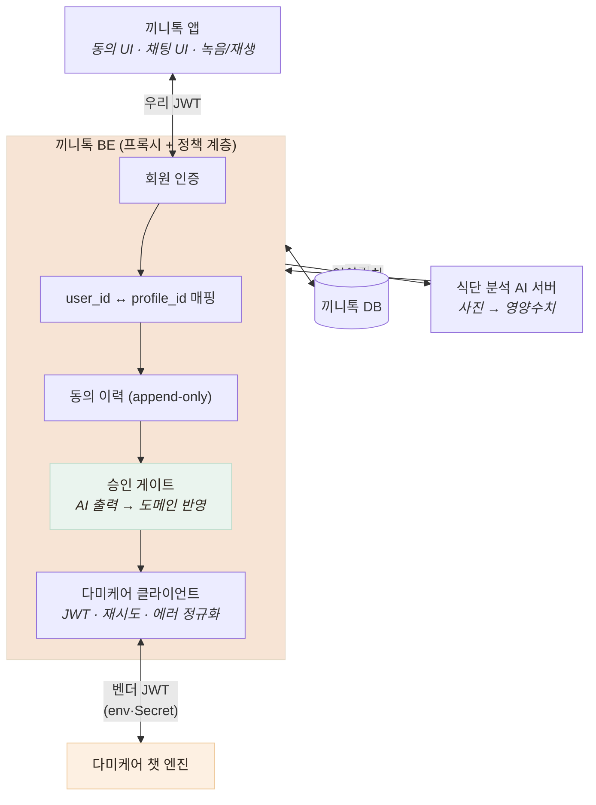

# 외부 LLM 챗봇 연동 — 외주 업체가 만든 AI를 우리 얼굴로 내보내기

> 건강 상담 LLM · STT · TTS 연동과, 그 출력을 믿지 않는 구조

## 왜 필요했나

어르신의 건강 상태를 수집해야 하는데 **설문은 어르신이 못 쓴다.**
음성 대화가 답이지만, 대화형 건강 상담 엔진을 직접 만들 수는 없다.

외부 벤더(엠씨테크)의 다미케어 챗 엔진을 연동하기로 했다.
**우리 서비스의 얼굴로 나가지만 우리가 만들지 않은 AI**를 붙이는 일이다.

## 무슨 문제가 있었나

### 문서를 그대로 믿을 수 없었다

API 가이드를 읽고 바로 구현하지 않고 **먼저 실제 API를 찔러 봤다.** 어긋나는 지점이 나왔다.

- **STT 지원 포맷이 문서에 없다** — 모바일 기본 포맷(m4a)이 실제로는 안 된다
- **무응답 종결 횟수가 다르다** — 문서는 "30초×2회", 실측은 빈 입력 **3회째**에 종결
- **에러 응답 포맷이 세 가지**로 갈린다

### AI 출력이 도메인 진실을 오염시킬 수 있다

챗봇이 "어르신이 당뇨가 있다고 말했다"고 판단하면, 그게 곧바로 식단 판정에 반영되는가?
**반영되면 안 된다.** LLM의 오인식이 곧바로 식사 추천을 바꾼다.

## 어떤 선택지가 있었고, 무엇을 선택했나

### 앱이 벤더에 직접 붙는가 vs 우리 서버가 중계하는가

| 후보 | 장점 | 단점 |
|---|---|---|
| 앱 → 벤더 직접 | 왕복 1회 감소, 서버 부하 없음 | **벤더 토큰이 앱에 내려간다.** APK를 뜯으면 추출되고, 유출돼도 앱 업데이트 없이는 회수 불가 |
| **백엔드가 중계** | 토큰이 서버에만 존재, 정책을 한 곳에서 적용 | 왕복 1회 증가, 벤더 장애를 우리가 흡수 |

**서비스 단위 시크릿은 클라이언트에 두면 안 된다.** 사용자별 토큰이면 회수가 되지만
이건 전 사용자가 공유하는 하나의 키다(월 200만 토큰 한도도 공유).

부가 효과가 컸다. 벤더의 **세 가지 에러 포맷을 우리 것 하나로 정규화**하고,
**응급 안내를 얹고**, **토큰 한도를 서버에서 관측**할 수 있게 됐다.

특히 **`401`을 그대로 내리지 않는다.** 벤더 토큰 만료는 우리 쪽 문제인데,
앱에 401이 가면 인터셉터가 **어르신을 로그아웃시킨다.** 503으로 접었다.

### AI가 만든 건강정보를 어디에 저장하는가

| 후보 | 문제 |
|---|---|
| 기존 `elderly_health_profiles`에 바로 반영 | **LLM 오인식이 곧바로 식단 판정을 바꾼다.** 되돌릴 근거도 사라짐 |
| **`chatbot_health_snapshots`(원본)에 격리 + 보호자 승인 후 반영** | 사람이 개입해야 하므로 반영이 늦어짐 |

두 번째를 택했다. **AI 출력과 도메인 진실을 물리적으로 분리**하고 그 사이에 사람을 뒀다.

트레이드오프를 명시하면 — **지금은 챗봇 결과가 식단 판정에 아무 영향을 주지 않는다.**
보호자 검토 화면이 아직 없기 때문이다. 이건 미완성이지만 **의도적으로 안전한 쪽에 멈춰 둔 상태**다.

### 음성 포맷 — 서버가 변환할 것인가 앱이 맞출 것인가

벤더 STT가 m4a를 못 읽는다는 것을 실측으로 확인한 뒤(트러블슈팅 4), 두 선택지가 있었다.

| 후보 | 문제 |
|---|---|
| 서버가 ffmpeg으로 변환 | 의존성이 늘고 **업로드된 음성이 서버 디스크에 떨어진다** — 민감정보 |
| **앱이 처음부터 WAV로 녹음** | 프리셋을 못 쓰고 옵션을 직접 지정해야 함 |

두 번째. **16kHz mono LinearPCM**으로 고정했다.
음성 인식은 16kHz면 충분하고(전화 음질보다 높다), 44.1kHz 스테레오로 올리면
**파일이 5~6배 커진다.** 어르신 기기가 셀룰러일 수 있고 **업로드가 곧 대기 시간**이다.
30초 발화 기준 16kHz mono는 약 1MB, 44.1kHz 스테레오는 약 5MB.

> **이 결정은 나중에 뒤집혔다.** 안드로이드는 WAV 녹음을 지원하지 않아 앱이 라벨만
> `wav`로 붙이고 있었고, 안드로이드 음성 대화가 항상 실패했다. 최종 해법은 서버가
> **매직 바이트로 컨테이너를 판별해 변환**하는 것이다. 내가 반대한 이유("음성이 서버
> 디스크에 남는다")는 `stdin→stdout` 파이프로 해소됐다. 상세는 탭 3 · 트러블슈팅 5.

## 작업 내용

- `챗봇연동-설계와검증.md` — 설계 결정 10건, 검증 3축, 벤더 요청 항목 P1~P3

## 결과 — 측정으로 검증

- **구현 전 API 실측으로 문서 모순 3건 해소, 미문서화 동작 2건 발견**
- 벤더 에러 **3포맷 → 우리 1포맷**으로 정규화. 401을 503으로 접어 **어르신이 로그아웃되지 않게**
- 어댑터에 **부팅 자가진단** — 기동 시 토큰으로 usage를 조회해 연결 가능 여부를 로그로.
  첫 사용자 요청이 아니라 **부팅 시점에** 알 수 있어야 한다
- 동의를 **가입 트랜잭션에 포함** — 별도 호출로 남기면 "계정은 있는데 동의 기록이 없는" 사용자가 생긴다
- 실서버 왕복 실측 — 상담 응답 **1.3~1.9초**, STT **3.3초**, TTS 200 `audio/wav`
- `Jest 377 passed` (챗봇 41개 포함)

## 남은 한계

- **보호자 검토·승격 화면이 없다.** 그래서 챗봇 결과가 아직 식단 판정에 반영되지 않는다
- 벤더 파일럿 토큰이 만료 예정이라 **장기 운영 검증이 없다**
- 상담 품질(질문 순서·문맥 유지)을 **정량 평가하지 못했다.** 대화 몇 건을 직접 해 본 수준

## 경험을 통해 배운 점

- **문서는 가설이고 실측이 사실이라는 것.** 찔러 보기 전에 코드를 썼다면 모순 3건을 구현에 녹였을 것이다
- 외부 AI는 **경계에서 격리해야 한다는 것.** 에러 포맷·토큰·출력 신뢰도 전부 경계에서 정규화된다
- AI 출력과 도메인 진실 사이에 **사람을 두는 것이 미완성이 아니라 설계라는 것.**
  다만 그 화면을 못 만들면 기능이 멈춘다는 것도 함께 배웠다
