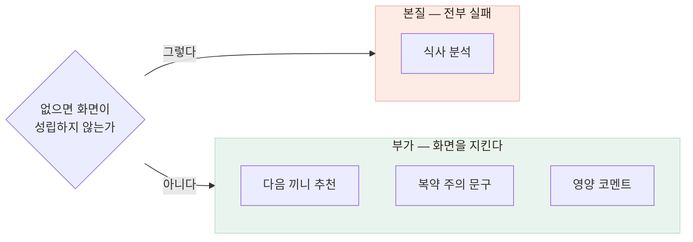
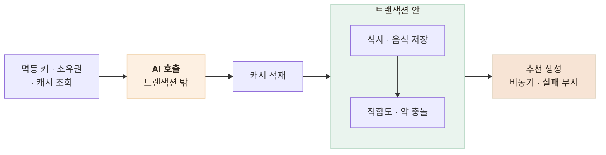

# AI가 죽었을 때 화면을 어디까지 지킬까 — 실패 정책 4등급

> 외부 AI 장애를 "전부 실패"로 처리하지 않기 위해 기능마다 실패 정책을 다르게 둔 기록

<!-- 사진 자리: AI 장애 시 앱 화면 4가지를 나란히 놓은 비교 캡처 — 분석 실패 안내 / 추천 없이도 정상인 홈 / 이전 복약 문구가 남아 있는 화면 / 코멘트만 비어 있는 영양 화면 -->

## 한눈에

| | |
|---|---|
| **문제** | AI 문구 하나가 실패하면 영양 화면 전체가 막혔다 |
| **판단** | 값이 없으면 화면이 성립하는지로 본질과 부가를 갈랐다 |
| **해법** | 기능마다 다른 실패 정책 4등급, 에러 코드는 앱의 다음 행동으로 |
| **결과** | 변환·재시도 판정을 순수 함수로 분리, 테스트 18개로 고정 |

## 갈림길 — 실패를 어디까지 번지게 할까

거의 모든 화면이 AI 응답에 기댄다. 초기 구현은 실패하면 요청 전체를 에러로 반환했고, 기준을 **화면의 성립 여부** 하나로 다시 잡았다.

| 후보 | 내용 | 판단 |
|---|---|---|
| 전부 같은 정책 | 초기 구현 | 폐기 — 부가 정보 하나가 화면 전체를 막는다 |
| **본질·부가 구분** | 값이 없어도 화면이 도는지로 나눈다 | **채택** — 기능별로 등급을 준다 |

## 등급별로 무엇을 남기나

| 기능 | 실패했을 때 | 왜 |
|---|---|---|
| **식사 분석** | 아무것도 저장하지 않고 에러 | 영양소 없는 기록은 계산을 오염시킨다 |
| **다음 끼니 추천** | 무시하고 로그만 — fire-and-forget | 사용자 요청은 이미 성공했다 |
| **복약 주의 문구** | 저장된 **이전 값** 반환 | 없는 것보다 조금 지난 문구가 낫다 |
| **영양 코멘트** | 이전 문구, 없으면 조용히 비운다 | 부가 정보로 화면 전체를 막지 않는다 |

복약 문구는 이전 값을 돌려주되 캐시는 갱신하지 않아 다음 요청에서 다시 시도한다.

## 순서와 코드를 계약으로 고정했다

분석이 오래 걸려 트랜잭션을 열어 둘 수 없었고, 무엇보다 **AI가 실패하면 아무것도 저장되지 않아야** 했다.

앱에 내리는 코드는 상태 코드가 아니라 **앱이 할 일**로 접었다.

| 앱이 받는 것 | 앱이 할 일 | 재시도 |
|---|---|---|
| `MEAL_NO_FOOD_DETECTED` 422 | 다시 찍기 유도 | 무의미 |
| `AI_ANALYSIS_FAILED` 502 | 재시도 버튼 — 알 수 없는 에러도 여기로 접는다 | 가치 있음 |
| `AI_TIMEOUT` 504 | "잠시 후 다시" | 가치 있음 |
| `AI_UNAVAILABLE` 503 | 수동 입력으로 유도 | 운영자 개입 |

- 502로 접는 쪽이 아무 분기도 못 하는 500보다 낫다
- 재시도는 **502에서 1회만, 분석 경로에서만** 한다
- 로그에는 접기 전의 **진짜 원인**을 깊이 3까지 펼쳐 남긴다

## 남은 한계

| 항목 | 상태 |
|---|---|
| 정책 문서화 | 코드로만 표현했고 **문서는 나중** — 새 기능의 등급을 알 수 없다 |
| 이전 값 폴백 | 얼마나 오래된 값인지 화면에 표시하지 않는다 |
| AI 서버 LLM 경로 | 전체 타임아웃 래퍼가 없어 백엔드가 대신 막는 상태다 |

## 배운 점

- 장애 정책은 통일하는 것이 아니라 **기능의 중요도만큼 나눠야** 한다는 것
- 에러 코드는 분류가 아니라 **다음 행동의 지시**로 설계해야 한다는 것
- 원인을 구분해 주지 않는 에러 메시지는 **펼치는 일 자체가 기능**이라는 것
