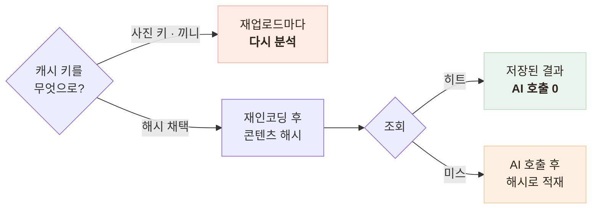
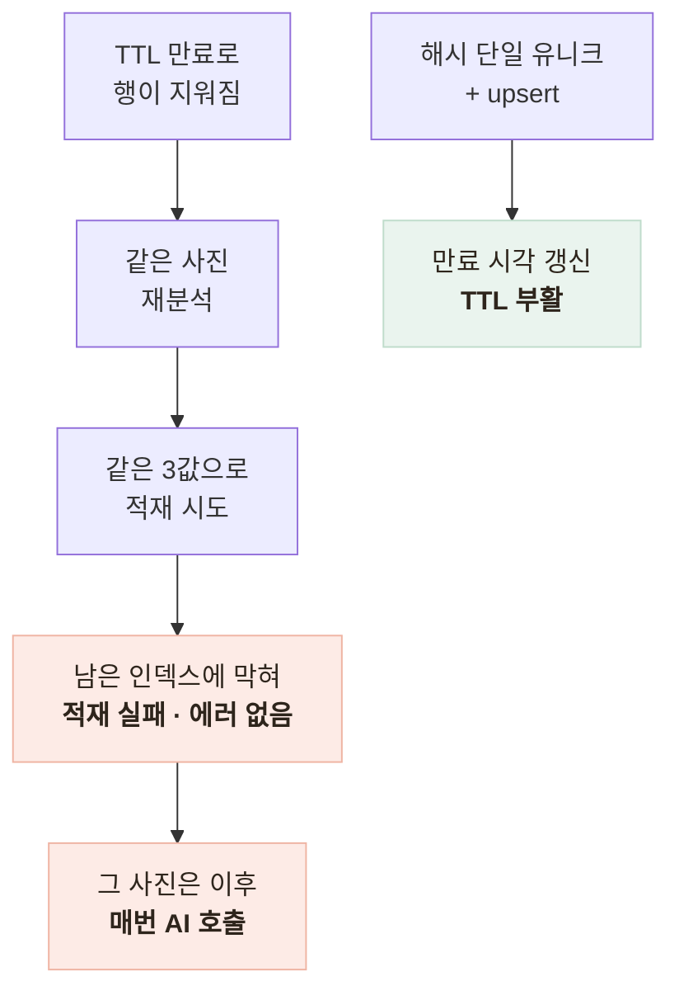

# 같은 사진을 두 번 분석하지 않는다 — 캐시를 일관성 장치로 쓰기

> 비용 절감으로 시작한 분석 캐시가, Vision 출력이 매번 흔들리는 문제를 사용자에게 안 보이게 막는 장치가 된 기록

<!-- 사진 자리: 같은 한정식 사진을 두 번 분석했을 때 캐시 히트로 동일한 영양소가 나오는 로그 캡처 (AI 호출 1회만 찍힌 것) -->

## 한눈에

| | |
|---|---|
| **문제** | 같은 사진을 다시 분석하면 영양소 숫자가 달라졌다 |
| **판단** | 모델을 고칠 수 없으니 같은 사진에 같은 답이 나오게 만든다 |
| **근거** | 같은 사진 5회에 라벨 집합 5가지, 나트륨 1,452~2,942mg |
| **결과** | 이미지 해시 캐시로 AI 호출 1회를 e2e 테스트로 고정 |

## 문제 — 같은 밥상이 매번 다른 숫자가 된다

Vision은 건당 과금이라 재분석은 돈을 두 번 내는 일이지만, 진짜 문제는 비용이 아니었다. 쓰는 분석기에는 **temperature 설정 수단**이 없어 같은 입력에 같은 출력을 요구할 방법이 없다.

| 측정 | 값 |
|---|---|
| 같은 한정식 사진 5회 | 라벨 집합이 **5가지로 갈렸다** (Jaccard 27%) |
| 나트륨 총합 | **1,452mg ~ 2,942mg** 사이에서 흔들렸다 |
| 프롬프트 규칙 + 라벨 정규화 | Jaccard 56%까지 올랐으나 **총합 변동은 거의 안 줄었다** |

주원인은 인식 실패가 아니라 입도였다. 반찬 여섯 개를 6개로 볼지 7개로 볼지가 매번 달라진다. 모델을 고칠 수 없으니 **같은 사진에 같은 답**이 남은 레버였다.

## 갈림길 — 캐시 키를 무엇으로

| 후보 | 내용 | 판단 |
|---|---|---|
| 사진 저장 키 | 업로드마다 새 키 발급 | 폐기 — 같은 사진을 다시 올리면 안 맞는다 |
| 사용자 + 날짜 + 끼니 | 기록 단위로 묶기 | 폐기 — 다른 끼니에 올리면 다시 분석한다 |
| **이미지 콘텐츠 해시** | 재인코딩한 바이트로 계산 | **채택** — 업로드 경로·소유자와 무관하다 |

- 앱이 계산한 해시는 받지 않는다 — 믿을지 고민하는 문제 자체를 없앴다
- 캐시에는 해시와 결과만 담는다 — 해시를 아는 사람은 이미 그 사진의 소유자다

## 유니크 제약 하나가 조용히 비용을 새게 한다

처음 설계는 `(해시, 모델 버전, 테이블 버전)` 3값 유니크였다. 버전별로 나눠 보관하려는 의도였지만, 로그에도 남지 않는 실패 모드가 있었다.

보관 기간은 90일을 기본값으로 뒀고, 캐시 히트 경로에서는 서명 URL을 아예 만들지 않는다.

## 남은 한계

| 항목 | 상태 |
|---|---|
| 캐시의 보장 | **재현성만 보장한다** — 첫 분석이 틀렸으면 90일간 같은 오답이 남는다 |
| 정확도 | 저울과 식약처 DB를 기준으로 한 대조군이 없어 재지 못했다 |
| 해시 민감도 | 살짝 다르게 찍으면 무효 — "같은 밥상"이 아니라 "같은 바이트"를 잡는다 |
| 테이블 교체 | 과거 기록 재분석은 응답에 버전을 실어 둔 것까지만 준비됐다 |

## 배운 점

- 성능 최적화로 시작한 장치가 **품질 문제를 막는 장치**가 될 수 있다는 것
- 모델을 고칠 수 없을 때는 **모델을 덜 부르는 것**도 해결책이라는 것
- 유니크 제약 하나가 **에러 없이 비용만 새는 구조**를 만들 수 있다는 것
