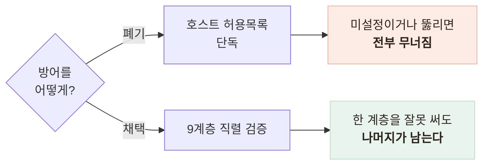
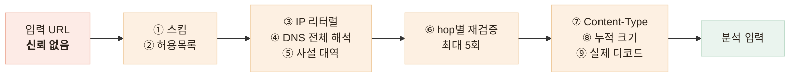

# 사진 URL을 받는 서버의 SSRF 방어 — 9계층 검증과 프라이버시

> 외부에서 받은 문자열로 서버가 직접 요청을 보내는 구조에서, 공격 경로를 세고 계층으로 막은 기록

## 한눈에

| | |
|---|---|
| **문제** | 서버가 외부 문자열을 URL로 해석해 자기 네트워크 위치에서 요청한다 |
| **판단** | 허용목록 단독을 버리고 검증을 9계층으로 직렬로 쌓았다 |
| **근거** | 기준은 방어의 강도가 아니라 **틀렸을 때의 피해**였다 |
| **결과** | 422와 502로 재시도 가치가 갈리고, 못 막는 갭은 명시 후 봉인했다 |

## 갈림길 — 하나로 막을까, 계층으로 쌓을까

계약상 사진은 업로드가 아니라 URL 전달이다. 무상태 서버에는 자연스럽지만, 공격자가 우리 서버를 자기 손처럼 써서 메타데이터 주소와 내부망을 두드릴 수 있다는 뜻이다.

| 후보 | 내용 | 판단 |
|---|---|---|
| 허용목록 단독 | 도메인 목록 한 겹으로 차단 | 폐기 — 설정을 깜빡하면 방어가 0이 된다 |
| **계층 직렬 검증** | 스킴부터 실제 디코드까지 아홉 관문 | **채택** — 오설정의 피해가 한 겹으로 한정된다 |

## 계층 흐름과 실패 코드

리다이렉트 자동 추적은 껐다. 따라가면 검증을 끼울 지점이 사라져, 수동 루프로 **매 hop마다 다시 검증**한다.

| 코드 | 무슨 뜻인가 | 예 |
|---|---|---|
| **422** | 재시도해도 같은 결과인 **금지된 입력** | 사설 IP로 해석됨, 비-HTTP 스킴 |
| **502** | 재시도할 가치가 있는 **업스트림 문제** | DNS 해석 실패 |

사설 IP는 DNS 해석이 성공한 뒤에 걸리므로 422다. 즉 **검증 순서가 곧 코드의 의미**다. 뒤쪽 세 관문은 자기신고를 믿지 않는다 — 크기는 받으면서 세고, 마지막은 실제 디코드다.

## 봉인과 프라이버시

DNS 리바인딩은 **막지 못한다고 자진 명시**하고, 대신 운영 설정으로 덮었다.

| 결정 | 이유 |
|---|---|
| IP 핀닝 폐기 | SNI·Host 유지에 커스텀 전송 계층이 필요해 복잡도가 급증한다 |
| 프로덕션은 **허용목록으로 봉인** | 리바인딩이 나도 목록 밖 도메인은 차단된다 |
| 코드 기본값은 전체 허용 | 운영 버킷을 기본값으로 두면 검증 도구의 외부 이미지가 막힌다 |
| 우회는 **이중 자물쇠** | 플래그와 허용목록이 둘 다 필요하다 — 하나만으로는 효과가 없다 |
| 사진은 메모리에서만 처리 | 디스크에 쓰지 않고, 재인코딩에서 위치 정보가 결과적으로 탈락한다 |
| 로그는 허용목록 방식 | **서명 URL의 경로·토큰**과 프롬프트·API 키는 남기지 않는다 |

허용목록이 비어도 사설 IP 차단은 항상 작동해, 봉인을 깜빡해도 순진한 SSRF는 막힌다.

## 남은 한계

| 항목 | 상태 |
|---|---|
| 리바인딩 갭 | 남아 있고, 봉인이 **사람의 규율에 의존**한다 |
| 로그 금지 필드 | 부재를 단언하는 테스트가 없어 코드 리뷰와 육안에 의존한다 |
| 외부 LLM 전송 | **서버 코드로 막을 수 없다** — 약관과 계약으로 다룰 문제다 |

## 배운 점

- "URL을 받는다"는 한 줄의 계약이 곧 **공격 표면**이라는 것
- 방어를 고르는 기준은 강도가 아니라 **틀렸을 때의 피해**라는 것
- 못 막는 것을 남기는 것도 방어라는 것 — **모르는 갭**은 덮을 수 없다
