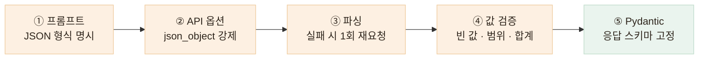

# AI 출력을 그대로 내보내지 않습니다 — JSON 강제부터 Pydantic 계약까지

매번 달라질 수 있는 모델 출력을 5단계로 걸러, 앱이 받는 응답 형태를 코드로 고정했습니다

## 한눈에

| | |
|---|---|
| **문제** | LLM 출력은 형식 약속을 지키지 않을 수 있습니다 — 코드펜스, 빈 값, 음수, 없는 키가 언제든 섞입니다 |
| **판단** | 모델을 더 믿는 대신, 프롬프트 → API 옵션 → 파싱 → 값 검증 → 응답 스키마의 각 지점에 방어를 겹쳤습니다 |
| **근거** | 형식 제어를 프롬프트 하나에만 맡기면 모델의 실수가 그대로 앱 화면까지 전파됩니다 |
| **결과** | 성공 응답은 Pydantic 모델로 고정하고, 형식을 복구할 수 없으면 잘못된 값 대신 명확한 오류로 실패시킵니다 |



## ① 프롬프트 — 형식을 문장이 아니라 스키마로 못박습니다

"JSON으로 답해줘" 정도로는 부족합니다. 식단 분석 프롬프트에는 **키 이름·타입·값 범위까지 적은 형식 한 줄**을 그대로 넣고, 형식 밖의 출력을 금지합니다.

```text
사진 속 음식을 모두 찾아 아래 형식의 JSON 객체로만 응답하라.
다른 텍스트·설명·코드펜스는 절대 출력하지 않는다.
{"foods": [{"name": "...", "nameKo": "...", "areaShare": 0.0~1.0,
  "confidence": 0.0~1.0, "nutrients": {"calories": 정수, ...}}]}
```

## ② API 옵션 — JSON 객체 형태를 API 수준에서 제한합니다

프롬프트와 별개로 OpenAI 호출에 `response_format: {"type": "json_object"}`를 설정해 **응답이 유효한 JSON 객체 형태가 되도록 제한**합니다. 이 옵션이 보장하는 것은 딱 거기까지입니다 — **키·타입·값 범위는 뒤의 검증 단계에서 보장합니다.** 여기에 낮은 temperature를 사용하고, 출력 길이에도 상한을 두었습니다.

이 모드는 JSON "객체"만 허용하기 때문에, 음식 **목록**을 받아야 하는 응답도 `{"foods": [...]}` 객체로 감싸도록 프롬프트와 맞춰두었습니다 — 옵션 하나를 켜는 것도 프롬프트 계약과 함께 설계해야 동작합니다.

## ③ 파싱 — 그래도 깨질 수 있으니, 실패하면 한 번만 다시 요청합니다

응답은 문자열로 받아 코드펜스(```)를 제거한 뒤 JSON으로 파싱합니다. 실패하면 **"직전 응답이 유효한 JSON이 아니었다. 위 형식의 JSON 객체만 다시 출력하라"를 붙여 1회 재요청**하고, 그래도 실패하면 애매한 값을 내보내는 대신 **502(LLM_OUTPUT_INVALID)로 명확하게 실패**시킵니다.

재시도를 1회로 제한한 이유가 있습니다. 이 서버를 호출하는 백엔드도 재호출 주체라서, **층마다 재시도를 두면 장애 1건이 여러 배의 과금 호출로 불어납니다.** 재시도 정책은 한 곳에만 둡니다.

## ④ 값 검증 — JSON이 유효해도 내용까지 믿지 않습니다

파싱에 성공한 JSON도 그대로 쓰지 않습니다. 항목마다 값을 확인해 **버리거나, 잘라내거나, 계약에 맞게 보정**합니다.

| 확인하는 것 | 처리 |
|---|---|
| 이름이 빈 항목 | 항목을 버립니다 |
| 영양소 5개 키 — 누락·숫자 아님·음수 | 그 음식의 영양소를 채택하지 않습니다 (`null` + 경고) |
| `confidence`·`areaShare`가 0~1 범위 밖 | 범위 안으로 잘라냅니다 |
| 면적 비중의 합이 1 초과 | 비례 축소해 "합 ≤ 1" 계약을 유지합니다 |
| 같은 음식을 다른 이름으로 중복 보고 | 표준 라벨로 정규화한 뒤 하나로 합칩니다 |

작은 면적 조각을 걸러내는 판정도 모델에게 맡기지 않습니다. 프롬프트에 "3% 미만은 보고하지 마"를 넣어 봤더니 **모델이 매번 다르게 판단해 음식 개수가 오히려 더 흔들렸습니다**(같은 사진 5회 호출에 개수 편차 증가). **형식과 명확한 수치 규칙은 모델의 지시 준수에 기대지 않고, 서버 코드에서 결정론적으로 처리했습니다.**

## ⑤ Pydantic — 내보내기 직전, 응답 구조를 코드로 강제합니다

검증을 통과한 결과는 FastAPI의 `response_model`로 선언된 **Pydantic 모델을 통해서만 응답으로 나갑니다.** 필드 이름·타입·필수 여부를 코드로 검증해 **성공 응답의 형태를 하나로 통일했습니다** — 정상 응답으로는 계약에 정의된 형태만 내보냅니다.

```python
class FoodItem(BaseModel):
    name: str
    nameKo: str
    confidence: float
    areaShare: float
    portion: Literal["small", "regular", "large"]
    nutrients: Optional[Nutrients] = None  # 미등록 음식은 에러 대신 null + warnings

class AnalyzeResponse(BaseModel):
    foods: list[FoodItem]
    totalNutrients: Nutrients
    warnings: list[str] = []
    ...
```

모르는 음식이 나와도 요청 전체를 실패시키지 않습니다 — 영양소만 `null`로 두고 `warnings`에 `unknown_food:라벨`을 담아, **계약은 지키면서 무엇이 빠졌는지 알려줍니다.**

## 이 계약은 검증 하네스가 실제 서버에서 다시 확인합니다

이렇게 고정한 응답 계약은 검증 하네스의 검사 항목이기도 합니다 — **최종 `totalNutrients`의 5개 키가 항상 존재하는지**, 각 음식의 유효한 영양소가 합계에 올바르게 반영되는지, 사진 누락 시 422가 나는지를 확인합니다. 코드가 계약을 만들고, **하네스가 실행 중인 서버에서 그 계약이 실제로 지켜지는지 34개 검사로 확인**합니다.

파싱과 값 검증은 분석 백엔드들이 **공유하는 한 곳**에 있습니다. 모델별 출력 차이는 이 분석 계층 안에서 흡수하고, **앱이 의존하는 API 계약은 모델과 분리했습니다.** 분석 백엔드를 교체하더라도 앱의 응답 형태는 바뀌지 않습니다.
