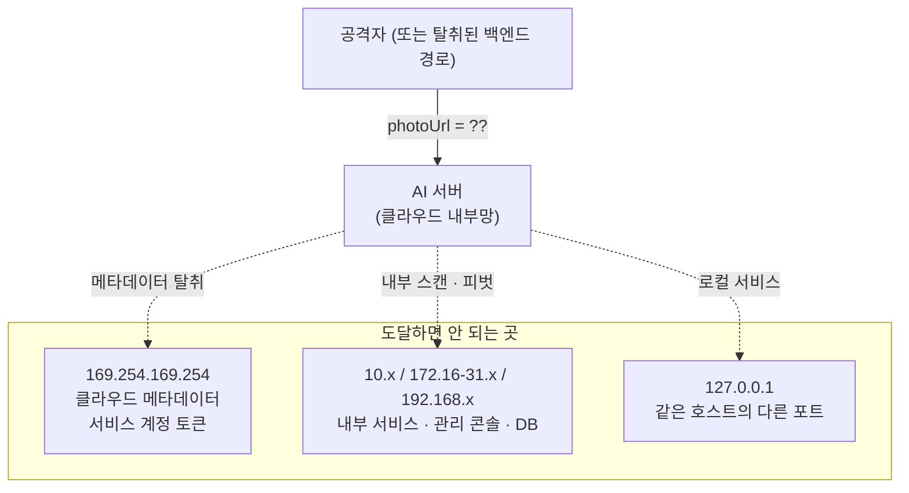

# 이미지 보안 — SSRF 방어와 프라이버시

> 계약상 사진은 업로드가 아니라 **URL 전달**입니다(백엔드가 GCS에 올리고 AI 서버는 URL만 받음).
> 무상태와 대용량 회피를 위한 선택이었지만 — **입력이 URL인 서버는, 공격자에게 자기 네트워크
> 위치를 빌려주는 서버**입니다.

## 문제 — photoUrl로 도달할 수 있는 곳

AI 서버는 클라우드 내부망에 있습니다. `photoUrl`에 무엇을 넣느냐에 따라 도달할 수 있는 곳:

1. **클라우드 메타데이터 탈취** — 서비스 계정 토큰·임시 자격증명. 성공하면 **클라우드 계정
   자체가 위험해집니다.** SSRF 중 가장 치명적
2. **내부 서비스 스캔·피벗** — 방화벽 뒤의 관리 콘솔·내부 API. 응답 시간 차이만으로도 포트 스캔이 됩니다
3. **DNS 리바인딩** — 검증 시점엔 공인 IP, 연결 시점엔 사설 IP로 해석되게 조작
4. **비-HTTP 스킴** — `file:///etc/passwd`, `gs://`, `ftp://`

그리고 이 URL이 가리키는 것은 **어르신의 식사·생활이 담긴 민감 데이터**라,
SSRF와 프라이버시를 같은 계층에서 다뤄야 했습니다.

## 선택 — 실수했을 때 덜 위험한 쪽으로

**허용목록 vs 차단목록**

| 후보 | 장점 | 단점 |
|---|---|---|
| 허용목록만 | 가장 안전 | **개발·테스트에서 임의 이미지 사용 불가** — 결국 누군가 검증을 통째로 끄게 된다 |
| 차단목록만 | 유연 | **놓친 대역이 곧 구멍** — 신규 예약 대역·IPv6 매핑을 계속 따라가야 함 |
| **차단은 항상 + 허용목록은 프로덕션 옵션** | 개발 편의와 운영 안전 분리 | 설정을 켜야 좁아짐 |

스킴 제한과 사설·링크로컬 대역 차단은 **설정과 무관하게 항상** 적용되고,
프로덕션에서는 허용목록을 GCS 호스트로 좁히도록 문서에 명시했습니다.

**리다이렉트는 수동 루프** — httpx 자동 추적을 쓰면 hop별 검증 지점이 없습니다.
검증을 통과한 공인 URL이 사설 IP로 리다이렉트하면 그대로 뚫립니다.
`follow_redirects=False`로 끄고 **최대 5 hop 수동 루프**를 돌며 매 hop 검증을 다시 태웁니다.

**크기 제한은 스트림으로** — `Content-Length` 헤더는 속일 수 있습니다.
**스트리밍 중 누적 바이트를 세어** 15MB 초과 시 즉시 끊습니다. 다 받은 뒤에는 이미 늦습니다.

**에러 코드는 원인별로** — DNS 실패는 **502**(재시도 의미 있음), 사설 IP는 **422**(재시도 무의미).
소비자의 다음 행동이 다르므로 코드도 달라야 합니다.

## 결과

- 검증 계층: 스킴 → 허용목록 → IP 리터럴 → **DNS 전체 해석** → 사설 대역 → hop별 재검증 →
  Content-Type → 누적 크기 → 디코드
- `getaddrinfo`의 **모든 결과를 검사** — A 레코드가 여러 개면 하나라도 사설이면 차단.
  IPv4-mapped IPv6(`::ffff:192.168.x.x`)는 매핑을 풀어 재검사
- 하네스가 **실서버에 실제 악성 URL을 쏴서** 차단을 확인 — 34/34
- **EXIF 방위 정규화 후 메타데이터 제거** — 위치정보가 GPT로 넘어가지 않음
- 로그는 화이트리스트 방식 — photoUrl·지병·약 이름을 남기지 않음
- **못 막은 것도 문서화** — DNS 리바인딩(TOCTOU)은 IP 핀닝의 복잡도 대비 MVP 이득이 작다고
  판단해 수용하고 명시. 프로덕션 허용목록을 켜면 이 경로 자체가 닫힘

## 배운 점

- **입력 형식 하나가 공격 표면을 결정한다** — "업로드 대신 URL"을 고른 순간 SSRF가 따라왔다
- 방어는 한 겹이 아니라 **계층**이어야 한다 — 스킴·대역·허용목록·hop·크기가 각각 다른 공격을 막는다
- **막지 못한 것을 적는 것**이 막은 것을 적는 것만큼 중요하다 — 안 적으면 다음 사람은 막혀 있다고 믿는다
