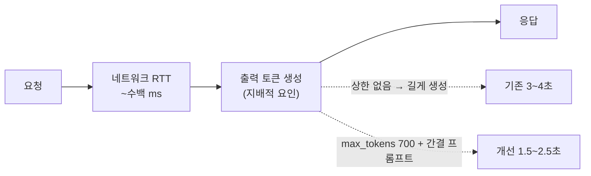

# GPT 비용 12배·응답 2배 — 측정이 찾은 최적화

> 추측하지 않고 측정했더니, 로직 수정 없이 비용과 속도가 잡힌 기록

## 무슨 문제가 있었나

- 어르신이 식사마다 사진을 올린다 — 1일 3~4끼 × 사용자 수만큼 Vision 호출
- 그런데 **아무도 건당 비용을 몰랐다** — 대시보드의 월 합계만 있고, 분석 때문인지 문구 생성 때문인지도 구분 불가
- 추천 문구·복약 주의사항 응답도 **3~4초** — 어르신이 결과 화면에서 기다리는 시간

## 원인을 어떻게 찾았나

- 서버와 **완전히 동일한 경로**(다운로드 → EXIF → 리사이즈 → base64)로 실측 스크립트를 만들어 API `usage`를 읽음
- 결과: 입력 **37,009 토큰, 건당 8.08원** — 비용의 거의 전부가 이미지 입력 토큰
- 응답 지연도 쪼개 보니 네트워크가 아니라 **출력 토큰 생성 시간**이 지배 요인

## 어떤 선택지가 있었고, 무엇을 선택했나

### 비용 — 해상도 축소 vs 비전 상세도(detail) 축소

- 해상도를 낮춰도 **토큰은 거의 안 줄어든다** — 타일 계산 방식이라 해상도에 비례하지 않음
- 이 파이프라인이 GPT에게 요구하는 건 **음식 이름과 면적 비중**뿐 — 글자·미세 질감을 읽지 않는다
- **저해상도로 충분한 작업에 고해상도 요금을 내고 있었다** → `detail: low` 적용

### 속도 — 지배 요인이 아닌 레버는 당기지 않는다

- 출력 간결화(프롬프트) + `max_tokens` 상한 700 채택 — 생성 토큰 자체를 줄이는 게 가장 큰 이득
- 커넥션 재사용(수백 ms)은 **지배 요인이 아니라 보류** — 확실한 이득이라도 순서가 있다

## 결과 — 측정으로 검증

| | 개선 전 | 개선 후 |
|---|---|---|
| Vision 건당 비용 | 8.08원 (37,009 토큰) | **0.68원 (3,007 토큰) — 12배** |
| 복약 주의사항 응답 | ~4.6초 | **~2.0초** |
| 추천 메뉴 응답 | ~3.2초 | **~2.5초** |

- 인식 품질 유지 확인 — 동일 사진 confidence 0.9
- 이 수치로 **자체 모델 전환 손익분기가 월 44만 건**으로 계산됨 — "GPU를 올려야 한다"는 판단을 한참 뒤로 미뤘다
- 이후 응답에 usage(토큰·예상 비용)를 실어 **호출마다 대시보드에서 보이게** 함

## 남은 한계

- 측정 표본이 사진 1장 — 반찬 많은 상차림은 토큰이 다를 수 있다
- `detail: low`의 품질 영향을 정확도 회귀 세트로 고정하지 못했다

## 경험을 통해 배운 점

- **비용은 기능이 아니라 설정에 숨어 있을 수 있다**는 것 — 로직 수정 0줄로 12배가 줄었다
- 최적화 전에 **동일 경로로 재현하는 측정 스크립트**부터 만들어야 한다는 것
- "싼 것을 골랐다"가 아니라 **"이 작업에 그 품질이 필요한가"** 를 먼저 물어야 한다는 것
