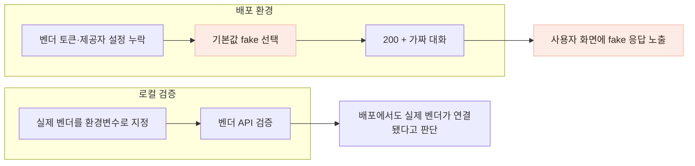
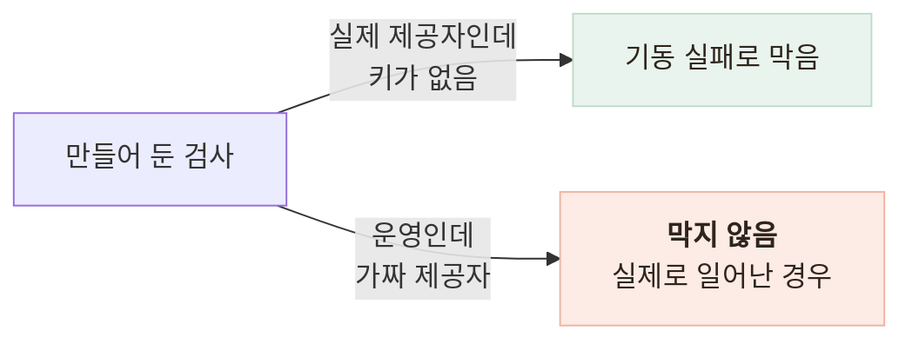

# 운영에서 개발용 가짜 챗봇이 응답하던 문제를 막았습니다

> 로컬에서는 실제 벤더를 검증했지만 배포 환경에는 토큰이 없어서, 기본값으로 설정한 가짜 챗봇이 사용자에게 응답하고 있었습니다.

## 한눈에

| | |
|---|---|
| **증상** | 어르신의 말풍선에 `[fake stt] 74862바이트`가 표시됐습니다. |
| **원인** | 배포 환경에 벤더 설정이 없었고, 챗봇 제공자의 기본값이 개발용 `fake`였습니다. |
| **놓친 이유** | 가짜 챗봇도 `200`과 정상 형태의 응답을 반환해 서버 오류와 화면만으로는 드러나지 않았습니다. |
| **수정** | 운영 환경에서는 가짜 챗봇이 응답을 만들지 않고 `503`으로 중단하도록 했습니다. |

## 사용자는 대화하고 있었지만 실제 AI는 호출되지 않았습니다

벤더 없이도 앱과 백엔드를 개발할 수 있도록 질문·STT·TTS 응답을 만드는 `FakeChatbotAdapter`를 두었습니다. 문제는 이 구현이 개발 환경뿐 아니라 설정이 없는 운영 환경에서도 기본값으로 선택됐다는 점입니다.

배포 뒤 실기기에서 건강 대화를 사용한 사람이 `[fake stt] 74862바이트`라는 문구를 발견했습니다. 화면에 보인 질문도 가짜 챗봇에 넣어 둔 문장과 일치했습니다.

| 당시 관측값 | 상태 |
|---|---|
| HTTP 응답 | `200 OK` |
| 앱 화면 | 질문과 답변이 이어져 정상처럼 보임 |
| 서버 오류 로그 | 0건 |
| 자동 테스트 | 366개 통과 |
| 로컬 벤더 검증 | 환경변수로 실제 벤더를 직접 지정해 실행 |

가짜 구현이 오류 없이 의도한 응답을 반환하고 있었기 때문에 일반적인 오류 모니터링으로는 발견하기 어려웠습니다.

## 로컬 검증 설정과 배포 설정이 달랐습니다

로컬 검증 명령은 `CHATBOT_PROVIDER=damicare`와 실제 토큰을 직접 넣어 실행했습니다. 하지만 그 설정을 배포 환경에 옮기는 단계가 빠졌고, 배포 서버는 기본값인 `fake`로 시작했습니다. **실제 벤더를 검증한 사실이 배포 설정까지 검증해 주지는 않았습니다.**

## 같은 문제를 막는 장치를 이미 만들어 뒀지만 방향이 반대였습니다

설정을 옮기는 단계를 빠뜨린 것은 절차 실수지만, 이 사고가 사용자에게까지 닿은 이유는 **제가 만들어 둔 안전장치가 반대 방향만 막고 있었기 때문**입니다.

같은 프로젝트의 식단 분석 AI 제공자에는 이미 같은 성격의 검사를 넣어 뒀습니다.

"실제 제공자를 골랐는데 키가 없는 경우"는 막았지만, "운영인데 가짜를 골랐는지"는 묻지 않았습니다. 앞의 경우는 개발자가 곧바로 알아채는 실패이고, 뒤의 경우는 **사용자에게만 보이는 실패**입니다.

같은 검사를 두 곳에 쓰면서 물었어야 할 것은 코드 형태가 아니라 **그 출력을 결국 누가 보는가**였습니다.

## 운영에서는 가짜 응답보다 명확한 실패를 선택했습니다

| 방법 | 판단 |
|---|---|
| 배포 체크리스트에 설정 추가 | 같은 종류의 수동 누락이 반복될 수 있어 이것만으로는 부족했습니다. |
| 토큰이 없으면 모든 환경에서 서버 기동 실패 | 로컬 개발과 외부 연결이 없는 테스트도 막히므로 제외했습니다. |
| **운영에서 가짜 챗봇 호출을 `503`으로 중단** | 개발용 fake는 유지하면서 사용자에게 가짜 건강 상담이 나가는 것을 막을 수 있어 선택했습니다. |

운영 환경에서는 가짜 챗봇의 상담 시작·메시지·프로필·동의·STT·TTS 메서드가 응답을 만들기 전에 `CHATBOT_UNAVAILABLE` 오류를 냅니다. 서버가 시작될 때도 운영에서 `fake`가 선택됐다는 오류 로그를 남깁니다.

| 변경 전 | 변경 후 |
|---|---|
| `200`과 가짜 질문·답변 | `503`과 “지금은 건강 대화를 할 수 없어요” 안내 |
| 서버 오류 로그 없음 | 서버 시작 시 잘못된 제공자 설정 기록 |
| 사용자가 문구를 보고 알려줄 때 발견 | 첫 상담 요청에서 설정 문제 확인 가능 |

운영에서 그럴듯한 가짜 응답은 기능을 유지하는 대체 수단이 아니라, 실제 연결 실패를 숨기는 결과가 됐습니다. 그래서 운영에서는 **틀린 답을 정상처럼 보여주기보다 기능이 현재 사용할 수 없음을 명확히 알리는 방식**을 선택했습니다.

## 재발 방지

- 로컬 환경에서는 가짜 챗봇이 계속 동작하는지 확인했습니다.
- 운영 환경에서는 상담·음성·동의 등 실제 사용자 경로가 모두 `503`으로 중단되는지 자동화 테스트로 남겼습니다.
- 배포 후 검증의 첫 단계에 **배포된 환경이 실제 벤더를 선택했는지** 확인하는 항목을 추가했습니다.
- 실제 벤더를 선택한 경우에는 부팅 시 `/usage`를 호출해 토큰이 유효한지도 구분하도록 했습니다.

현재도 배포 환경변수를 배포 파이프라인에서 강제하지는 못합니다. 다만 설정이 다시 빠지더라도 사용자가 가짜 건강 상담을 받는 상태로 조용히 운영되지는 않습니다.
