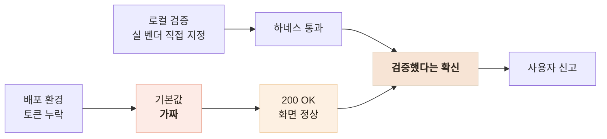
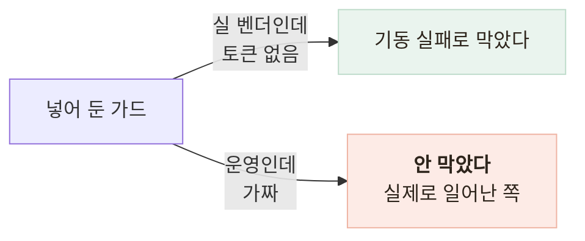

# 모든 지표가 초록인데 사용자는 가짜 AI와 대화하고 있었다

> 테스트 366개 통과·에러 로그 0건 상태에서 개발용 가짜 챗봇이 운영에 나간 사고, 그리고 그것이 내 설계 결정 때문이었다는 기록

<!-- 사진 자리: 실기기 화면에서 사용자 말풍선에 "[fake stt] 74862바이트"가 떠 있는 건강대화 캡처 -->

## 한눈에

| | |
|---|---|
| **증상** | 어르신 화면 말풍선에 `[fake stt] 74862바이트`가 떴다 |
| **원인** | 환경변수 기본값이 `fake`인데 배포 환경에 벤더 토큰을 넣지 않았다 |
| **해법** | 운영 환경에서만 가짜 어댑터가 **503**으로 멈추게 했다 |
| **결과** | 사용자 신고가 아니라 **첫 요청**에서 드러난다 |

## 지표는 전부 초록이었다

| 신호 | 상태 |
|---|---|
| HTTP 응답 | 200 |
| 화면 | 질문이 나오고 대화가 진행돼 정상으로 보였다 |
| 서버 에러 로그 | 0건 |
| 자동 테스트 | 366개 통과 |
| AI 검증 하네스 | 18/19 통과 (실 벤더로 돌렸다) |

가짜가 "정상적으로" 가짜 응답을 200으로 돌려줬으므로 **모니터링**으로 탐지될 유형이 아니었다.

## 검증했다는 확신이 어디서 왔나

같은 프로젝트의 AI 프로바이더에는 같은 가드를 이미 넣어 뒀는데, 막는 **방향**이 반대였다.

## 고친 방법

| 후보 | 판단 |
|---|---|
| 배포 체크리스트에 항목 추가 | **휴먼 에러**에 취약 — 이번 사고의 직접 원인과 같은 종류다 |
| 부팅 시 토큰 검사, 없으면 기동 실패 | 개발과 CI가 막힌다 |
| **운영 환경에서만 가짜가 503** (채택) | 개발은 그대로 두고 운영에서는 시끄럽게 멈춘다 |

- 가짜 어댑터 8개 메서드의 첫 줄에서 **동기 예외**를 던진다
- 부팅 자가진단으로 토큰 유효성을 로그에 남겨 깨진 토큰과 구분한다
- 검증 계층 맨 앞에 **환경 동등성**과 **경로 동등성** 두 층을 넣었다

## 결과

| 전 | 후 |
|---|---|
| 200 + 가짜 대화 | **503** "지금은 건강 대화를 할 수 없어요" |
| 로그 무에러 | 부팅 시 "운영인데 프로바이더가 가짜다" 에러 |

운영에서 폴백이 그럴듯한 가짜라면 그것은 폴백이 아니라 **은폐**다.

## 남은 한계

| 항목 | 상태 |
|---|---|
| 배포 환경변수 체크리스트 | **문서로만** 있고 파이프라인이 강제하지 않는다 |
| AI 서버의 mock 백엔드 | 여전히 기본값이다 — 개발자만 본다는 차이로 뒤로 뒀다 |
| 배포 반영 지연 | **25~35분**이라 재검증 시점을 사람이 챙겨야 한다 |

## 배운 점

- **안전한 기본값**은 동작하지 않는 것이지 가짜로 동작하는 것이 아니라는 것
- 같은 패턴을 두 곳에 쓸 때 물어야 하는 것은 코드가 아니라 **출력의 소비자**라는 것
- 초록불은 안전의 증거가 아니라 **내가 물어본 질문**에만 답한 결과라는 것
