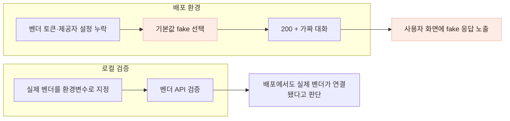
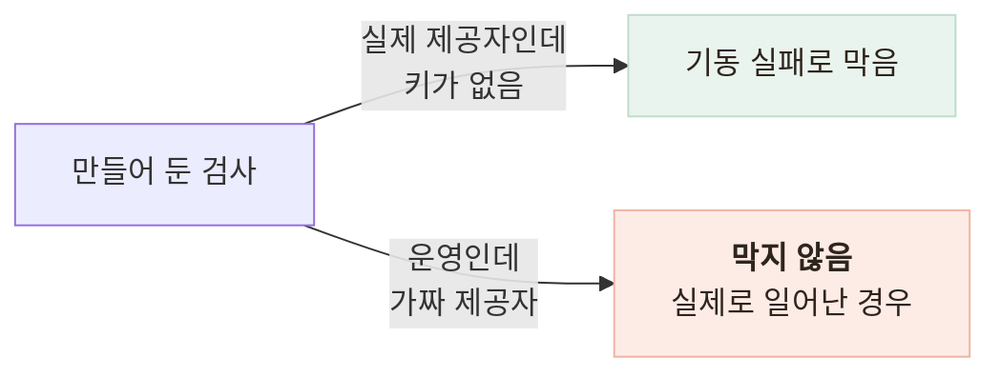

# 운영 환경에서 개발용 가짜 챗봇이 노출되지 않도록 막았습니다

> 로컬에서는 실제 벤더 API를 검증했지만, 배포 환경에 제공자와 토큰 설정이 빠지면서 **기본값인 개발용 `fake` 챗봇이 사용자에게 응답하고 있었습니다.**

## 한눈에

| | |
|---|---|
| **증상** | 어르신의 말풍선에 `[fake stt] 74862바이트`가 표시됐습니다. |
| **원인** | 배포 환경에 벤더 설정이 없었고, 챗봇 제공자의 기본값이 개발용 `fake`였습니다. |
| **놓친 이유** | 가짜 챗봇도 `200`과 정상 형태의 응답을 반환해 오류 모니터링과 기존 테스트에서는 드러나지 않았습니다. |
| **수정** | 운영 환경에서는 가짜 챗봇이 응답을 만들지 않고 `503`으로 중단하도록 했습니다. |

## 사용자는 대화하고 있었지만 실제 AI는 호출되지 않았습니다

벤더 없이도 앱과 백엔드를 개발할 수 있도록 질문·STT·TTS 응답을 만드는 `FakeChatbotAdapter`를 두었습니다. 문제는 이 구현이 개발 환경뿐 아니라 설정이 없는 운영 환경에서도 기본값으로 선택됐다는 점입니다.

 

배포 뒤 실기기에서 건강 대화를 사용한 사람이 `[fake stt] 74862바이트`라는 문구를 발견했습니다. 화면에 보인 질문도 가짜 챗봇에 넣어 둔 문장과 일치했습니다.

| 당시 관측값 | 상태 |
|---|---|
| HTTP 응답 | `200 OK` |
| 앱 화면 | 질문과 답변이 이어져 정상처럼 보임 |
| 서버 오류 로그 | 0건 |
| 자동 테스트 | 366개 통과 |
| 로컬 벤더 검증 | 환경변수로 실제 벤더를 직접 지정해 실행 |

문제는 서버가 실패한 것이 아니라, **잘못된 구현이 정상적으로 동작하고 있었다는 점**이었습니다. `FakeChatbotAdapter`도 `200`과 정상 스키마를 반환했기 때문에 기존 오류 모니터링과 테스트에서는 이상으로 드러나지 않았습니다.

## 로컬 검증 설정과 배포 설정이 달랐습니다

로컬 검증 명령은 `CHATBOT_PROVIDER=damicare`와 실제 토큰을 직접 넣어 실행했습니다. 하지만 그 설정을 배포 환경에 옮기는 단계가 빠졌고, 배포 서버는 기본값인 `fake`로 시작했습니다. **실제 벤더를 검증한 사실이 배포 설정까지 검증해 주지는 않았습니다.**

## 설정 누락보다 더 큰 문제는 fake가 운영에서도 허용된다는 점이었습니다

배포 설정을 옮기지 않은 것은 수동 작업에서 발생한 실수였습니다. 하지만 같은 실수가 사용자에게까지 노출된 이유는 **운영 환경에서도 `fake` 제공자를 정상적인 선택으로 허용하고 있었기 때문**입니다.

식단 분석 쪽에는 실제 제공자를 선택했는데 키가 없으면 실패하도록 검사가 있었지만, **운영에서 개발용 제공자가 선택됐는지 확인하는 조건은 없었습니다.**

"실제 제공자를 골랐는데 키가 없는 경우"는 막았지만, "운영인데 가짜를 골랐는지"는 확인하지 않았습니다. 앞의 경우는 서버가 바로 실패해 개발자가 알아차릴 수 있었지만, 뒤의 경우는 **정상 응답처럼 보여 사용자에게까지 그대로 전달되는 실패**였습니다.

## 운영에서는 가짜 응답보다 명확한 실패를 선택했습니다

| 방법 | 판단 |
|---|---|
| 배포 체크리스트에 설정 추가 | 같은 종류의 수동 누락이 반복될 수 있어 이것만으로는 부족했습니다. |
| 토큰이 없으면 모든 환경에서 서버 기동 실패 | 로컬 개발과 외부 연결이 없는 테스트도 막히므로 제외했습니다. |
| **운영에서 가짜 챗봇 호출을 `503`으로 중단** | 개발용 fake는 유지하면서 사용자에게 가짜 건강 상담이 나가는 것을 막을 수 있어 선택했습니다. |

챗봇 설정 하나 때문에 다른 기능까지 함께 중단시키기보다는, **챗봇 경로만 명확하게 사용할 수 없는 상태로 만들기 위해 `503`을 선택했습니다.**

운영 환경에서는 가짜 챗봇의 상담 시작·메시지·프로필·동의·STT·TTS 메서드가 응답을 만들기 전에 `CHATBOT_UNAVAILABLE` 오류를 냅니다. 서버가 시작될 때도 운영에서 `fake`가 선택됐다는 오류 로그를 남깁니다.

| 변경 전 | 변경 후 |
|---|---|
| `200`과 가짜 질문·답변 | `503`과 “지금은 건강 대화를 할 수 없어요” 안내 |
| 서버 오류 로그 없음 | 서버 시작 시 잘못된 제공자 설정 기록 |
| 사용자가 문구를 보고 알려줄 때 발견 | 서버 시작 로그와 첫 상담 요청에서 설정 문제 확인 가능 |

운영에서 그럴듯한 가짜 응답은 기능을 유지하는 대체 수단이 아니라, 실제 연결 실패를 숨기는 결과가 됐습니다. 그래서 운영에서는 **틀린 답을 정상처럼 보여주기보다 기능이 현재 사용할 수 없음을 명확히 알리는 방식**을 선택했습니다.

## 재발 방지

- 운영 환경에서 `fake`가 선택되면 **상담·STT·TTS 등 7개 호출이 가짜 응답을 만들지 않고 `CHATBOT_UNAVAILABLE`로 종료되는지** 자동화 테스트로 남겼습니다.
- 배포 후에는 **실제 배포 서버에서 상담이 시작되는지 직접 확인**하도록 검증 절차를 추가했습니다.
- 실제 벤더를 선택한 경우에는 시작 시 `/usage`를 호출해 **토큰이 실제로 유효한지까지 확인**하도록 했습니다.

배포 환경변수 자체를 자동으로 강제하는 단계까지는 만들지 않았습니다. 대신 같은 설정 누락이 다시 발생해도 **개발용 가짜 상담이 정상 서비스처럼 사용자에게 전달되지 않도록 막았습니다.**
