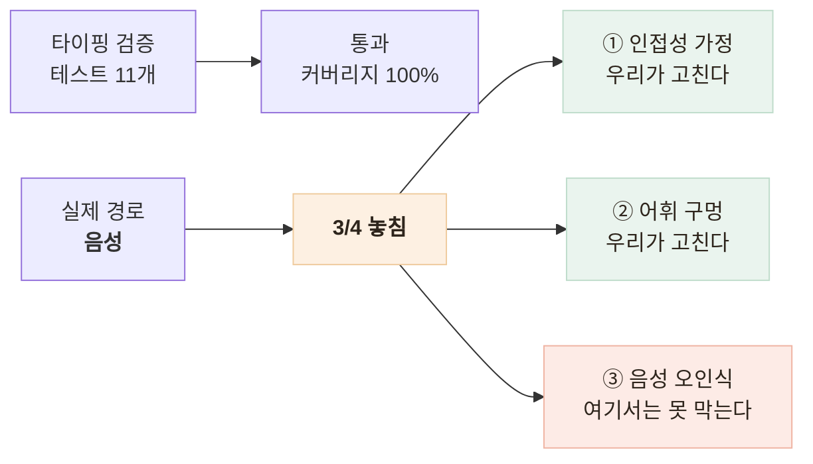

# 타이핑으로만 검증한 안전장치가 음성에서 4분의 3을 놓쳤다

> 단위 테스트 11개 통과·라인 커버리지 100% 상태에서 실제 발화 4건 중 3건을 놓친 원인을 세 갈래로 나눈 기록

<!-- 사진 자리: 말한 문장과 음성 인식이 들은 문장을 나란히 놓고 놓친 3건에 표시를 넣은 비교 표 -->

## 한눈에

| | |
|---|---|
| **증상** | 응급 가드가 실제 음성 발화 **4건 중 3건**을 놓쳤다 |
| **원인** | 인접성 가정·어휘 구멍·음성 인식 오인식이 겹쳤다 |
| **해법** | 근접 판정과 구어 어휘를 넓히고 **음성 경로**를 검증에 넣었다 |
| **결과** | 음성 실측 **1/4 → 4/4**, 오탐 0건 |

## 검증한 경로와 실제 경로가 달랐다

## 어떻게 셋으로 갈랐나

| 말한 것 | 음성 인식이 들은 것 | 결과 |
|---|---|---|
| 가슴이 너무 아프고 숨이 안 쉬어져요 | 가슴이 너무 아프고, 숨이 안 쉬어져요. | 격상 |
| 갑자기 한쪽 팔다리에 힘이 빠지고 말이 어눌해요 | …말이 **어느래요** | 놓침 |
| 숨이 차서 말을 못 하겠어요 | **숨이 자서** 말을 못하겠어요 | 놓침 |
| 정신이 자꾸 흐릿해지고 어지러워요 | (정확히 인식) | 놓침 |

- 첫 결론은 "음성 인식이 잘못 들어서"였는데 **4행**이 그 설명을 깨뜨린다
- 정확히 인식된 문장도 놓쳤으니 음성과 **무관한 원인**이 최소 하나 더 있다
- 격상된 1행도 **흉통**은 안 걸렸다 — 셋 중 둘은 타이핑해도 틀려 있었다

## 고친 방법

| 후보 | 판단 |
|---|---|
| "힘이 빠진다"를 그대로 추가 | **오탐 폭증** — 어르신이 노쇠를 말할 때 늘 쓰는 표현이다 |
| **편측(한쪽·왼쪽·오른쪽)을 함께 요구** (채택) | 뇌졸중 판정 기준도 *한쪽* 위약이라 의학적으로도 옳은 선이다 |

- 근접 판정은 수식어는 덮되 **문장 경계**는 넘지 않게 폭을 제한했다
- 테스트가 판정 결과 대신 **판정 근거**, 즉 걸린 신호 목록을 단언하게 고쳤다
- ③은 **벤더 협의 항목**(인식 신뢰도 점수 제공)으로 올리고 한계로 남겼다

## 결과

| 항목 | 값 |
|---|---|
| 운영 음성 실측 탐지 | 1/4 → **4/4** |
| 오탐 | 0건 |
| 전체 테스트 | **377개** 통과 (챗봇 41개 포함) |

회귀 테스트에는 음성 인식이 실제로 돌려준 문자열을 그대로 넣었다. 지어낸 입력이 아니라 **관측된 입력**이어야 같은 자리가 다시 뚫리지 않는다.

## 남은 한계

| 항목 | 상태 |
|---|---|
| 음성 경로 검증 | **수동**이다 — 합성 음성을 만들어 사람이 돌린다 |
| 음성 오인식 | **한 글자 오류**로 정규식이 뚫리는 구조적 한계다 |
| 응급 신호 목록 | **의료 검토**가 없고 표본도 경향으로 말할 크기가 아니다 |

## 배운 점

- 자동 검증은 상상한 경로만 검증하고, 못 본 경로는 **커버리지 숫자**에 안 나온다는 것
- 테스트가 쉬운 순수 함수가 오히려 위험했다는 것 — **문자열의 출처**를 안 묻게 된다
- 안전장치의 어휘를 넓히는 일은 재현율이 아니라 **오탐과의 균형** 문제라는 것
