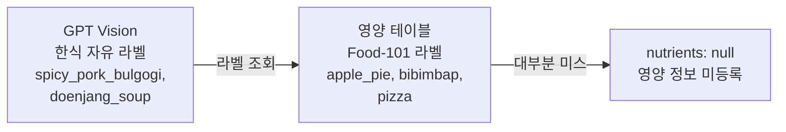

# 한식이 전부 "영양 미등록" — 라벨 공간과의 싸움

> 인식은 되는데 값이 없다 — 그리고 모델을 못 고칠 때 남는 레버

## 무슨 문제가 있었나

- 실사진 테스트에서 한식 밥상이 거의 다 **"영양 정보 미등록"** — 영양소가 없으면 부족분 계산·도시락 추천·보호자 알림이 전부 멈춘다
- **인식 실패가 아니었다** — GPT는 제육볶음·잡곡밥을 정확히 인식했다



- 영양 테이블이 자체 모델용 **서양 101종 라벨**이라 조회가 미스 — 분석 백엔드를 GPT로 바꿨는데 테이블은 그대로 둔 것
- 각 컴포넌트는 정상인데 **연결점에서 어긋난** 전형적인 통합 결함

## 어떤 선택지가 있었고, 무엇을 선택했나

### 한식 테이블 직접 구축 vs GPT에게 영양소도 요청 vs 하이브리드

- 직접 구축은 **음식 수가 무한**해서 끝이 없고, GPT 값만 쓰면 흔들리고 검증 불가
- **테이블 우선 + GPT 추정 폴백 + 점진 승격** 채택 — 검증된 값은 테이블, 없으면 즉석 추정, 반복 관측된 것만 사람 검토 후 테이블로 승격
- 응답에 `nutritionSource: table | estimated | null`을 실어 **앱이 검증값과 추정값을 구분** — 값만 주고 출처를 안 주면 앱은 둘을 똑같이 표시한다

### 남은 문제 — 라벨이 매번 다르다 (일관성 측정에서 발견)

- 같은 사진 5회에 라벨 집합이 5번 다 달랐다 (Jaccard 27%) — 인식하는 건 GPT라 **우리는 모델을 못 고친다**
- 남는 레버는 **입력 제약(프롬프트)** 과 **출력 정규화(서버)** 두 곳뿐 — 실측으로 두 번 방향을 바꿨다

| 시도 | Jaccard | 교훈 |
|---|---|---|
| 표준 어휘 24종 + 크기 판정을 프롬프트에 | 27% → **76.5%** (CV는 악화) | 크기 판정("3% 미만 제외")을 **모델이 매번 다르게 판단** |
| 크기 판정을 빼며 묶는 기준도 함께 뺌 | 76.5% → 50.1% | **묶는 기준은 모델만 할 수 있다** — 서버는 라벨이 다르면 같은 종류인지 모른다 |
| **최종 — 역할 분리** | **55.9%** | 어휘 = 프롬프트+서버 사전 · **묶기 = 모델**(의미) · **크기 컷 = 서버**(숫자) |

- 동의어 사전의 선도 신중하게 — `steamed_rice→rice`는 합치고 `tofu_stew→stew`는 안 합침(영양이 다른 음식)
- **라벨을 전부 `food`로 바꿔도 지표는 좋아진다** — 목표는 거칠게 만드는 게 아니라 안정시키는 것

## 결과 — 측정으로 검증

- 한식 상차림에서 **영양소가 채워진다** — 미등록 음식도 `estimated`로 값이 나옴
- 미지 라벨은 `warnings`로 수집해 **다음 배포의 테이블 승격 후보**로 — 실패를 로그로 흘리지 않고 데이터로
- 라벨 흔들림 **절반 이하로** — Jaccard 27.0% → 55.9%, 좌우 반전 15% → 60%

## 가장 중요한 결과 — 사용자가 보는 숫자는 그대로였다

```
Jaccard      27.0% → 55.9%   (2.1배 개선)
sodiumMg CV  22.2% → 22.7%   (거의 그대로)
```

- 총합 흔들림의 주원인이 동의어가 아니라 **입도(몇 개로 쪼개는가)** 라는 뜻 — 그건 아직 못 잡았다
- **지표 하나만 보고 개선을 판단하면 안 된다** — Jaccard만 봤으면 "2배 개선"이라 보고했을 것

## 경험을 통해 배운 점

- **각 컴포넌트가 정상이어도 연결점에서 깨진다**는 것 — 통합 지점을 실데이터로 밟아야 보인다
- **모델을 못 고칠 때도 레버는 있다**는 것 — 외부 AI를 쓴다는 것이 통제를 포기한다는 뜻은 아니다
- **판단의 종류에 따라 주체가 다르다**는 것 — 크기는 서버가(숫자), 묶기는 모델이(의미). 바꿔 걸었더니 각각 나빠졌다
