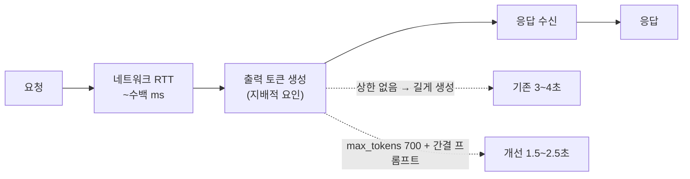

# LLM 응답 3~4초 → 1.5~2.5초

> 느린 원인을 네트워크로 짐작하지 않고 생성 토큰에서 찾은 기록

## 문제 상황

추천 문구·복약 주의사항 응답이 **3~4초** 걸렸다.
어르신이 식사를 기록하고 결과 화면에서 기다리는 시간이다.

## 원인 분석

로그의 `llm_call ... elapsedMs`는 **전송 + 생성 전체**라 원인을 구분하지 못했다.
쪼개서 보니 gpt-4o-mini에서 지배적 요인은 **출력 토큰 생성 시간**이었다.
모델 자체는 빠르고 네트워크 RTT는 수백 ms 수준이다.

원인은 두 가지였다.

1. **`max_tokens` 상한이 없어** 모델이 필요 이상으로 길게 생성했다
2. **프롬프트가 장황한 출력을 유도**했다

## 선택지 비교

| 레버 | 효과 | 채택 |
|---|---|---|
| **출력 간결화(프롬프트)** | 실제 생성 토큰 수 감소 = **가장 큰 실질 이득** | 채택 |
| **max_tokens 상한(700)** | 생성 시간 상한 확보, 폭주 방지 | 채택 |
| temperature 0.1 | 속도보다 **일관성** 목적(부수적) | 채택 |
| httpx 클라이언트 재사용 | TLS 핸드셰이크 수백 ms 절약 | 보류 — **지배 요인이 아니다** |
| 더 빠른 모델로 교체 | 품질 트레이드오프가 큼 | 보류 |

**지배 요인이 아닌 것을 먼저 고치지 않았다.** 클라이언트 재사용은 이득이 확실하지만
수백 ms짜리다. 3~4초를 만든 범인은 생성 토큰이었다.

요청에 포함됐던 `reasoning: { effort: "low" }`는 **적용할 수 없다고 판단**했다 —
o-series/GPT-5 계열 + responses API 전용 파라미터라 `gpt-4o-mini` + `chat/completions`에는 없다.
같은 목적을 **temperature 0.1 + max_tokens 상한 + 구조화 프롬프트**로 달성했다.

provider별 적용에서 함정이 하나 있었다 — **Anthropic Opus는 `temperature`를 받으면 400을 반환한다.**
`max_tokens`만 전달하고 주석으로 이유를 남겼다.

## 결과 — 측정으로 검증 (실제 gpt-4o-mini)

| 엔드포인트 | 개선 전 | 개선 후 |
|---|---|---|
| 추천 메뉴 | ~3.2초 | **~2.5초** |
| 복약 주의사항 | ~4.6초 | **~2.0초** (약 2.3배) |
| 영양 코멘트(신규) | — | **~1.5초** (출력이 짧아 가장 빠름) |

프롬프트는 `기본 원칙 → 판단 우선순위 → 출력 규칙 → Few-shot → 출력 형식` 골격으로 재작성했다.
길게 쓰는 것보다 **판단 기준과 출력 형식을 애매하지 않게** 쓰는 것이 핵심이었다.

Self-consistency나 검증 호출은 **채택하지 않았다** — 품질은 오르지만 **호출 수가 2배**가 되어
비용과 지연이 함께 늘어난다. 이 화면에서는 그 교환이 맞지 않았다.

## 남은 한계

- 외부 API 왕복이라 **1초대 이하로는 더 줄이기 어렵다**
- httpx 클라이언트 재사용은 **여전히 미적용**(향후 과제)
- 측정이 **소수 호출의 체감 시간**이다. p50/p95 같은 분포를 못 봤다

## 배운 점

- 느린 원인을 **짐작하지 않고 쪼개서 봐야 한다는 것.** 네트워크인 줄 알았는데 생성 토큰이었다
- **지배 요인이 아닌 레버를 먼저 당기지 않는다는 것.** 확실한 이득이라도 순서가 있다
- 품질을 올리는 기법이 **비용·지연과 교환된다는 것.** 검증 호출은 좋지만 이 화면에는 안 맞았다
