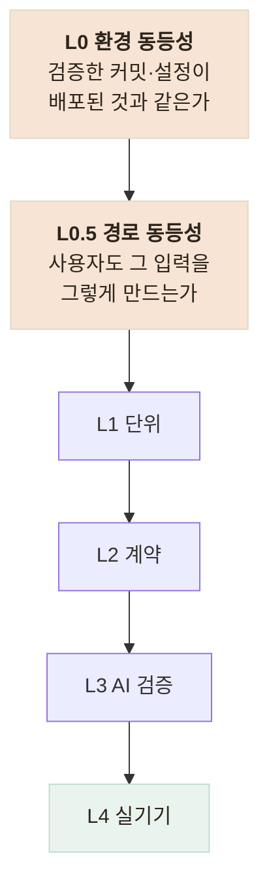

# AI로 개발하며 생긴 검증 공백 — 결함을 잡아낸 것은 누구였나

> AI 에이전트로 개발하면서 실제로 터진 결함들을 "무엇이 잡았는가" 기준으로 집계하고, 그 결과에 맞춰 검증 계층을 다시 세운 기록

<!-- 사진 자리: 결함을 잡아낸 주체별 집계 표를 시각화한 그래프 (사람이 심어둔 테스트 1 / 타입 1 / 자체 리뷰 3 / 실 DB·실서버 2 / 주석 1 / 사용자 3) -->

## 한눈에

| | |
|---|---|
| **증상** | 운영에서 두 번 터졌고 **둘 다 자동 검증은 전부 통과**였다 |
| **원인** | 검증이 "코드가 맞는가"만 묻고 환경과 입력 경로는 묻지 않았다 |
| **해법** | 계층 맨 앞에 **환경 동등성**·**경로 동등성** 두 층을 신설했다 |
| **결과** | 검증 6층 정리, 배포 후 재검증을 **한 명령**으로 고정 |

## 무엇이 결함을 잡았나

한 사이클 동안 발견된 결함을 발견 주체별로 세어 봤다.

| 잡은 주체 | 건수 |
|---|---|
| **사용자 (실기기)** | **3** |
| 에이전트 자체 리뷰 | 3 |
| 실 DB · 실서버 검증 | 2 |
| 사람이 미리 심어 둔 테스트 | 1 |
| 타입 시스템 | 1 |
| 사람이 남긴 주석 | 1 |

- 최다가 **사용자**라는 것이 문제다 — 사용자가 찾는 결함은 이미 나간 결함이다
- 반대로 인상적이었던 것은 **주석 1건**으로 원인을 20분 내에 특정한 일이다
- 그래서 얻은 문장은 **AI 개발의 신뢰도는 코드베이스의 자기방어력에 비례한다**

## 초록불이 답한 것은 내 질문뿐이었다

| 사고 | 지표 | 실제 |
|---|---|---|
| 가짜 챗봇이 운영에 노출 | 200 · 에러 0건 · 테스트 366 통과 | 어르신이 가짜 AI와 대화 중 |
| 응급 안전장치 미탐지 | 테스트 11개 · **커버리지 100%** | 음성 4건 중 3건 놓침 |

- 둘 다 지표가 아니라 *"실제로 써 봐"* 라는 요청에서 드러났다
- 커버리지 100%는 다 검증했다가 아니라 **테스트가 모든 줄을 밟았다**는 뜻일 뿐이다
- 수정 커밋이 다음 버그를 만든 일도 두 번 있었다 — 고치는 김에 옆 코드를 섞은 탓이다

## 검증 계층을 다시 세웠다

- L0는 세 질문으로 고정했다 — 배포된 커밋, 라우트 기동(401인가), 환경변수 일치
- 배포 반영이 **25~35분**임을 이때 알아 서버 기동 시간을 대조하게 바꿨다
- 되돌릴 수 없는 명령과 비밀 파일은 **경로 자체를 막았다** — 위험한 것은 차단 대상이다

## 결과

- 배포 후 재검증 한 명령으로 가짜 어댑터·응급 신호 4건·오탐 2건을 실서버에서 확인한다
- 재발 방지 장치를 테스트로 잠갔다 — 가짜면 503, 가드는 **판정 근거**까지 단언
- 보장 수준을 등급으로 나눠 화면 품질은 미검증이라는 것을 문서에 명시했다

## 남은 한계

| 항목 | 상태 |
|---|---|
| 배포 환경변수 체크리스트 | **문서로만** 있고 파이프라인이 강제하지 않는다 |
| 음성 경로 검증 | 여전히 **수동**이다 |
| 결함 집계 | 한 사이클 표본이라 **경향으로 말할 크기가 아니다** |

## 배운 점

- AI 시대의 병목은 코드 작성이 아니라 **무엇을 검증할지 정하는 일**이라는 것
- 초록불은 안전의 증거가 아니라 **내가 물어본 질문**에만 답한 결과라는 것
- 코드에 남은 주석과 테스트가 곧 **다음 사람과 에이전트를 막아주는 장치**라는 것
