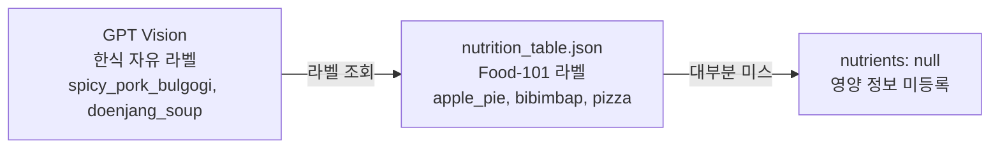
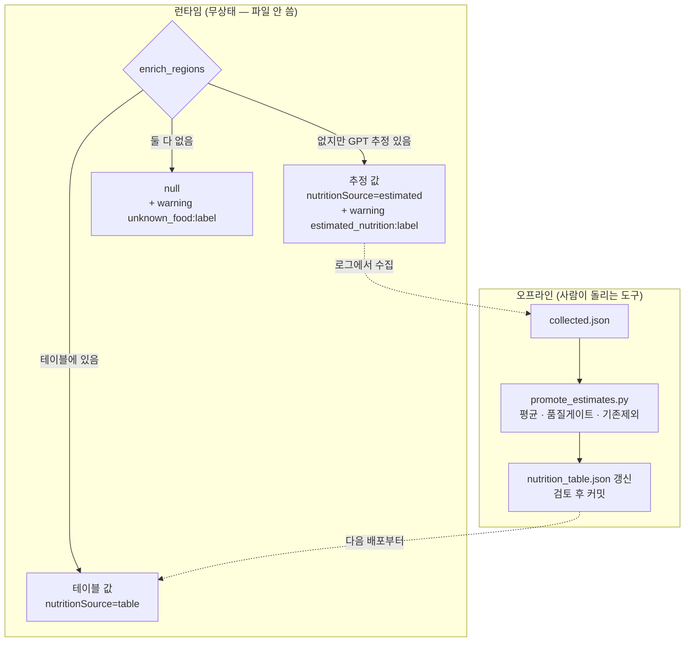

# 한식이 전부 "영양 정보 미등록"으로 떨어지던 문제

> 인식은 되는데 값이 없다 — 라벨 공간 미스매치와 점진 승격 설계

## 문제 상황

실사진 테스트에서 **한식 밥상이 거의 다 "영양 정보 미등록"** 으로 떨어졌다.
영양소가 안 나오면 부족분 계산도, 도시락 추천도, 보호자 알림도 전부 동작하지 않는다.

## 원인 분석

**인식 실패가 아니었다.** GPT Vision은 제육볶음·잡곡밥·콩나물무침을 정확히 인식했다.
문제는 그 다음 단계였다.

`nutrition_table.json`은 원래 `local` 백엔드(Food-101 분류기)용이라 **서양 101종 라벨**이었다.
한식은 `bibimbap`·`dumplings`·`miso_soup` 정도만 겹쳤다.

**분석 백엔드를 GPT로 바꿨는데 영양 테이블은 그대로 뒀다.**
두 컴포넌트가 각각은 정상인데 **연결점에서 어긋난** 전형적인 통합 결함이다.

## 선택지 비교

### 테이블을 한식으로 다시 만든다 vs GPT에게 영양소도 받는다

| 후보 | 장점 | 단점 |
|---|---|---|
| 한식 영양 테이블 직접 구축 | 정확·검증 가능·비용 0 | **음식 수가 무한하다.** 만들어도 새 음식이 계속 나옴 |
| GPT에게 영양소까지 요청 | 커버리지 무한 | 값이 매번 흔들림, **검증 불가, 신뢰도 미상** |
| **테이블 우선 + GPT 추정 폴백** | 검증된 값은 테이블, 없으면 즉석에서 채움 | 두 출처가 섞임 |

세 번째를 택하되, **섞이는 문제를 응답 스키마로 해결**했다.
`nutritionSource`를 `"table" | "estimated" | null`로 내려 **소비자가 신뢰도를 구분**할 수 있게 했다.

**값만 주고 출처를 안 주면 앱은 검증된 값과 추정값을 똑같이 표시하게 된다.**
이건 건강 데이터라 그 차이가 중요하다.

### 추정값을 그냥 두는가 vs 테이블로 승격하는가

폴백만 두면 **같은 음식을 매번 GPT에게 다시 묻는다.** 비용도 들고 값도 계속 흔들린다.

그런데 **AI 서버는 무상태**라 파일을 쓸 수 없다. 런타임과 오프라인을 분리했다.

**GPT가 즉석에서 채우고, 검증된 것만 테이블로 굳힌다.**
반복할수록 테이블이 커지고 GPT 의존이 줄어든다. 무상태 원칙은 그대로 지켜진다.

## 결과 — 측정으로 검증

- 한식 상차림에서 **영양소가 채워진다.** 테이블 미등록 음식도 `estimated`로 값이 나옴
- 응답에 `nutritionSource`가 실려 **앱이 검증값과 추정값을 구분**할 수 있음
- `warnings`에 `estimated_nutrition:{label}` / `unknown_food:{label}`을 남겨
  **승격 후보를 자동 수집**할 수 있게 함
- 승격 도구가 **평균·품질게이트·기존 제외**를 적용해 이상값이 테이블에 들어가지 않음
- `pytest 75 passed`

## 남은 한계

- **추정값의 정확도를 검증하지 못했다.** GPT가 제육볶음 1인분을 몇 kcal로 보는지가 실제와
  얼마나 다른지 **대조군이 없다.** 승격 게이트는 "값들이 서로 일관된가"만 보지 "값이 맞는가"는 못 본다
- **식약처 식품영양성분 DB 같은 공신력 있는 출처와 대조**하는 단계가 없다. 이게 정공법인데 못 붙였다
- 승격이 **수동**이다. 누군가 로그를 모아 스크립트를 돌려야 한다

## 배운 점

- **각 컴포넌트가 정상이어도 연결점에서 깨질 수 있다는 것.** 인식도 테이블도 정상인데
  라벨 공간이 달랐다. 통합 지점을 실데이터로 밟아 보지 않으면 안 보인다
- 값을 줄 때는 **출처도 함께 줘야 한다는 것.** `nutritionSource` 한 필드가 앱의 표시 방식을 결정한다
- 제약이 설계를 **더 낫게** 만들 수도 있다는 것. 파일을 못 쓴다는 제약 때문에 런타임/오프라인을
  분리했고, 결과적으로 **사람의 검토가 개입하는 지점**이 생겼다
