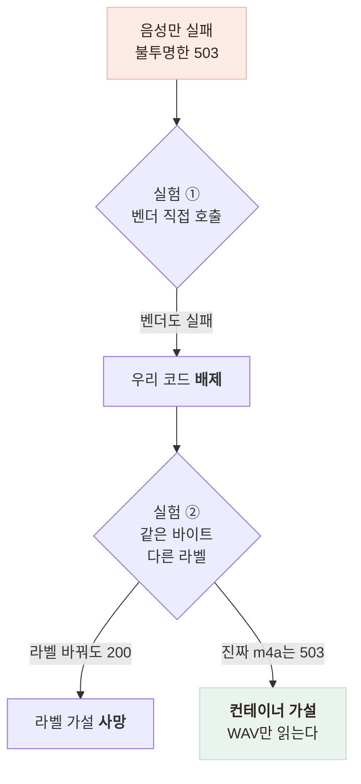

# 안드로이드에서만 음성이 안 됐다 — 두 번의 실험으로 원인 좁히기

> 텍스트 대화는 되는데 음성만 실패하던 문제를 가설 두 개를 잘라내며 규명한 기록

<!-- 사진 자리: 같은 WAV 바이트를 두 MIME 라벨로 보낸 응답과 진짜 m4a를 보낸 응답을 나란히 놓은 터미널 캡처 -->

## 한눈에

| | |
|---|---|
| **증상** | 텍스트 대화는 되는데 "눌러서 말하기"만 항상 실패했다 |
| **원인** | 안드로이드는 WAV를 녹음할 수 없어 **다른 컨테이너**가 올라갔다 |
| **해법** | 서버가 라벨 대신 **매직 바이트**로 판별해 WAV로 변환한다 |
| **결과** | 실제 한국어 음성 인식 **200 OK, 3.3초** |

## 진단 경로

벤더가 **엔진 사용 불가** 503 하나만 돌려줘서 앱·서버·벤더 중 어디가 틀렸는지 알 수 없었다.

| 보낸 것 | 결과 |
|---|---|
| WAV 바이트 + `audio/wav` 라벨 | 200 |
| **같은 WAV 바이트 + `audio/m4a` 라벨** | **200 — MIME은 보지 않는다** |
| 진짜 m4a(AAC) 컨테이너 | **503 엔진 사용 불가** |

벤더 문서에 지원 포맷이 없으므로 이 결론은 문서로는 나올 수 없었다.

## 근본 원인 — 세 계층이 라벨만 믿었다

| 계층 | 무엇을 했나 |
|---|---|
| 앱 | 안드로이드는 WAV를 못 만드는데 확장자와 MIME을 WAV로 붙였다 |
| 서버 | 그 라벨을 그대로 벤더에 넘겼다 |
| 벤더 | 415나 422가 아니라 **불투명한 503**으로만 실패했다 |

- 오디오 라이브러리의 안드로이드 구현은 OS 미디어 레코더를 쓰고 출력 목록에 WAV가 없다
- 기본값은 **3GP + AMR-NB**이고, 8kHz 전용이라 16kHz 설정도 무시됐다
- **텍스트만 멀쩡했던 이유**가 이것이다 — 그 경로에는 오디오가 없다

## 고친 방법

| 후보 | 판단 |
|---|---|
| 앱이 처음부터 WAV로 녹음 | **안드로이드에서 불가능** — 이 방향으로 정했다가 뒤집혔다 |
| **서버가 바이트를 보고 판별해 변환** (채택) | 기기·OS별 코덱 편차를 한 곳에서 흡수한다 |

- 변환을 서버에 둔 이유는 **제약의 주인**이 벤더라서다 — 앱이면 앱 배포가 필요하다
- 컨테이너를 매직 바이트로 구분하고 MPEG-4 계열은 **브랜드**까지 읽어 로그에 남긴다
- 변환은 표준 입출력 파이프로 돌려 "음성을 저장하지 않는다"는 원칙을 지켰다

## 결과

| 항목 | 값 |
|---|---|
| 실제 한국어 음성 인식 | **200 OK, 3.3초** |
| 실패 메시지 분기 | 파일 없음 / 0바이트 / 크기 초과 |
| 업로드 상한 | 10MB (16kHz mono, 30초 약 1MB) |

벤더 협의 항목은 지원 포맷 문서화, m4a·AAC 지원, 미지원 포맷은 503이 아니라 **400**으로 응답이다. 지금은 클라이언트가 재시도할 가치 없는 실패를 재시도 가능한 것으로 오해한다.

## 남은 한계

| 항목 | 상태 |
|---|---|
| 안드로이드 WAV 녹음 불가 | **라이브러리 구현 근거**로 판단했고 전 기기 확인은 아니다 |
| 서버 변환 | **CPU**를 쓰므로 동시 요청이 늘면 별도 제한이 필요하다 |

## 배운 점

- **제약**을 조건이 아니라 결론으로 써서 첫 결정을 뒤집게 됐다는 것
- 원인이 여러 층에 걸쳐 있을 때는 층별로 자르는 **실험**이 코드 읽기보다 빠르다는 것
- 자기 기술 방식을 믿지 않는 계층이 하나쯤 있어야 한다는 것 — 라벨을 안 믿는 판별이다
