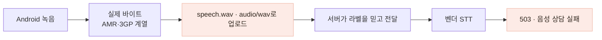
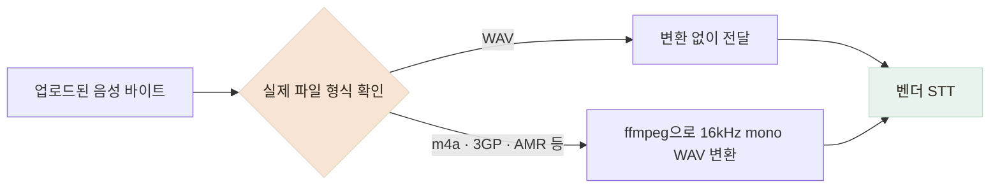

# 안드로이드 음성 상담의 503을 실제 오디오 형식 판별로 해결했습니다

> 텍스트 상담은 되지만 음성만 `503`으로 실패하던 문제를 벤더 직접 호출과 파일 형식 비교로 좁혀, 서버가 실제 형식을 확인하고 변환하도록 바꿨습니다.

## 한눈에

| | |
|---|---|
| **증상** | 안드로이드에서 “눌러서 말하기”를 사용하면 상담 음성만 항상 실패했습니다. |
| **원인** | 앱은 WAV라는 이름으로 보냈지만 실제 업로드 데이터는 안드로이드 녹음 경로에서 생성된 AMR·3GP 계열 형식이었습니다. |
| **진단** | 같은 WAV 바이트의 MIME만 바꿔 보내며 라벨이 아니라 실제 오디오 형식이 결과를 가른다는 것을 확인했습니다. |
| **해결** | 제가 실제 형식 문제까지 규명했고, 팀원이 서버에서 시작 바이트로 형식을 판별해 WAV로 변환하도록 구현했습니다. |

## 불투명한 `503`을 두 번의 실험으로 좁혔습니다

텍스트 상담은 정상인데 음성 인식만 `503 ENGINE_UNAVAILABLE`로 실패했습니다. 이 응답만으로는 앱이 잘못 보낸 것인지, 끼니톡 서버가 잘못 전달한 것인지, 벤더의 STT 엔진이 멈춘 것인지 구분할 수 없었습니다.

먼저 끼니톡 서버를 거치지 않고 벤더 API에 WAV 파일을 직접 보냈습니다. `200`이 반환돼 벤더 STT 자체는 동작하고 있음을 확인했습니다.

다음으로 MIME 라벨과 실제 파일 형식 중 무엇이 실패를 만드는지 비교했습니다.

| **같은 WAV 바이트** | **같은 WAV 바이트** | **실제 m4a(AAC) 바이트** |
|---|---|---|
| `audio/wav` 라벨 | `audio/m4a` 라벨 | 실제 비-WAV 형식 |
| **`200`** | **`200`** | **`503`** |

같은 WAV 바이트는 MIME을 `audio/m4a`로 바꿔도 성공했습니다. 반면 실제 m4a(AAC) 바이트를 보내자 `503`이 재현됐습니다. 이를 통해 **MIME 라벨이 아니라 실제 오디오 형식이 처리 결과를 가른다는 것**을 확인했습니다.

벤더가 WAV가 아닌 형식을 처리하지 못하는지 확인하기 위해 m4a(AAC)를 대조 파일로 사용했습니다. 이후 실제 안드로이드 업로드 파일을 확인하니, **기존 앱에서는 AMR-NB·3GP 계열 바이트가 WAV라는 이름과 MIME으로 전달**되고 있었습니다.

## 파일 이름은 WAV였지만 실제 내용은 달랐습니다

**당시 사용하던 안드로이드 녹음 경로에서는 WAV가 생성되지 않았는데**, 앱 설정은 파일 확장자와 MIME을 `wav`로 고정하고 있었습니다. 실제로는 AMR-NB·3GP 계열 바이트가 WAV라는 이름으로 서버에 올라갔고, 서버도 라벨을 믿고 그대로 벤더에 전달했습니다.

iOS에서만 확인했을 때는 실제 WAV가 만들어져 문제가 드러나지 않았습니다. 플랫폼별 녹음 결과를 확인하지 않고 파일 이름만 같게 만든 것이 원인이었습니다.

## 서버에서 실제 형식을 확인하고 변환하도록 했습니다

처음에는 앱에서 WAV를 만들어 그대로 벤더에 전달하는 구조였습니다. 하지만 플랫폼별 녹음 결과가 달랐기 때문에, **서버가 실제 형식을 확인하고 벤더가 받을 수 있는 WAV로 맞추는 방식**으로 바꿨습니다.

| 후보 | 판단 |
|---|---|
| 앱에서 WAV로 녹음 | 서버 변환이 필요 없지만 안드로이드에서 같은 방식을 사용할 수 없고, 플랫폼별 형식이 달라질 때마다 앱을 다시 배포해야 했습니다. |
| **서버에서 실제 형식을 판별해 WAV로 변환** | 변환 의존성은 늘지만 한 곳에서 여러 형식과 구버전 앱을 함께 처리할 수 있어 적용했습니다. |

제가 두 실험으로 실제 형식 문제까지 규명한 뒤, 팀원이 다음 서버 변환 구조를 구현했습니다.

서버는 파일 이름이나 MIME을 그대로 믿지 않고, **파일 시작 바이트를 확인해 실제 형식을 판별합니다.** WAV면 그대로 전달하고, 변환이 필요한 형식은 ffmpeg으로 16kHz mono WAV로 변환합니다. 변환은 표준 입력과 출력 파이프로 처리해 음성 파일을 디스크에 저장하지 않았고, 기존의 음성 비저장 원칙도 유지했습니다.

앱도 안드로이드에서는 실제로 만들 수 있는 m4a(AAC), iOS에서는 WAV를 사용하고, 업로드 라벨을 실제 파일에 맞게 보내도록 수정했습니다.

## 확인한 범위

- 벤더에 실제 한국어 WAV를 전송해 STT `200 OK`와 약 3.3초의 응답을 확인했습니다.
- 자동화 테스트에서 m4a(AAC)를 16kHz mono WAV로 변환하고, 기존 안드로이드가 만들던 AMR도 WAV로 변환되는지 확인했습니다.
- WAV 입력은 다시 변환하지 않고 같은 바이트를 그대로 전달하는지 확인했습니다.
- 알 수 없는 형식이나 변환 실패는 벤더의 불투명한 `503` 대신 감지한 형식을 포함한 검증 오류로 구분했습니다.

실제 안드로이드 기기에서 녹음부터 STT 응답까지 전체 경로를 자동으로 검증하는 테스트는 아직 없습니다.

## 실제 파일 형식을 기준으로 처리하도록 바꿨습니다

`503`을 벤더 장애로 단정하지 않고 직접 호출과 파일 비교로 범위를 좁힌 결과, **MIME이나 확장자가 아니라 실제 업로드된 오디오 형식이 문제**임을 확인했습니다.

이후 서버가 실제 형식을 판별해 필요한 경우 WAV로 변환하도록 바꾸면서, **플랫폼마다 다른 녹음 형식을 벤더가 받을 수 있는 하나의 형식으로 맞추는 구조**로 정리했습니다. 기존 WAV는 그대로 전달하고, 안드로이드에서 생성되는 형식도 변환 후 처리되는 것을 자동화 테스트로 확인했습니다.
