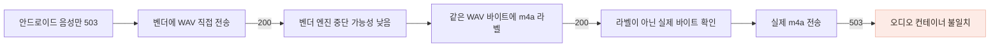
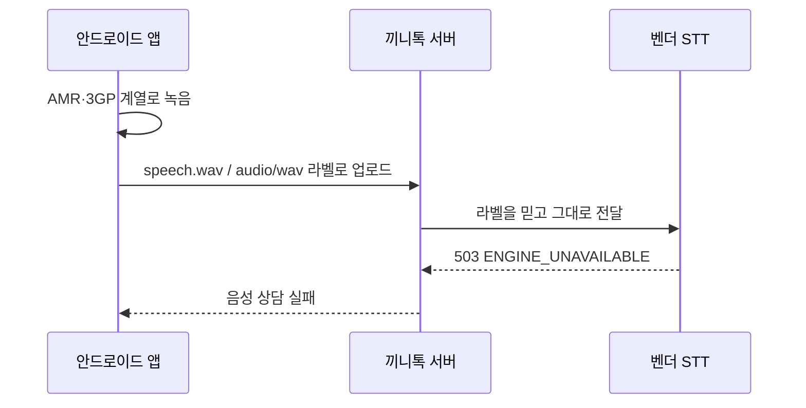
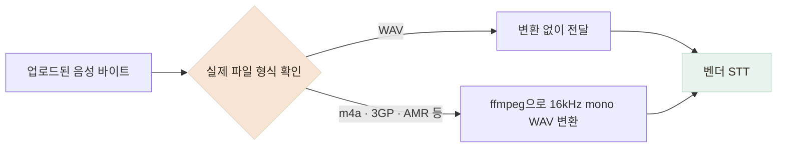

# 안드로이드 음성 실패 원인을 오디오 형식에서 찾았습니다

> 텍스트 상담은 되지만 음성만 `503`으로 실패하던 문제를 벤더 직접 호출과 파일 형식 비교로 좁혔습니다.

## 한눈에

| | |
|---|---|
| **증상** | 안드로이드에서 “눌러서 말하기”를 사용하면 상담 음성만 항상 실패했습니다. |
| **원인** | 앱은 파일 이름을 WAV로 붙였지만 실제 바이트는 안드로이드가 만든 AMR·3GP 계열이었습니다. |
| **진단** | 같은 WAV 바이트의 MIME만 바꿔 보내며 라벨 문제가 아니라 실제 오디오 컨테이너 문제임을 확인했습니다. |
| **해결** | 제가 컨테이너 문제까지 규명했고, 팀원이 서버에서 실제 바이트를 판별해 WAV로 변환하도록 구현했습니다. |

## 불투명한 `503`을 두 번의 실험으로 좁혔습니다

텍스트 상담은 정상인데 음성 인식만 `503 ENGINE_UNAVAILABLE`로 실패했습니다. 이 응답만으로는 앱이 잘못 보낸 것인지, 끼니톡 서버가 잘못 전달한 것인지, 벤더의 STT 엔진이 멈춘 것인지 구분할 수 없었습니다.

먼저 끼니톡 서버를 거치지 않고 벤더 API에 WAV 파일을 직접 보냈습니다. `200`이 반환돼 벤더 STT 자체는 동작하고 있음을 확인했습니다.

다음으로 MIME 라벨과 실제 파일 형식 중 무엇을 확인하는지 비교했습니다.

| 벤더에 보낸 파일 | 결과 | 해석 |
|---|---|---|
| WAV 바이트 + `audio/wav` | `200` | WAV는 처리할 수 있었습니다. |
| **같은 WAV 바이트 + `audio/m4a`** | **`200`** | MIME 라벨은 실패 원인이 아니었습니다. |
| 실제 m4a(AAC) 바이트 | `503` | 실제 오디오 컨테이너를 처리하지 못했습니다. |

같은 바이트에 라벨만 바꿔도 성공했기 때문에, 확장자나 MIME을 고치는 것만으로는 해결되지 않는다는 것을 확인했습니다.

## 파일 이름은 WAV였지만 실제 내용은 달랐습니다

안드로이드의 녹음 구현은 WAV 출력을 지원하지 않는데, 앱 설정은 파일 확장자와 MIME을 `wav`로 고정하고 있었습니다. 실제로는 AMR-NB·3GP 계열 바이트가 WAV라는 이름으로 서버에 올라갔고, 서버도 라벨을 믿고 그대로 벤더에 전달했습니다.

iOS에서만 확인했을 때는 실제 WAV가 만들어져 문제가 드러나지 않았습니다. 플랫폼별 녹음 결과를 확인하지 않고 파일 이름만 같게 만든 것이 원인이었습니다.

## 서버에서 실제 형식을 확인하고 변환하도록 했습니다

처음에는 앱이 처음부터 WAV를 만들도록 해결하려 했지만, 안드로이드에서는 같은 방법을 사용할 수 없었습니다. 기기와 운영체제마다 다른 녹음 형식을 앱별로 맞추면 문제가 생길 때마다 앱을 다시 배포해야 합니다.

제가 두 실험으로 컨테이너 문제까지 규명한 뒤, 팀원이 다음 서버 변환 구조를 구현했습니다.

서버는 파일 이름이나 MIME 대신 `RIFF...WAVE`, `#!AMR`, `ftyp` 같은 시작 바이트를 확인합니다. WAV면 그대로 전달하고, 다른 형식이면 ffmpeg의 표준 입력과 출력 파이프로 변환합니다. 음성 파일을 디스크에 저장하지 않아 기존의 음성 비저장 원칙도 유지했습니다.

앱도 안드로이드에서는 실제로 만들 수 있는 m4a(AAC), iOS에서는 WAV를 사용하고, 업로드 라벨을 실제 파일에 맞게 보내도록 수정했습니다.

## 확인한 범위

- 벤더에 실제 한국어 WAV를 전송해 STT `200 OK`와 약 3.3초의 응답을 확인했습니다.
- 자동화 테스트에서 m4a(AAC)를 16kHz mono WAV로 변환하고, 기존 안드로이드가 만들던 AMR도 WAV로 변환되는지 확인했습니다.
- WAV 입력은 다시 변환하지 않고 같은 바이트를 그대로 전달하는지 확인했습니다.
- 알 수 없는 형식이나 변환 실패는 벤더의 불투명한 `503` 대신 감지한 형식을 포함한 검증 오류로 구분했습니다.

실제 안드로이드 기기 전체에서 녹음부터 STT 응답까지 자동으로 실행하는 테스트는 아직 없습니다. 또한 서버 변환은 CPU를 사용하므로 음성 요청이 늘어나면 동시 변환 수를 제한해야 합니다.
