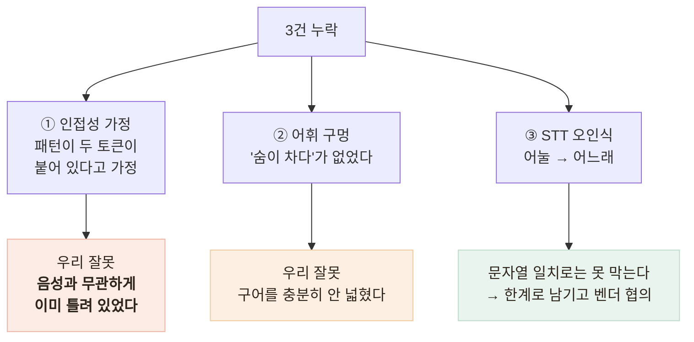

# 응급 가드가 음성 경로에서 뚫렸다 — AI 안전성 검증의 사각

> 단위 테스트 11개가 통과하는 동안, 실제 발화 4건 중 3건이 새어 나가고 있었다

## 무슨 문제가 있었나

- 응급 가드에 단위 테스트 11개, 전부 통과, **라인 커버리지 100%**
- 그런데 TTS로 어르신 발화를 합성해 **말하기 → STT → 판정** 전체 경로를 태우자 —

| 말한 것 | STT가 들은 것 | 결과 |
|---|---|---|
| 가슴이 너무 아프고 숨이 안 쉬어져요 | (정확) | 격상 |
| 한쪽 팔다리에 힘이 빠지고 말이 **어눌**해요 | 말이 **어느래**요 | **놓침** |
| 숨이 **차서** 말을 못 하겠어요 | 숨이 **자서** | **놓침** |
| 정신이 자꾸 흐릿해지고 어지러워요 | (정확) | **놓침** |

## 원인을 어떻게 찾았나 — 성격이 다른 세 가지



- 인접성이 가장 뼈아팠다 — 패턴이 "가슴이" 바로 뒤에 "아프"를 요구하는데, 어르신 구어는 "가슴이 **너무** 아프고"
- 확인해 보니 **타이핑해도 이미 틀려 있었다** — 음성과 무관한 우리 잘못

## 테스트가 "틀린 이유로" 통과하고 있었다

```ts
// 있던 테스트 — 통과했다
expect(detectEmergency('가슴이 조금 답답해요').escalate).toBe(false);

// 의도: 신호 1개라서 false — 실제: "조금"이 껴서 신호 0개
// 수정: 판정 결과가 아니라 판정 근거까지 단언
expect(result.signals).toEqual(['흉통']);   // ← 이 줄이 없었다
expect(result.escalate).toBe(false);
```

- `escalate`만 단언하면 "0개라서 false"와 "1개라서 false"가 구분되지 않는다 — 그 사이에 결함이 통째로 숨어 있었다

## 오탐까지 설계해야 안전장치다

- "힘이 빠진다"를 그대로 넣으면 노쇠 표현("다리에 힘이 없어요")까지 격상 — **너무 자주 뜨는 경고는 없는 것과 같다**
- **편측(한쪽·왼쪽·오른쪽) 동반을 요구** — 뇌졸중 FAST의 기준(*한쪽* 위약)과도 일치
- 근접 판정은 문장 경계를 넘지 않게 — "가슴은 괜찮아요. 손에 땀이 나요"가 흉통+식은땀으로 합쳐지면 안 된다

## 결과 — 측정으로 검증

- 운영 서버 실측 **1/4 → 4/4 격상, 오탐 0건**
- 회귀 테스트에 **STT가 실제로 돌려준 문자열**("어느래요", "숨이 자서")을 그대로 — 지어낸 입력은 지어낸 결함만 막는다
- 배포 후 실서버 검증 스크립트에 응급 4건·오탐 2건 고정

## 경험을 통해 배운 점

- **테스트하기 쉬운 함수가 위험할 수 있다**는 것 — 문자열만 넣으면 되니, 그 문자열이 어디서 오는지(STT)를 묻지 않게 된다
- **결과만 보는 테스트는 이유가 틀려도 통과한다**는 것 — 판정 근거를 단언해야 한다
- 안전장치는 **오탐 비용까지 설계**해야 한다는 것
