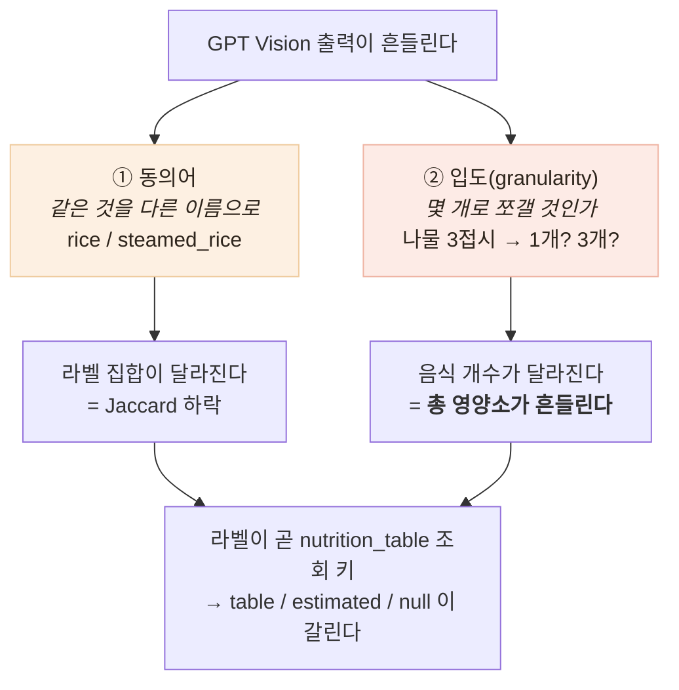

# 라벨이 매번 달라 영양소가 흔들린다 — 모델을 못 고칠 때 남는 레버

> 측정이 원인을 둘로 갈라 줬고, 그중 하나만 고쳐졌다

## 문제 상황

일관성 측정(탭 2 · 검증 4)에서 나온 결과다.

```
같은 한정식 사진 5회 → 5가지 다른 라벨 집합 (Jaccard 27.0%)
sodiumMg  1,452 ~ 2,942mg  (CV 22.2%)   ← 고혈압 지표가 2배 차이
portion 판정이 뒤집힘 (grilled_fish large/regular, kimchi regular/small)
```

**같은 사진을 두 번 찍으면 다른 판정이 나온다.**

## 원인 분석 — 인식 오류가 아니라 두 가지 흔들림

결과를 나열해 보면 정체가 보인다.

```
rice  /  steamed_rice
soup  /  stew  /  stews  /  tofu_stew
vegetable_side_dish  /  seasoned_vegetables  /  stir-fried_vegetables  /  mixed_vegetables
noodles  /  noodle_side_dish  /  stir_fried_noodles  /  sweet_potato_noodle
```



**둘은 성격이 다르다.** ①은 이름 문제라 사전으로 흡수할 수 있고,
②는 판단 문제라 사전으로 못 잡는다. **이 구분이 해법을 갈랐다.**

## 어떤 선택지가 있었고, 무엇을 선택했나

### 우리는 이 모델을 고칠 수 없다

`ANALYZER_BACKEND=openai`라 인식을 **GPT-4o-mini Vision**이 한다.
재학습·파인튜닝이 불가능하므로 **레버는 경계 두 곳뿐**이다.

| 레버 | 무엇을 할 수 있나 |
|---|---|
| **입력 제약** (프롬프트) | 어떤 어휘를 쓸지, 무엇을 하나로 묶을지 지시 |
| **출력 정규화** (서버) | 표기 통일, 동의어 흡수, 같은 라벨 병합, 크기 컷 |

### 어휘를 강제할 것인가 vs 우선순위만 줄 것인가

| 후보 | 장점 | 단점 |
|---|---|---|
| 목록을 주고 **"이 중에서만"** | 라벨이 완전히 안정된다 | **목록에 없는 새 음식을 표현할 길이 막힌다.** `estimated` 폴백과 점진 승격(트러블슈팅 3)이 통째로 죽는다 |
| 테이블 라벨 101종을 그대로 제시 | 테이블 조회 성공률 상승 | **테이블이 Food-101 서양 101종**이라 한식엔 쓸 게 없다. 밥을 `fried_rice`로 억지 매핑하게 된다 |
| **한식 상차림 표준 어휘 24종을 "우선 사용"으로** | 흔들림은 줄고 새 음식은 살아 있다 | 어휘를 사람이 관리해야 함 |

세 번째. **soft constraint**로 두어 하이브리드 설계를 지켰다.

어휘는 `app/data/label_vocabulary.json`에 뒀다 —
`CLAUDE.md`의 *"파이프라인 코드에 특정 음식 하드코딩 금지"* 를 지키기 위해서다.

### 동의어를 어디까지 합칠 것인가

**이 선을 잘못 그으면 지표만 좋아진다.**

`steamed_rice → rice`는 넣고, **`tofu_stew → stew`는 넣지 않았다.**
두부찌개와 된장찌개는 영양이 다른 음식이라, 합치면 안정성을 얻는 대신 정보를 잃는다.

> **흔들림이 줄었다는 지표는 라벨을 전부 `food`로 바꿔도 달성된다.**
> 목표는 라벨을 거칠게 만드는 것이 아니라 **안정시키는 것**이다.

### 판단을 모델에게 시킬 것인가, 서버가 할 것인가

여기서 **실측으로 두 번 방향을 바꿨다.**

**1차 시도** — 프롬프트에 `"3% 미만은 보고하지 마"` + `"같은 종류는 하나로 합쳐"` 를 넣었다.

```
Jaccard 27.0% → 76.5%   (라벨은 크게 안정)
음식 개수 범위 1 → 2     (입도는 오히려 악화)
sodiumMg CV 22.2% → 35.3%  (악화)
```

**크기 판정을 모델에게 맡긴 게 문제였다.** "3%"를 매번 다르게 판단한다.

**2차 시도** — 크기 판정을 프롬프트에서 빼고 **서버가 결정론적으로** 자르게 했다.
그런데 이때 묶는 기준(`"같은 종류는 하나로"`)도 함께 뺐다.

```
Jaccard 76.5% → 50.1%   ← 더 나빠졌다
```

**묶는 기준은 모델만 할 수 있다는 것을 놓쳤다.** 서버는 라벨이 다르면
그것이 같은 종류인지 알 방법이 없다. 반면 크기는 숫자라 서버가 판정할 수 있다.

**최종** — **역할을 나눴다.**

| | 담당 | 이유 |
|---|---|---|
| 어휘 (뭐라고 부를까) | 프롬프트 + 서버 정규화 | 프롬프트만으론 매번 안 지키고, 사전만으론 새 표현을 못 잡는다 |
| **묶는 기준** (같은 종류인가) | **모델** | 서버는 라벨이 다르면 같은 종류인지 모른다 |
| **크기 판정** (너무 작은가) | **서버** | 기준이 숫자라 결정론적으로 할 수 있다. 모델은 매번 다르게 판단한다 |

`local` 백엔드에는 이미 *"3% 미만 마스크는 제거·병합"* 후처리 규칙이 있었다.
**비전 LLM 경로에는 그 규칙이 없었던 것**이라, 같은 기준을 서버 쪽에 맞춰 넣었다.

## 결과 — 측정으로 검증

같은 스크립트, 같은 사진으로 재측정했다.

| | Jaccard | **sodiumMg CV** | 음식 개수 | 표본 |
|---|---|---|---|---|
| 개선 전 | 27.0% | 22.2% | 6~7 | n=5 |
| 1차 (어휘 + 프롬프트 판정) | **76.5%** | 35.3% | 5~7 | n=5 |
| 2차 (어휘 + 서버 판정) | 50.1% | 20.9% | 6~8 | n=5 |
| **최종 (역할 분리)** | **55.9%** | **22.7%** | 5~8 | n=8 |

**라벨 흔들림은 절반 이하로 줄었다 — Jaccard 27.0% → 55.9% (2.1배).**
동의어가 사라져 `rice`·`soup`·`kimchi`·`grilled_fish`·`seasoned_vegetables`로 수렴한다.

메타모픽도 함께 좋아졌다.

| 변환 | 개선 전 | 개선 후 |
|---|---|---|
| JPEG 재인코딩 | Jaccard 33% | 50% |
| 좌우 반전 | **15%** | **60%** |
| 리사이즈 | 50% | 56% |

부수 효과로 **`nameKo`도 안정됐다.** 표준 어휘의 한국어 이름을 우선하므로
같은 음식에 "나물무침"/"시금치나물"/"나물"이 번갈아 뜨지 않는다.

단위 테스트 26건을 붙였다. **관측된 흔들림을 그대로 케이스로** 넣었다
(`mixed_vegetables → seasoned_vegetables` 등). `pytest 101 passed`.

## 🔴 그런데 사용자가 보는 숫자는 그대로다

```
sodiumMg CV   22.2%  →  22.7%
```

**거의 안 변했다.** 이게 이 작업에서 가장 중요한 결과다.

Jaccard가 2배 좋아졌는데 총 영양소는 그대로라는 것은,
**총합 흔들림의 주원인이 동의어(①)가 아니라 입도(②)였다**는 뜻이다.
그리고 입도는 아직 못 잡았다 — 음식 개수가 **5~8**로 여전히 흔들린다.

> **지표 하나만 보고 개선을 판단하면 안 된다.**
> Jaccard만 봤으면 "2배 개선"이라고 보고했을 것이다.
> 그런데 사용자에게 보이는 값은 나트륨이고, 그건 그대로다.

`portion` 판정도 여전히 뒤집힌다(`seasoned_vegetables`가 large/regular/small 3종).
`areaShare` 표준편차가 배율 경계(0.8 / 1.2)를 넘나들기 때문이다.

## 남은 한계

- **입도 흔들림을 못 잡았다.** 상차림을 몇 개로 볼지가 모델의 판단이고,
  프롬프트로도 서버로도 고정하지 못했다
- **표본이 5~8회다.** 조건 간 미세한 차이(50.1% vs 55.9%)는 노이즈와 구분되지 않는다.
  27% → 56%는 노이즈로 설명하기 어려운 크기지만, **그 이상은 말할 수 없다**
- **어휘 24종을 내가 정했다.** 실제 어르신 상차림 분포를 조사하지 않았다
- **정확도는 여전히 안 쟀다.** 일관성이 올라도 **5번 다 똑같이 틀릴 수 있다**
- 입력 토큰이 3,007 → 약 3,250으로 늘어 **건당 0.68원 → 약 0.73원**(약 7%)

## 배운 점

- **모델을 못 고칠 때도 할 수 있는 게 있다는 것.** 입력 제약과 출력 정규화 두 레버로
  라벨 흔들림을 절반으로 줄였다. 외부 AI를 쓴다는 것이 통제를 포기한다는 뜻은 아니다
- **판단의 종류에 따라 주체가 다르다는 것.** 크기는 서버가(기준이 숫자다),
  묶는 기준은 모델이(의미를 알아야 한다). 둘을 바꿔 걸었더니 각각 나빠졌다
- **정규화의 선을 어디에 긋느냐가 개선과 정보 손실을 가른다는 것.**
  전부 합치면 지표는 완벽해지고 서비스는 쓸모없어진다
- **지표가 좋아진 것과 사용자 경험이 좋아진 것은 다르다는 것.**
  Jaccard 2배 개선이 나트륨 흔들림을 하나도 못 줄였다
