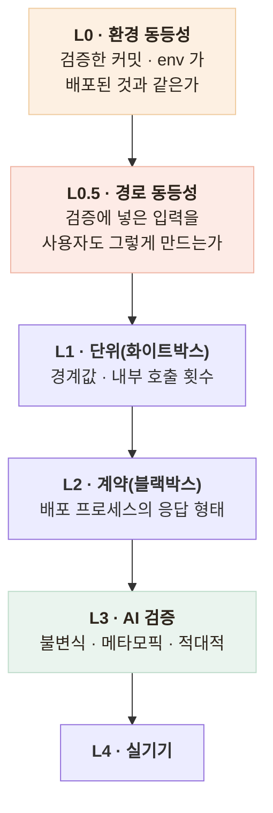

# 운영에서 가짜 AI가 사용자에게 응답했다 — 전부 초록불이었다

> 테스트 366개가 통과하는 동안 화면에 `[fake stt] 74862바이트`가 떴다

## 무슨 문제가 있었나

- 벤더 없이도 개발되도록 만든 **가짜(fake) 어댑터**가, 배포에 `CHATBOT_TOKEN`이 빠지면서 **실제 어르신에게 서비스**됐다
- 발견은 **사용자 제보** — 화면에 `[fake stt] ...` 문구가 떴다

| 지표 | 상태 |
|---|---|
| HTTP 상태 코드 | 200 |
| 에러 로그 | 0건 |
| Jest | 366 passed |
| 배포 | 성공 |

- **전부 초록이었다** — 가짜 어댑터는 정상적으로 가짜 응답을 만들어 200으로 돌려주고 있었으니까
- **모니터링으로 잡을 수 있는 종류의 사고가 아니다**

## 원인 — 내 설계 결정이었다

- AI 서버의 "키 없어도 mock으로 동작" 원칙을 챗봇에 그대로 가져온 것
- AI 서버의 mock은 **개발자만 보고**, 챗봇의 fake는 **어르신 화면에 나간다** — 같은 패턴, 다른 소비자
- 기본값이 빠졌을 때의 동작을 "동작하지만 틀림"으로 둔 것이 운영까지 따라갔다

## 어떤 선택지가 있었고, 무엇을 선택했나

| 후보 | 판단 |
|---|---|
| 배포 체크리스트에 항목 추가 | **사람이 빠뜨린다** — 이번에도 그래서 났다 |
| 부팅 시 키 검사, 없으면 기동 실패 | 개발·CI가 막힌다 |
| **운영 환경에서만 가짜 어댑터가 503** | 개발은 그대로, 운영에서는 시끄럽게 멈춤 — 채택 |

- 가짜 어댑터의 8개 메서드 전부가 운영에서 503을 던지는 것을 테스트로 고정
- 벤더 어댑터에 **부팅 자가진단** 추가 — 첫 사용자 요청이 아니라 부팅 시점에 알아야 한다
- 원칙 명문화 — **"기본값은 '동작하지만 틀림'이 아니라 '동작하지 않음'이어야 한다"**

## 같은 모양의 사고 두 번 — 검증 계층에 두 줄이 빠져 있었다

- 이 사고와 응급 가드 사각은 **같은 모양** — 자동 지표는 전부 초록인데 실제가 틀렸고, 둘 다 "실제로 써 봐"에서 드러났다
- 기존 계층은 전부 "코드가 맞는가"만 묻고 있었다 — **L0 · L0.5** 를 추가했다

- L0를 위해 배포 후 재검증을 **한 명령으로 고정** — 가짜 어댑터 검출·응급 4건·오탐 2건·무응답 종결을 실서버에 직접 확인
- AI 에이전트(Claude Code) 기반 개발이라 더 잘 생기는 공백이었다 — 속도가 빨라 "왜"를 되묻는 지점이 줄고, **테스트도 함께 생성되니 "이 테스트가 무엇을 못 잡는가"를 안 묻게 된다**

## 경험을 통해 배운 점

- **자동 지표가 전부 초록인 것이 안전을 뜻하지 않는다**는 것
- **기본값은 "동작하지 않음"이어야 한다**는 것 — 조용히 틀리는 것보다 시끄럽게 멈추는 게 낫다
- 같은 패턴도 **소비자가 다르면 위험도가 다르다**는 것 — 개발자가 보는 mock과 어르신이 보는 fake는 전혀 다른 문제
- **AI 시대의 병목은 코드 작성이 아니라 "무엇을 검증할지 정하는 일"** 이라는 것
