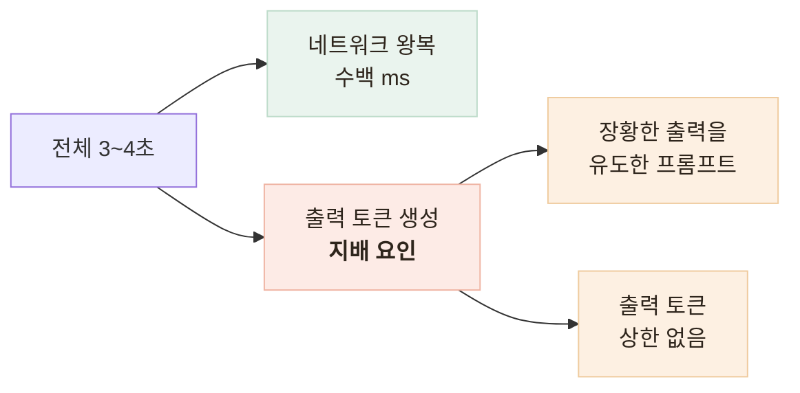
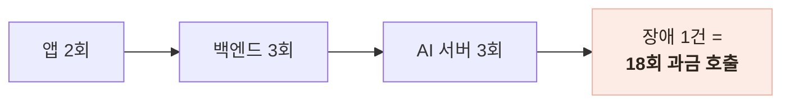

# LLM 응답 3~4초를 1.5~2.5초로 — 원인을 출력 토큰 생성으로 특정

> 느린 원인을 네트워크로 짐작하지 않고 측정으로 좁힌 뒤, 레버 다섯 개를 비교해 두 개만 채택한 기록

<!-- 사진 자리: 요청부터 응답까지의 구간을 네트워크 왕복과 출력 토큰 생성으로 나눠 그린 시간 분해 그림 -->

## 한눈에

| | |
|---|---|
| **증상** | AI 문구 생성이 모두 **3~4초**라는 피드백이 들어왔다 |
| **원인** | 지배 요인은 네트워크가 아니라 **출력 토큰 생성 시간**이었다 |
| **해법** | 프롬프트로 출력을 간결화하고 **출력 토큰 상한 700**을 걸었다 |
| **결과** | 복약 주의 4.6초 → **2.0초**, 약 2.3배 |

## 짐작하지 않고 구간을 나눴다

외부 API 호출이라 "네트워크가 느리다"로 결론 내기 쉬운 자리였고, 그 결론을 택하면 할 수 있는 일이 거의 없어진다. 호출 로그의 소요 시간은 전송과 생성을 합친 값이라 그것만으로는 어디가 느린지 알 수 없다.

줄일 수 있는 대상은 왕복 횟수나 연결 방식이 아니라 **생성되는 토큰 수**였다.

## 레버 다섯 개 중 둘만 채택했다

| 레버 | 판단 |
|---|---|
| **출력 간결화(프롬프트)** | 채택 — 실제 생성 토큰이 줄어 **가장 큰 실질 이득** |
| **출력 토큰 상한 700** | 채택 — 생성 시간 상한을 확보하고 폭주를 막는다 |
| temperature 0.1 | 채택 — **일관성** 목적이고 속도는 부수 효과다 |
| HTTP 클라이언트 재사용 | 보류 — 수백 ms를 아끼지만 **지배 요인**이 아니다 |
| 더 빠른 모델로 교체 | 보류 — **품질 트레이드오프**가 크다 |

- 채택 기준은 하나였다 — 측정으로 특정한 **지배 요인**을 건드리는가
- 원인을 특정하지 않았다면 클라이언트 재사용부터 손대고 3~4초는 남았을 것이다
- 프롬프트를 원칙·우선순위·출력 규칙·예시로 **구조화**하고 별도 검증 호출은 뺐다

## 재시도는 정확히 1회로 못 박았다

같은 작업에서 재시도 정책도 함께 정리했다. 근거는 곱셈이다 — 재시도가 여러 층에 흩어지면 장애 한 건이 청구서에 곱해져 실린다.

재호출 주체는 백엔드 하나로 정하고, AI 서버의 1회는 형식 불량 교정만 맡는다.

## 결과

| 엔드포인트 | 개선 전 | 개선 후 |
|---|---|---|
| 다음 끼니 추천 | 약 3.2초 | 약 2.5초 |
| 복약 주의 | 약 4.6초 | **약 2.0초** (약 2.3배) |
| 식사 코멘트(신규) | — | 약 1.5초 |

- 회귀는 테스트 **68개**·계약 하네스 **38/38**·실 프로바이더 수동으로 확인했다
- 가장 많이 줄어든 복약 주의가 원래 가장 장황했다는 점이 원인 특정의 방증이다
- 요청에 있던 **추론 강도 설정**은 쓰는 모델·엔드포인트에 없어 적용 불가였다

## 남은 한계

| 항목 | 상태 |
|---|---|
| 추가 단축 | 외부 API 왕복이라 **1초대 이하**로 줄이기는 어렵다 |
| HTTP 클라이언트 재사용 | 보류 상태다 — 전환하면 수백 ms를 더 줄일 수 있다 |
| 출력 상한 700 | **경험적 값**이고 잘림을 자동으로 감지하지 않는다 |
| 문구 품질 | 형태까지만 검증한다 — 실제로 저염인지는 못 잡는다 |

## 배운 점

- 외부 API가 끼면 원인을 네트워크로 미루기 쉽지만 **구간 분해** 없이는 근거가 없다는 것
- 성능 작업의 결과물은 빨라진 숫자가 아니라 **버린 레버의 목록**이라는 것
- 속도와 일관성을 같은 레버로 얻는 경우가 있다는 것 — 출력 간결화가 둘을 함께 해결했다
- 재시도는 주체를 하나로 정해야 곱셈이 청구서로 오지 않는다는 것
</content>
