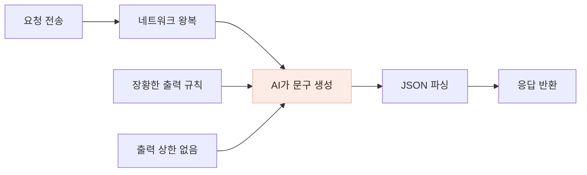

# AI 문구의 출력 길이를 줄여 응답 시간을 개선했습니다

> 추천·복약 안내가 길게 생성되던 프롬프트를 정리하고 출력 상한을 추가한 뒤, 같은 GPT-4o-mini 호출의 응답 시간을 다시 확인했습니다.

## 한눈에

| | |
|---|---|
| **증상** | 식사 추천과 복약 주의 문구 생성에 약 3~4초가 걸렸습니다. |
| **관찰** | 가장 긴 답변을 만들던 복약 주의 API가 가장 느렸습니다. |
| **수정** | 답변을 2문장 이내로 제한하고 최대 출력 토큰을 700으로 설정했습니다. |
| **실측 예** | 복약 주의 약 4.6초 → 2.0초, 다음 끼니 추천 약 3.2초 → 2.5초로 줄었습니다. |

## 응답을 기다리는 구간에서 줄일 수 있는 부분을 나눴습니다

외부 API가 느리면 네트워크 문제로 보기 쉽지만, 전체 시간만으로는 어느 구간을 줄여야 하는지 알기 어렵습니다. 당시 로그와 응답을 함께 확인했을 때 네트워크 왕복은 수백 ms 수준이었고, 답변이 길었던 복약 주의 문구가 약 4.6초로 가장 느렸습니다.

요청별 생성 토큰을 전후로 따로 기록하지는 못했기 때문에, 출력 생성 시간이 유일한 원인이었다고 단정하지는 않았습니다. 다만 **가장 장황한 API가 가장 느렸고, 문구를 줄인 뒤 같은 API의 시간이 가장 크게 감소한 점**을 근거로 우선 출력 길이를 조정했습니다.

## 다섯 가지 방법을 비교하고 두 가지를 중심으로 적용했습니다

| 방법 | 판단 |
|---|---|
| **프롬프트에서 답변 길이와 순서를 제한** | 실제 답변 길이를 줄일 수 있어 적용했습니다. |
| **최대 출력 토큰 700 설정** | 예상보다 긴 답변이 계속 생성되는 상한을 두기 위해 적용했습니다. |
| temperature 0.1 | 속도보다는 출력 형식의 일관성을 높이기 위해 적용했습니다. |
| HTTP 클라이언트 재사용 | 연결 시간을 줄일 수 있지만 당시 가장 큰 지연 구간으로 보지 않아 보류했습니다. |
| 더 빠른 모델로 교체 | 답변 품질이 달라질 수 있어 기존 모델에서 먼저 개선했습니다. |

추천 문구는 `부족하거나 많은 영양소 설명 → 다음 끼니 음식 제안` 순서로 2문장 안에 끝내도록 바꿨습니다. 복약 주의도 약마다 필요한 주의사항만 구조화해 반환하도록 프롬프트를 정리했습니다.

OpenAI에는 `max_tokens`, Gemini에는 `maxOutputTokens`, Anthropic에는 `max_tokens`로 같은 상한을 적용해 제공자가 바뀌어도 정책이 유지되도록 했습니다.

## 실제 GPT 호출 시간을 다시 확인했습니다

| API | 변경 전 | 변경 후 |
|---|---:|---:|
| 다음 끼니 추천 | 약 3.2초 | 약 2.5초 |
| 복약 주의사항 | 약 4.6초 | **약 2.0초** |
| 영양 코멘트 | 신규 | 약 1.5초 |

가장 장황했던 복약 주의사항은 약 2.3배 짧아졌고, 처음부터 짧은 문장만 요청한 영양 코멘트가 가장 빠르게 응답했습니다. 이 값은 대규모 부하 테스트의 평균이 아니라 **수정 전후 실제 GPT-4o-mini 호출에서 확인한 응답 시간**입니다.

## 재시도 횟수도 한 곳에서 제한했습니다

응답이 느릴 때 앱·백엔드·AI 서버가 각각 재시도하면 한 번의 실패가 여러 번의 유료 호출로 늘어날 수 있습니다. 일반적인 재호출은 백엔드가 담당하고, AI 서버는 JSON 형식이 잘못된 경우에만 한 번 더 요청하도록 역할을 나눴습니다.

형식 파싱 실패가 반복돼도 원래 호출 1회와 교정 호출 1회에서 끝나는지 테스트로 확인했습니다.

## 남은 과제

- 전후 호출의 입력·출력 토큰과 네트워크 시간을 같은 형식으로 저장하지 못했습니다. 이후 성능 측정에서는 총 응답 시간뿐 아니라 토큰 수와 호출 구간도 함께 남길 필요가 있습니다.
- 출력 상한 700은 당시 응답을 기준으로 정한 값입니다. 답변이 잘렸는지 자동으로 감지하는 처리는 아직 없습니다.
- 외부 API 호출이므로 네트워크와 제공자 상태에 따른 변동은 남아 있습니다.
