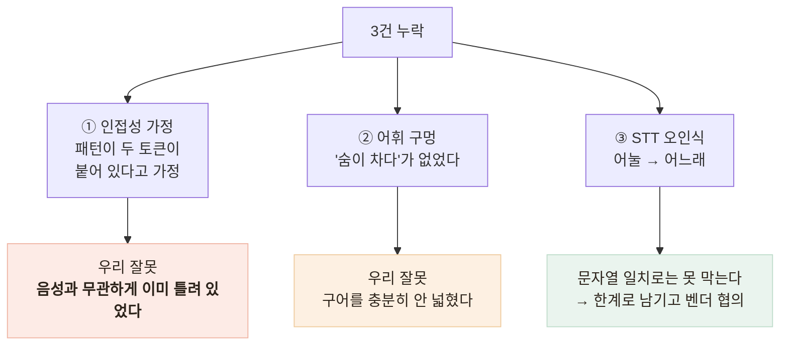

# 응급 가드가 음성 경로에서 뚫렸다 — AI 안전성 검증의 사각

> 단위 테스트 11개가 통과하는 동안 4건 중 3건이 새어 나가고 있었다

## 배경

적대적 입력 검증으로 벤더 LLM의 응급 에스컬레이션 부재를 발견하고,
**사용자 입력을 판정하는 가드레일**을 우리 쪽에 넣었다(→ 탭 2 · 검증 2).
이 가드에는 단위 테스트 11개가 붙어 있었고 전부 통과했다.

## 그런데 — 문제 상황

이 가드에는 **단위 테스트 11개**가 붙어 있었고 전부 통과했다.

그런데 실제로 대화해 보라는 요청을 받고, macOS TTS로 어르신 발화를 합성해
**말하기 → STT → 판정** 전체 경로를 태웠다.

| 말한 것 | STT가 들은 것 | 결과 |
|---|---|---|
| 가슴이 너무 아프고 숨이 안 쉬어져요 | (정확) | 격상 |
| 한쪽 팔다리에 힘이 빠지고 말이 **어눌**해요 | 말이 **어느래**요 | **놓침** |
| 숨이 **차서** 말을 못 하겠어요 | 숨이 **자서** | **놓침** |
| 정신이 자꾸 흐릿해지고 어지러워요 | (정확) | **놓침** |

**4개 중 3개가 새어 나갔다.**

## 원인 분석 — 성격이 다른 세 가지



**① 인접성 가정이 가장 뼈아팠다.** 패턴을 `가슴이?\s*(아프|답답)`처럼 썼다.
"가슴이" 바로 뒤에 "아프"가 와야 한다는 뜻이다.
어르신 구어는 그렇게 말하지 않는다 — "가슴이 **너무** 아프고", "정신이 **자꾸** 흐릿해지고".

확인해 보니 **"가슴이 너무 아프고"는 흉통으로 잡히지 않고 있었다.**
1행이 격상된 것은 호흡곤란 덕이었지 흉통 덕이 아니었다. **타이핑해도 틀려 있었다.**

**② 어휘 구멍** — "숨이 차다"는 호흡곤란의 가장 흔한 구어인데 없었다.
뇌졸중 FAST의 편측 위약도, 의식저하의 "흐릿·멍하다"도 없었다.
*"의학 용어가 아니라 구어체를 잡아야 한다"* 고 주석에 써 놓고 실제로는 좁았다.

**③ STT 오인식** — 한 글자 오류로 정규식이 뚫린다. **여기서는 못 막는다.**

### 테스트가 "틀린 이유로" 통과하고 있었다

이게 가장 옮겨 쓸 만한 발견이다.

```ts
// 있던 테스트 — 통과했다
expect(detectEmergency('가슴이 조금 답답해요').escalate).toBe(false);
```

의도는 *"흉통 1개는 잡혔지만 복합 2개가 필요해서 false"* 였다.
실제로는 **신호가 0개**였다. "조금"이 껴서 패턴이 아무것도 못 잡았다.

`escalate`만 단언하면 **"0개라서 false"와 "1개라서 false"가 구분되지 않는다.**
그 사이에 결함이 통째로 숨을 수 있고, 실제로 숨어 있었다.

## 선택지 비교 — 어디까지 넓힐 것인가

편측 위약을 잡으려면 "힘이 빠진다"를 넣어야 한다. 그런데 **"다리에 힘이 없어요"는
어르신이 노쇠를 말할 때 늘 쓰는 표현**이다. 이걸로 119를 안내하면 안내가 일상이 된다.

| 후보 | 문제 |
|---|---|
| "힘이 빠진다"를 그대로 추가 | **오탐 폭증.** 노쇠 표현과 구분 불가 |
| **편측(한쪽·왼쪽·오른쪽)을 함께 요구** | "다리에 힘이 없어요"는 안 잡히고 "한쪽 팔다리에 힘이 빠지고"는 잡힌다 |

두 번째. **뇌졸중 FAST의 기준도 *한쪽* 위약이라 의학적으로도 여기가 옳은 선**이다.

그리고 근접 판정을 넣되 **`[^.!?]{0,12}`로 문장 경계를 넘지 않게** 했다.
"가슴은 괜찮아요. 손에 땀이 나요"가 흉통+식은땀으로 합쳐지면 안 된다.

## 결과 — 측정으로 검증

- 운영 서버 실측 **1/4 → 4/4 격상**, 오탐 **0건**
- 회귀 테스트에 **STT가 실제로 돌려준 문자열을 그대로** 넣었다("어느래요", "숨이 자서").
  지어낸 입력이 아니라 **관측된 입력**이어야 다음에 같은 곳에서 안 뚫린다
- 테스트를 **판정 근거까지 단언**하도록 고쳤다

```ts
const result = detectEmergency('가슴이 조금 답답해요');
expect(result.signals).toEqual(['흉통']);   // ← 이 줄이 없었다
expect(result.escalate).toBe(false);
```

- 라벨 중복 제거 추가 — 한 라벨을 두 패턴이 맡게 되면서
  **복합 2개 판정이 신호 하나로 뚫릴 뻔한 것**을 발견해 함께 수정
- `Jest 377 passed` (챗봇 41개)

## 남은 한계

- **진짜 음성 경로는 여전히 수동이다.** macOS TTS가 필요해 자동화하지 못했다.
  그리고 합성 음성이라 **실제 어르신 발화(사투리·떨림·틀니)와도 다르다**
- STT 오인식은 **문자열 일치로 막을 수 없다.** 벤더가 신뢰도 점수를 주기 전까지는 구조적 한계.
  요청 항목(P1)으로 등록했다
- **응급 신호 목록이 의료 검토를 받지 않았다.** 119 신고 기준을 참고했지만 근거가 경험적이다
- 검증 표본이 **1회**다. LLM은 확률적이라 1회 PASS가 항상 PASS를 뜻하지 않는데,
  토큰 비용(1회 = 31,550 tok) 때문에 N회 반복을 못 했다

## 배운 점

- **테스트하기 쉬운 함수가 위험할 수 있다는 것.** 순수 함수는 문자열만 넣으면 되니
  **그 문자열이 어디서 오는지를 묻지 않게 된다**
- **결과만 보는 테스트는 이유가 틀려도 통과한다는 것.** 판정 결과가 아니라 판정 근거를 단언해야 한다
- 안전장치는 **오탐 비용까지 설계해야 한다는 것.** 너무 자주 뜨는 경고는 없는 것과 같다
- 회귀 케이스는 **관측된 입력**이어야 한다는 것. 지어낸 입력은 지어낸 결함만 막는다
