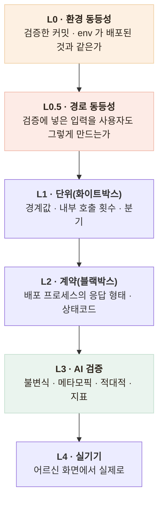

# 운영에 가짜 AI가 나갔다 — 전부 초록불이었다

> 벤더 없이도 개발·테스트가 되도록 만든 **가짜(fake) 어댑터**가, 배포에 `CHATBOT_TOKEN`이
> 빠지면서 **실제 어르신에게 서비스**됐습니다. 발견은 사용자 제보 — 화면에
> `[fake stt] 74862바이트` 같은 문구가 떴습니다.

## 왜 아무 알람도 안 울렸나

| 지표 | 상태 |
|---|---|
| HTTP 상태 코드 | 200 |
| 에러 로그 | 0건 |
| Jest | 366 passed |
| 배포 | 성공 |

**전부 초록이었습니다.** 가짜 어댑터는 정상적으로 가짜 응답을 만들어 200으로 돌려주고 있었으니까요.
관측 가능한 모든 지표가 "정상"을 가리키는데 사용자는 가짜 응답을 받고 있었습니다 —
**모니터링으로 잡을 수 있는 종류의 사고가 아닙니다.**

## 원인 — 내 설계 결정이었다

AI 서버에서 세운 "키가 없어도 서버는 떠야 한다"(mock 기본값) 원칙은 옳았습니다 —
개발·CI·대시보드가 키 없이 돌아야 하니까. 그 원칙을 챗봇에도 그대로 가져왔는데,

- AI 서버의 mock은 **대시보드에 "mock(무료)"로 표시되고 개발자만 봅니다**
- 챗봇의 fake는 **어르신 화면에 그대로 나갑니다**

같은 패턴인데 **소비자가 달랐습니다.** 기본값이 빠졌을 때의 동작을 "동작하지만 틀림"으로 둔 것이
운영까지 따라간 것입니다.

## 대응 — 절차로 못 막으면 코드가 막는다

| 후보 | 판단 |
|---|---|
| 배포 체크리스트에 항목 추가 | **사람이 빠뜨린다.** 이번에도 그래서 났다 |
| 부팅 시 키 검사, 없으면 기동 실패 | 개발·CI가 막힌다 |
| **운영 환경에서만 가짜 어댑터가 503** | 개발은 그대로, 운영에서는 시끄럽게 멈춤 |

가짜 어댑터의 8개 메서드 전부가 운영에서 503을 던지는 것을 테스트로 고정하고,
벤더 어댑터에는 **부팅 자가진단**(기동 시 토큰으로 연결 확인)을 추가했습니다.
원칙은 문서에 명문화했습니다 —

> **기본값은 "동작하지만 틀림"이 아니라 "동작하지 않음"이어야 한다.**
> 조용히 틀리는 것보다 시끄럽게 멈추는 게 낫다.

이 원칙은 이후 부하 테스트용 SSRF 예외 설정에 바로 재적용됐습니다(자물쇠 2중 —
플래그 하나만 실수로 켜져도 열리지 않는 구조).

## AI 에이전트 개발이 남긴 교훈

이 프로젝트는 AI 에이전트(Claude Code) 기반으로 개발했고, 속도는 확실히 빨랐습니다.
그런데 이 사고와 응급 가드 사각(별도 문서)은 **같은 모양**이었습니다 — 자동 지표는 전부
초록인데 실제가 틀린 것. 둘 다 "실제로 써 봐"에서 드러났습니다.

- 속도가 빨라 "왜 이렇게 했지"를 되묻는 지점이 줄어듭니다
- 테스트도 함께 생성되니 **"이 테스트가 무엇을 못 잡는가"를 안 묻게 됩니다**

그래서 검증 계층에 두 줄을 추가했습니다 — 기존 계층은 전부 "코드가 맞는가"만 묻고 있었습니다.



L0(배포된 것을 직접 찌른다)를 위해 배포 후 재검증을 한 명령으로 고정했습니다.

```
$ npm run verify:chatbot-live

1. 상담이 시작되는가 (가짜 어댑터면 운영에서 503)     ✅
2. 응급 신호 — 배포된 가드가 고쳐진 가드인가          ✅ 4/4
3. 오탐 — 격상되면 안 되는 것                        ✅ 2/2
4. 무응답 종결 — 빈 입력 3회에 종결                   ✅
```

**AI 시대의 병목은 코드 작성이 아니라 "무엇을 검증할지 정하는 일"** — 이 프로젝트에서
오래 걸린 것은 전부 판단이었지 타이핑이 아니었습니다.
