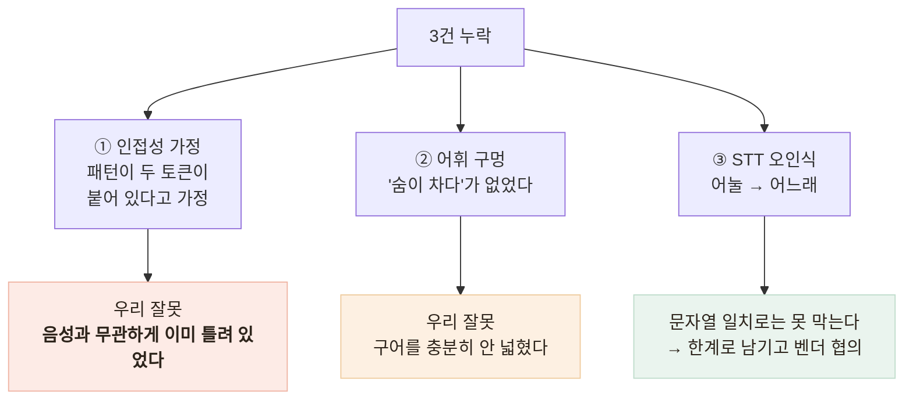

# 응급 가드가 음성 경로에서 뚫렸다 — 검증의 사각

> 응급 가드에는 단위 테스트 11개가 붙어 있었고 전부 통과, **라인 커버리지 100%**였습니다.
> 그런데 TTS로 어르신 발화를 합성해 **말하기 → STT → 판정** 전체 경로를 태우자 —

## 4건 중 3건이 새어 나갔다

| 말한 것 | STT가 들은 것 | 결과 |
|---|---|---|
| 가슴이 너무 아프고 숨이 안 쉬어져요 | (정확) | 격상 |
| 한쪽 팔다리에 힘이 빠지고 말이 **어눌**해요 | 말이 **어느래**요 | **놓침** |
| 숨이 **차서** 말을 못 하겠어요 | 숨이 **자서** | **놓침** |
| 정신이 자꾸 흐릿해지고 어지러워요 | (정확) | **놓침** |

## 원인 — 성격이 다른 세 가지



**① 인접성 가정이 가장 뼈아팠습니다.** 패턴이 "가슴이" 바로 뒤에 "아프"를 요구하는데,
어르신 구어는 그렇게 말하지 않습니다 — "가슴이 **너무** 아프고", "정신이 **자꾸** 흐릿해지고".
확인해 보니 "가슴이 너무 아프고"는 흉통으로 잡히지 않고 있었습니다.
**타이핑해도 이미 틀려 있었던 것** — 음성과 무관한 우리 잘못입니다.

**② 어휘 구멍** — "숨이 차다"는 호흡곤란의 가장 흔한 구어인데 없었습니다.
*"의학 용어가 아니라 구어체를 잡아야 한다"* 고 주석에 써 놓고 실제로는 좁았습니다.

**③ STT 오인식** — 한 글자 오류로 정규식이 뚫립니다. 문자열 일치로는 못 막는 구조적 한계라,
벤더에 신뢰도 점수를 요청 항목으로 등록하고 한계로 남겼습니다.

## 테스트가 "틀린 이유로" 통과하고 있었다

가장 옮겨 쓸 만한 발견입니다.

```ts
// 있던 테스트 — 통과했다
expect(detectEmergency('가슴이 조금 답답해요').escalate).toBe(false);
```

의도는 *"흉통 1개는 잡혔지만 복합 2개가 필요해서 false"* 였는데, 실제로는 **신호가 0개**였습니다 —
"조금"이 껴서 패턴이 아무것도 못 잡은 것. `escalate`만 단언하면 "0개라서 false"와
"1개라서 false"가 구분되지 않고, 그 사이에 결함이 통째로 숨습니다. 실제로 숨어 있었습니다.

```ts
// 수정 — 판정 결과가 아니라 판정 근거까지 단언
const result = detectEmergency('가슴이 조금 답답해요');
expect(result.signals).toEqual(['흉통']);   // ← 이 줄이 없었다
expect(result.escalate).toBe(false);
```

## 오탐까지 설계해야 안전장치다

편측 위약을 잡으려면 "힘이 빠진다"를 넣어야 하는데 — "다리에 힘이 없어요"는 어르신이 노쇠를
말할 때 늘 쓰는 표현입니다. 이걸로 119를 안내하면 **안내가 일상이 되어 아무도 안 봅니다.**

| 후보 | 문제 |
|---|---|
| "힘이 빠진다"를 그대로 추가 | **오탐 폭증** — 노쇠 표현과 구분 불가 |
| **편측(한쪽·왼쪽·오른쪽) 동반을 요구** | "다리에 힘이 없어요"는 안 잡히고 "한쪽 팔다리에 힘이 빠지고"는 잡힌다 |

뇌졸중 FAST의 기준도 *한쪽* 위약이라 **의학적으로도 여기가 옳은 선**입니다.
근접 판정은 `[^.!?]{0,12}`로 **문장 경계를 넘지 않게** — "가슴은 괜찮아요. 손에 땀이 나요"가
흉통+식은땀으로 합쳐지면 안 됩니다.

## 결과

- 운영 서버 실측 **1/4 → 4/4 격상, 오탐 0건**
- 회귀 테스트에 **STT가 실제로 돌려준 문자열**("어느래요", "숨이 자서")을 그대로 —
  지어낸 입력은 지어낸 결함만 막습니다
- 라벨 중복 제거도 함께 — 한 라벨을 두 패턴이 맡으면서 복합 2개 판정이
  신호 하나로 뚫릴 뻔한 것을 발견해 수정
- 배포 후 실서버를 직접 찌르는 검증 스크립트에 응급 4건·오탐 2건을 고정

## 배운 점

- **테스트하기 쉬운 함수가 위험할 수 있다** — 순수 함수는 문자열만 넣으면 되니,
  그 문자열이 어디서 오는지(STT)를 묻지 않게 된다
- **결과만 보는 테스트는 이유가 틀려도 통과한다** — 판정 근거를 단언해야 한다
- 안전장치는 **오탐 비용까지 설계**해야 한다 — 너무 자주 뜨는 경고는 없는 것과 같다
- 회귀 케이스는 **관측된 입력**이어야 한다 — 합성이 아니라 실제 STT 출력을 넣는다
