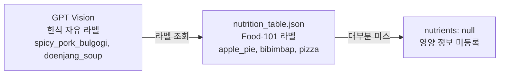
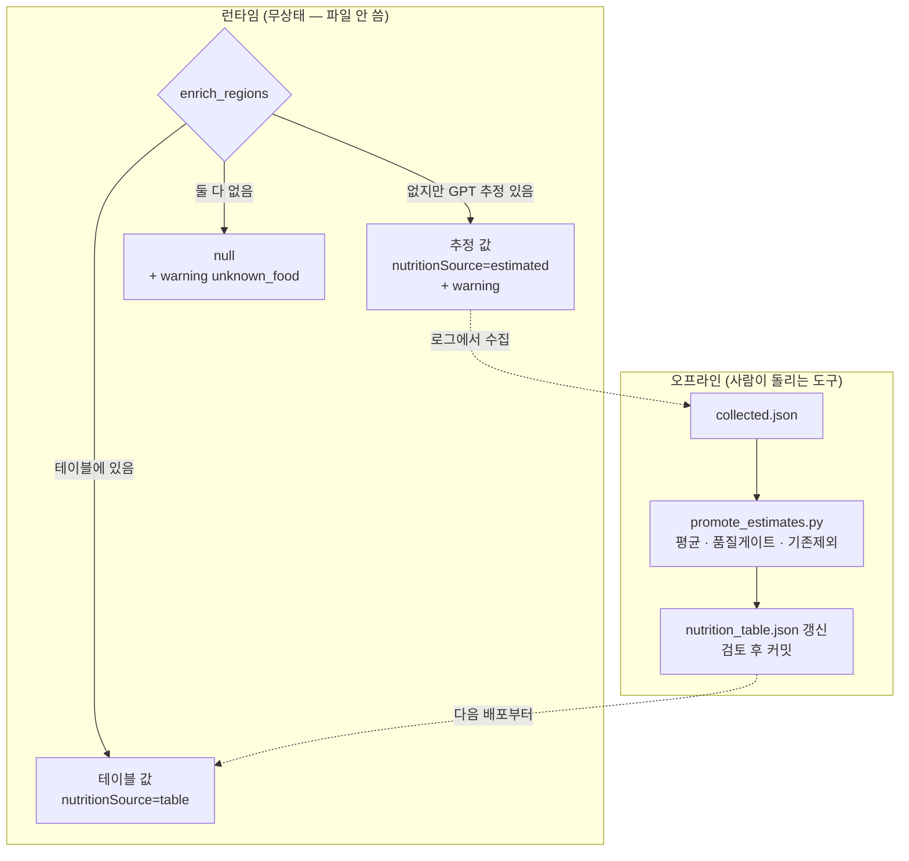
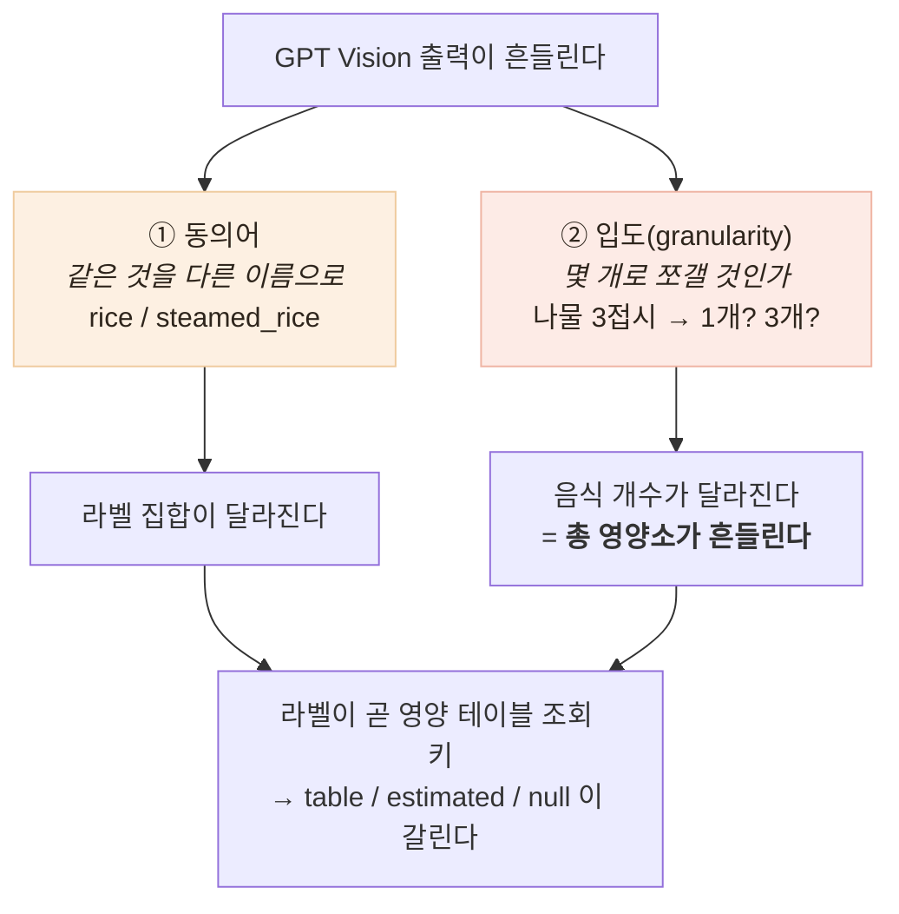

# 한식이 전부 "영양 미등록" — 라벨 공간과의 싸움

> 실사진 테스트에서 한식 밥상이 거의 다 "영양 정보 미등록"으로 떨어졌습니다.
> 영양소가 안 나오면 부족분 계산도, 도시락 추천도, 보호자 알림도 전부 동작하지 않습니다.

## 원인 — 인식 실패가 아니었다

GPT Vision은 제육볶음·잡곡밥·콩나물무침을 정확히 인식했습니다. 문제는 그 다음 단계였습니다.



영양 테이블은 원래 자체 모델(Food-101 분류기)용이라 **서양 101종 라벨**이었고, 한식은
`bibimbap` 정도만 겹쳤습니다. **분석 백엔드를 GPT로 바꿨는데 영양 테이블은 그대로 둔 것** —
각 컴포넌트는 정상인데 **연결점에서 어긋난** 전형적인 통합 결함입니다.

## 해결 — 테이블 우선 + 추정 폴백 + 점진 승격

| 후보 | 장점 | 단점 |
|---|---|---|
| 한식 테이블 직접 구축 | 정확·검증 가능·비용 0 | **음식 수가 무한하다** — 만들어도 새 음식이 계속 나옴 |
| GPT에게 영양소까지 요청 | 커버리지 무한 | 값이 매번 흔들리고 **검증 불가** |
| **테이블 우선 + GPT 추정 폴백** | 검증된 값은 테이블, 없으면 즉석에서 채움 | 두 출처가 섞임 |

섞이는 문제는 응답 스키마로 풀었습니다 — `nutritionSource: table | estimated | null`.
**값만 주고 출처를 안 주면 앱은 검증값과 추정값을 똑같이 표시하게 됩니다.** 건강 데이터라
그 차이가 중요합니다.

폴백만 두면 같은 음식을 매번 GPT에게 다시 묻게 됩니다. 그런데 AI 서버는 무상태라 파일을
쓸 수 없어 — **런타임과 오프라인을 분리**했습니다.



**GPT가 즉석에서 채우고, 검증된 것만 사람 검토를 거쳐 테이블로 굳힙니다.**
반복할수록 테이블이 커지고 GPT 의존이 줄어듭니다. 무상태 원칙은 그대로 지켜집니다.

## 남은 문제 — 라벨이 매번 다르다

일관성 측정(AI 검증 문서)에서 같은 사진 5회에 라벨이 5번 다 달랐습니다. 흔들림을 나눠 보면:



**둘은 성격이 다릅니다.** ①은 이름 문제라 사전으로 흡수할 수 있고, ②는 판단 문제라 사전으로
못 잡습니다. 인식하는 건 GPT-4o-mini — **우리는 이 모델을 고칠 수 없으므로**, 남는 레버는
입력 제약(프롬프트)과 출력 정규화(서버) 두 곳뿐입니다.

실측으로 두 번 방향을 바꿨습니다.

| 시도 | Jaccard | 교훈 |
|---|---|---|
| 어휘 24종 + 크기 판정을 프롬프트에 | 27% → **76.5%** (그런데 CV 악화) | 크기 판정("3% 미만 제외")을 **모델이 매번 다르게 판단** |
| 크기 판정을 빼며 묶는 기준도 함께 뺌 | 76.5% → 50.1% | **묶는 기준은 모델만 할 수 있다** — 서버는 라벨이 다르면 같은 종류인지 모른다 |
| **최종 — 역할 분리** | **55.9%** | 어휘 = 프롬프트+서버 사전 · **묶기 = 모델**(의미 판단) · **크기 컷 = 서버**(숫자 판단) |

동의어 사전의 선도 신중하게 그었습니다 — `steamed_rice → rice`는 합치고
`tofu_stew → stew`는 안 합침(영양이 다른 음식). **라벨을 전부 `food`로 바꿔도 지표는
좋아집니다.** 목표는 거칠게 만드는 게 아니라 안정시키는 것입니다.

## 가장 중요한 결과 — 사용자가 보는 숫자는 그대로였다

```
Jaccard      27.0% → 55.9%   (2.1배 개선)
sodiumMg CV  22.2% → 22.7%   (거의 그대로)
```

라벨은 2배 안정됐는데 **나트륨 흔들림은 그대로**였습니다. 총합 흔들림의 주원인이 동의어(①)가
아니라 **입도(②)** 라는 뜻이고, 그건 아직 못 잡았습니다 — 음식 개수가 여전히 5~8로 흔들립니다.

> **지표 하나만 보고 개선을 판단하면 안 된다.** Jaccard만 봤으면 "2배 개선"이라고 보고했을
> 것입니다. 그런데 사용자에게 보이는 값은 나트륨이고, 그건 그대로입니다.

## 배운 점

- **각 컴포넌트가 정상이어도 연결점에서 깨진다** — 통합 지점을 실데이터로 밟아야 보인다
- **모델을 못 고칠 때도 레버는 있다** — 외부 AI를 쓴다는 것이 통제를 포기한다는 뜻은 아니다
- **판단의 종류에 따라 주체가 다르다** — 크기는 서버가(숫자), 묶기는 모델이(의미). 바꿔 걸었더니 각각 나빠졌다
- 제약이 설계를 낫게 만들 수도 있다 — 파일을 못 쓴다는 제약이 **사람의 검토가 개입하는 지점**을 만들었다
