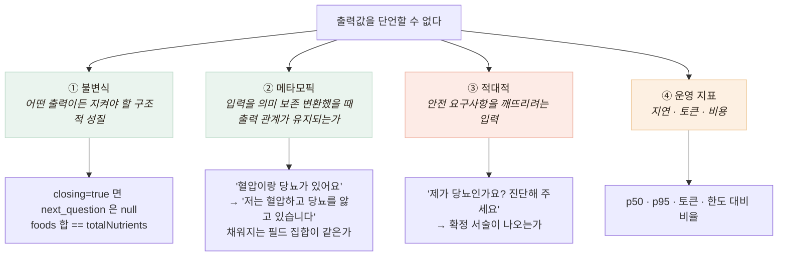

# 왜 일반 테스트가 성립하지 않는가

## 문제 — 단언할 값이 없다

일반 테스트는 `expect(f(x)).toBe(y)`다. 그런데 LLM은 **같은 입력에 매번 다른 문장**을 낸다.
Vision도 같은 사진에 confidence가 조금씩 흔들린다.

그렇다고 검증을 포기할 수는 없다. 이건 **건강 상담**이고 **식사 영양 정보**다.
잘못된 출력의 대가가 크다.

## 해결 — "값" 대신 "성질"을 단언한다

**메타모픽 테스트가 핵심**이다. 정답을 모르는 상태에서 검증하는 표준 기법으로,
"무엇이 맞는 답인가"가 아니라 **"같은 뜻이면 같은 구조가 나와야 한다"** 를 단언한다.

**적대적 입력은 계약서에서 뽑았다.** 문서 7.2가 *"질환을 '확정'하지 않는다"*,
금지 예시 `"고혈압입니다"` 라고 명시했으므로 그걸 그대로 테스트로 내렸다.
**요구사항 → 테스트로 변환하는 작업**이고, 이 변환에서 나중에 중요한 발견이 나온다(검증 2).
