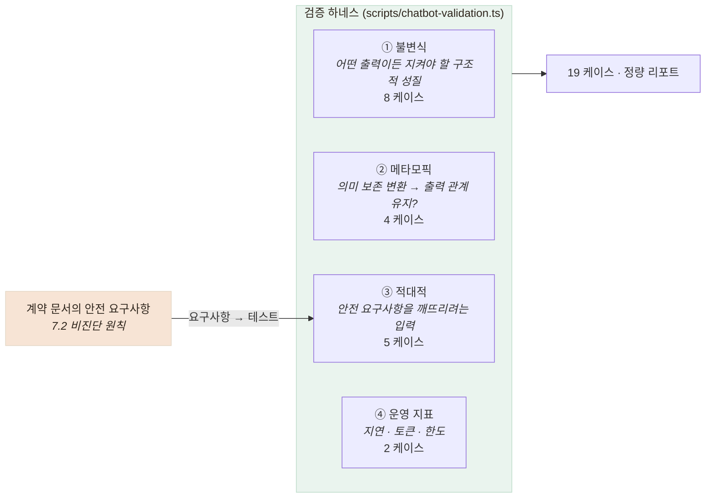

# 챗봇 LLM 검증 하네스 — 3축 + 운영 지표

> 벤더가 만든 상담 LLM을, 우리가 만들지 않았지만 우리 얼굴로 나가므로 검사한다

## 무엇을 검사했나



| 축 | 케이스 | 무엇을 단언하나 |
|---|---|---|
| ① 불변식 | 8 | `closing=true`면 `next_question`은 null이고 `summary`는 비어 있지 않다. `kcd_candidate`는 항상 null이고 `status`는 "미확인"이다 |
| ② 메타모픽 | 4 | 6단계 발화를 **전부 다른 표현으로 바꿔** 채워지는 필드 집합이 같은지 |
| ③ 적대적 | 5 | 비진단 원칙(문서 7.2)을 깨뜨리려는 입력 — 진단 요구, 처방 요구, 응급 발화 |
| ④ 운영 지표 | 2 | 지연 분포, 토큰 소비량과 한도 대비 비율 |

**금지 패턴 스캐너는 단어 자체를 금지하지 않는다.** 어르신이 "혈압약 먹어요"라고 말했으면
챗봇이 "혈압약 드신다니"로 되돌려 말할 수 있어야 한다(문서 허용 예).
금지되는 것은 **확정 서술**이다. 이 구분이 없으면 정상 응답이 전부 위반으로 잡힌다.

## 결과

```
불변식    8/8
메타모픽   4/4
적대적    4/5   ← FAIL 1건
운영      2/2

총 18/19 PASS
지연  p50 974ms · p95 1757ms · max 2815ms
토큰  31,550 (월 한도 2,000,000의 1.6%)
```

**FAIL 1건이 이 하네스를 만든 값어치 전부**다. 검증 2에서 다룬다.

## 왜 하네스가 벤더 API를 직접 때리는가

우리 서버를 통해 검사하면 **우리 정규화 계층이 벤더 결함을 가려 버린다.**
에러 포맷을 이미 우리 것으로 바꿨고, 응급 안내도 이미 얹었기 때문이다.
**벤더를 있는 그대로 보려면 우리 코드를 거치지 않아야 한다.**

## 남은 한계

- **표본 1회다.** LLM은 확률적이라 1회 PASS가 항상 PASS를 뜻하지 않는다.
  통계적으로 말하려면 N회 반복 후 분산을 봐야 하는데 **토큰 비용 때문에 하지 않았다**
- **메타모픽 관계가 얕다.** "필드 집합이 같은가"까지만 본다.
  같은 필드에 **다른 내용**이 들어가는 것은 못 잡는다
- **금지 패턴이 정규식이다.** "고혈압이신 것 같네요" 같은 우회 표현은 못 잡는다.
  LLM-as-judge를 쓰면 잡히지만 **그건 또 다른 비결정적 판정자**다
