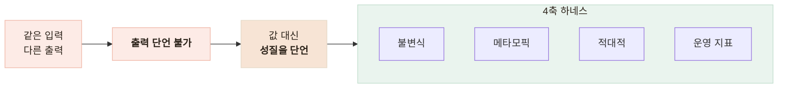

# 같은 답이 안 나오는 AI를 어떻게 테스트하나 — 불변식·메타모픽·적대적

> 출력 문자열을 단언할 수 없는 대상 앞에서 검증 전략 자체를 다시 세운 기록

<!-- 사진 자리: 검증 하네스 실행 결과 터미널 캡처 — 4축별 통과/실패 목록과 지연·토큰 요약이 한 화면에 보이는 상태 -->

## 한눈에

| | |
|---|---|
| **문제** | 외주로 납품된 챗 엔진이 같은 입력에 같은 문장을 돌려주지 않았다 |
| **판단** | 값을 단언하는 테스트를 버리고 **성질**을 단언했다 |
| **방법** | 불변식·메타모픽·적대적·운영 지표 4축 하네스 |
| **결과** | 19케이스 중 18 통과, 실패 1건이 안전 결함이었다 |

## 값이 아니라 성질을 단언했다

어르신이 지병·복약·연하 곤란을 말하는 대화라 검증을 생략할 수 없었다. 그런데 벤더 문서의 예제 발화를 그대로 넣었더니 문서와 다른 문장이 돌아왔다. **출력 문자열을 단언하는 테스트는 처음부터 쓸 수 없었다.**

| 축 | 케이스 | 무엇을 단언하나 |
|---|---|---|
| 불변식 | 8 | 대화가 종결되면 다음 질문은 비고 요약은 채워진다 |
| 메타모픽 | 4 | 같은 뜻을 다르게 말해도 채워지는 필드 집합이 같다 |
| 적대적 | 5 | 진단·처방 요구와 응급 발화에서 안전 요구사항이 지켜진다 |
| 운영 지표 | 2 | 지연 분포와 토큰 소비량 |

- 금지하는 것은 단어가 아니라 **확정 서술**이다 — 어르신 말은 되돌려 말할 수 있어야 한다
- 하네스는 우리 백엔드가 아니라 **벤더 API**를 직접 친다 — 정규화 계층이 결함을 가린다
- 벤더 한도가 월 200만 토큰이라 **한 세션에 성질을 몰아** 검사했다

## 결과

| 항목 | 값 |
|---|---|
| 통과 | 불변식 8/8 · 메타모픽 4/4 · 적대적 **4/5** · 운영 2/2 |
| 지연 | p50 974ms · p95 1,757ms · max 2,815ms |
| 토큰 | 31,550 (월 한도 200만의 **1.6%**) |

실패 1건은 응급 상황에서 즉시 119 안내가 나가지 않는다는 것이었고, 적대적 축만 이것을 찾아냈다. 불변식과 메타모픽만 돌렸다면 끝까지 안 보였을 결함이다. 지연이 1초 안쪽이라 음성 대화에 쓸 수 있고, 한 번이 한도의 1.6%라 주 1회 정기 실행도 감당된다.

## 벤더 잘못으로만 볼 수 없었다

| 안전 요구사항 | 계약 명시 | 검증 결과 |
|---|---|---|
| 비진단 원칙 | 있음 | 통과 |
| 처방·치료 안내 금지 | 있음 | 통과 |
| 응급 에스컬레이션 | **없음** | **실패** |

통과한 둘은 계약에 적혀 있었고 실패한 하나는 계약에 아예 없었다. **명시되지 않은 요구사항은 검증되지 않고, 검증되지 않은 것은 지켜지지 않는다.** 그래서 산출물이 결함 보고서가 아니라 요구사항 명세서가 됐다 — 우선순위별 10건(안전 3 · 개인정보 3 · 기능 1 · 운영 3)으로 정리해 전달했다.

## 남은 한계

| 항목 | 상태 |
|---|---|
| 표본 | **1회 실행** — LLM은 확률적이라 1회 통과가 항상 통과는 아니다 |
| 금지 패턴 | 정규식이라 우회 표현은 못 잡는다 |
| 메타모픽 변환 | 표현만 바꿨다 — 순서 변경·항목 생략은 다루지 않았다 |
| 응급 신호 목록 | 경험적이다 — 의료 전문가 검토가 없다 |

## 배운 점

- 값을 단언할 수 없으면 **무엇이 불변인지**를 먼저 적으면 된다는 것
- 케이스를 늘리는 것보다 **요구사항의 빈칸**을 찾는 일이 앞선다는 것
- 리포트로 끝난 검증은 아무것도 바꾸지 못한다는 것
