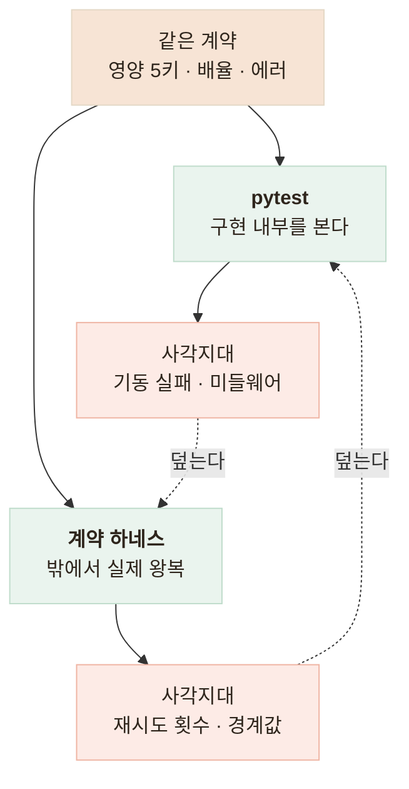

# 2층 검증 체계 — 단위 테스트와 계약 하네스가 잡는 것이 서로 다르다

> 각 층이 원리적으로 못 잡는 결함을 먼저 적고, 그 합집합이 비게 층을 나눈 기록

## 한눈에

| | |
|---|---|
| **문제** | 이 서버 응답을 다른 개발자의 백엔드가 그대로 소비한다 |
| **판단** | 한 층으로 안 보이는 결함이 있어 2층으로 나눴다 |
| **방법** | pytest는 구현 관점 화이트박스, 하네스는 소비자 관점 블랙박스 |
| **결과** | pytest 105개 통과, 하네스 34/34 (인증 키를 주면 37/37) |

## 층을 늘리기 전에 사각지대를 적었다

계약 하네스는 떠 있는 실서버에 밖에서 HTTP를 쏘는 독립 스크립트다. 같은 계약(영양소 5키·배율·에러 형태)을 두 층이 **독립 사본**으로 검증하니, 한쪽에서 낸 실수가 다른 쪽에서 걸린다.

| 결함 유형 | pytest | 하네스 |
|---|---|---|
| 배율 경계값 오판(0.8을 small로) | 잡음 | 못 잡음 — mock에 0.8이 없다 |
| 미들웨어 순서로 인증 응답이 깨짐 | 못 잡을 수 있음 | 잡음 — 실 HTTP 왕복 |
| 서버 기동 실패, 실 네트워크 다운로드 | 못 잡음 — 전부 모킹 | 잡음 |
| 재시도 호출이 정확히 2회인지 | 잡음 — 페이크 주입 | 못 잡음 — 내부 관측 불가 |

규약에 **"하네스 실패는 계약 위반이므로 하네스를 고치지 말고 서버를 고친다"를 명문화**했다.

## 자동화 경계를 결정론 하나로 그었다

pytest의 목표를 "키·GPU·네트워크 없이 전부 통과"로 못박았다. 실패가 코드 문제인지 외부 문제인지 구분되지 않으면 테스트를 무시하게 되고, **매 실행마다 과금되는 스위트는 죽은 테스트**가 된다.

| 경계 밖 | 왜 |
|---|---|
| 실 API 호출 | 건당 과금 + 비결정성 |
| GPU 실추론 | 모델 2.4GB와 GPU가 CI에 없다 |
| 대시보드 UI · LLM 문구 품질 | 유지비가 이득보다 크고 자연어는 단언 불가 |
| DNS 리바인딩 실공격 | 타이밍을 재현 불가 |

경계 밖은 수동 절차로 옮겼다. 실키 확인에서 확신도 0.95 인식부터 총합 산출까지 전 경로가 실동작했다.

## 피시험 대상 바로 아래에서 모킹했다

그보다 높으면 검증하려는 코드가 실행되지 않고, 낮으면 관심 밖 세부에 테스트가 결합된다.

| 대상 | 모킹 지점 | 이유 |
|---|---|---|
| 분석 엔드포인트 | 다운로드 함수 통째 스텁 | 다운로드 로직이 바뀌어도 안 깨진다 |
| 다운로드 계층 | HTTP 트랜스포트 | 리다이렉트·크기 초과는 실 요청 흐름을 타야 한다 |
| DNS | 해석 함수를 분리해 패치 | 이벤트 루프 패치는 불안정하고 범위가 넓다 |

- 경계값은 양쪽 네 지점으로 고정했다(0.79 / 0.8 / 1.2 / 1.21)
- 기준을 피검증물에서 읽으면 **자기 검증 순환**이라 라벨 101개를 독립 사본으로 뒀다
- 하네스는 **표준 라이브러리만** 쓴다 — 소비자는 우리 환경을 갖고 있지 않다

## 남은 한계

| 항목 | 상태 |
|---|---|
| 하네스 정상 분석 1건 | 실 네트워크가 필요해 오프라인 CI에서는 실패한다 |
| 로그 금지 필드 단언 | 미구현이다 |
| CI 연결 | 종료 코드까지 준비했지만 **사람이 수동 실행**한다 |

## 배운 점

- 테스트를 늘리기 전에 **이 층이 못 잡는 것**부터 적어야 한다는 것
- 기준점은 실패하기 전에 선언해야 한다는 것
- 검증 도구는 **소비자의 조건**으로 만들어야 한다는 것
