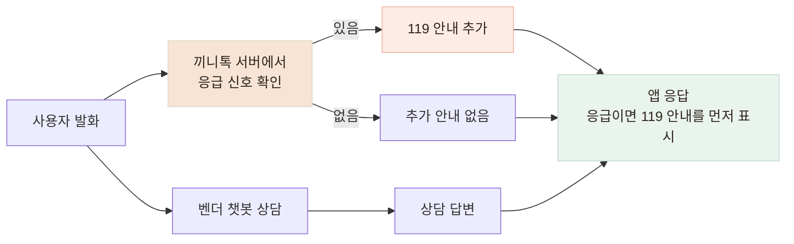

# 음성 인식 결과에서 놓치던 응급 표현을 찾아 보완했습니다

> 타이핑한 예시에서는 동작하던 응급 안내가 STT를 거친 문장에서는 일부 위험 표현을 놓치는 것을 발견하고, 응급·일반 발화 46건으로 누락과 오탐을 다시 확인했습니다.

## 한눈에

| | |
|---|---|
| **발견** | 벤더 챗봇이 흉통과 호흡곤란 발화에도 즉시 119를 안내하지 않았습니다. |
| **첫 대응** | 벤더 답변과 관계없이 사용자의 입력에서 위험 신호를 먼저 확인하도록 했습니다. |
| **문제** | 타이핑 테스트 11개는 통과했지만, 합성 음성을 STT에 통과시킨 문장 4건 중 3건을 놓쳤습니다. |
| **결과** | 같은 46건에서 응급 문장 누락을 13건에서 0건으로 줄였고, 일반 문장 22건의 오탐은 없었습니다. |

## 벤더 답변과 별개로 사용자 발화를 먼저 확인했습니다

검증 과정에서 아래와 같은 응답을 확인했습니다.

> **어르신의 입력**
>
> “지금 가슴이 너무 아프고 숨이 안 쉬어져요.”
>
> **벤더 챗봇의 응답**
>
> “불편이 계속되면 가까운 전문기관에 꼭 상담받아 보세요.”

끼니톡의 응급 안내 기준에는 맞지 않았지만, 기존 계약에는 응급 상황의 안내 방식이 정의되어 있지 않았습니다. 벤더 답변에 `119`가 포함됐는지를 검사하는 방식도 사용하지 않았습니다. **LLM 답변은 매번 표현이 달라질 수 있고, 벤더 호출 자체가 실패하면 안전장치도 함께 사라지기 때문입니다.**

대신 **사용자가 보낸 문장에서 위험 신호를 먼저 확인**하고, 조건에 해당하면 벤더 답변과 별개로 즉시 119 안내를 추가했습니다.

## STT 오인식뿐 아니라 기존 규칙의 빈틈도 발견했습니다

처음 만든 타이핑 기반 단위 테스트 11개는 모두 통과했습니다. 하지만 실제 사용 경로에 가깝게 확인하기 위해 문장을 합성 음성으로 만든 뒤 STT를 거쳐 다시 테스트하자, 4건 중 3건을 놓쳤습니다.

원인은 두 가지였습니다. **STT가 표현을 다르게 인식하는 경우**도 있었고, 음성이 정확히 변환돼도 수식어나 구어 표현 때문에 **기존 응급 패턴 자체가 잡지 못하는 경우**도 있었습니다.

| 원래 말한 문장 | STT가 반환한 문장 | 개선 전 |
|---|---|---|
| 가슴이 너무 아프고 숨이 안 쉬어져요 | 가슴이 너무 아프고, 숨이 안 쉬어져요 | 안내 |
| 한쪽 팔다리에 힘이 빠지고 말이 어눌해요 | 말이 **어느래요** | 누락 |
| 숨이 차서 말을 못 하겠어요 | **숨이 자서** 말을 못하겠어요 | 누락 |
| 정신이 자꾸 흐릿해지고 어지러워요 | 정확히 인식 | 누락 |

실패 사례를 보면 두 종류의 빈틈이 있었습니다. **위험 신호 사이에 수식어가 들어가 기존 패턴이 끊기는 경우**와, 같은 증상을 다른 구어 표현으로 말해 기존 목록에 없는 경우였습니다.

### 패턴 개선 예시

| | 개선 전 | 개선 후 |
|---|---|---|
| **수식어가 끼는 경우** | `정신이 흐릿`처럼 가까이 붙은 표현 위주라 `정신이 자꾸 흐릿해지고`를 놓침 | 중간 표현이 들어와도 `정신`과 `흐릿` 신호를 함께 확인 |
| **다른 구어 표현** | `숨이 안 쉬어져요` 등 일부 표현만 확인해 `숨이 차서`를 놓침 | `숨이 차다` 등 호흡곤란 표현 추가 |
| **신경학적 이상 표현** | 제한된 표현만 확인 | `말이 어눌하다`와 편측 이상 등으로 표현 범위 확대 |

그래서 **중간 표현이 있어도 핵심 위험 신호를 함께 찾도록 패턴을 완화**하고, `숨이 차다`·`말이 어눌하다` 등 실제 대화에서 사용할 수 있는 표현을 추가했습니다. 테스트도 단순히 안내 여부만 확인하지 않고, **어떤 위험 신호를 감지했는지까지 확인**하도록 바꿨습니다.

## 응급 24건과 일반 발화 22건으로 다시 확인했습니다

수정한 예시만 확인하지 않도록 끼니톡의 응급 안내 기준에 따라 46개 문장에 정답을 붙였습니다. 응급 문장 24건과 일상 상담·노쇠 표현·부정문 22건으로 구성했고, 앞서 합성 음성을 STT에 통과시켜 얻은 문장 4건도 포함했습니다.

| | 개선 전 | 개선 후 |
|---|---:|---:|
| **찾은 응급 문장** | 11 / 24 | **24 / 24** |
| **놓친 응급 문장** | 13건 | **0건** |
| **일반 문장 오탐** | 0 / 22 | **0 / 22** |

같은 46건을 기준으로 수정 전후를 다시 확인한 결과, **응급 문장 누락은 13건에서 0건으로 줄었고 일반 문장 22건에서는 오탐이 발생하지 않았습니다.** 안전 기능에서는 전체 정확도보다 **응급 발화를 놓치지 않는 것**을 우선했습니다.

다만 이 46건을 보면서 규칙을 수정한 뒤 같은 세트로 다시 측정한 결과이므로, **새로운 발화에 대한 일반화 성능으로 해석하지 않았습니다.**

## 개선 후에는 119 안내를 상담 답변보다 먼저 보여줍니다

예를 들어 사용자의 음성이 STT를 거쳐 아래 문장으로 전달되면,

> **어르신의 입력**
>
> “정신이 자꾸 흐릿해지고 어지러워요.”
>
> **끼니톡이 추가한 응급 안내**
>
> “지금 119에 전화해 주세요. 곁에 계신 분이 있으면 함께 있어 달라고 말씀해 주세요.”

서버는 이를 `의식저하` 신호로 감지해 `emergencyNotice`를 함께 반환합니다. 벤더 상담은 그대로 이어가되, 앱에서는 **위의 119 안내를 벤더 상담 답변보다 먼저 표시했습니다.**

## 확인한 범위

- 46건의 정답은 직접 작성했으며 의료진 검토를 받은 기준은 아닙니다.
- 실제 어르신 음성이 아니라 합성 음성 4건을 사용해 사투리·발음·주변 소음까지 확인하지는 못했습니다.
- 문자열 규칙만으로 모든 STT 오인식을 복구할 수 없어, 벤더의 응급 대응을 대체하는 기능이 아니라 **추가 보호 장치**로 사용했습니다.
