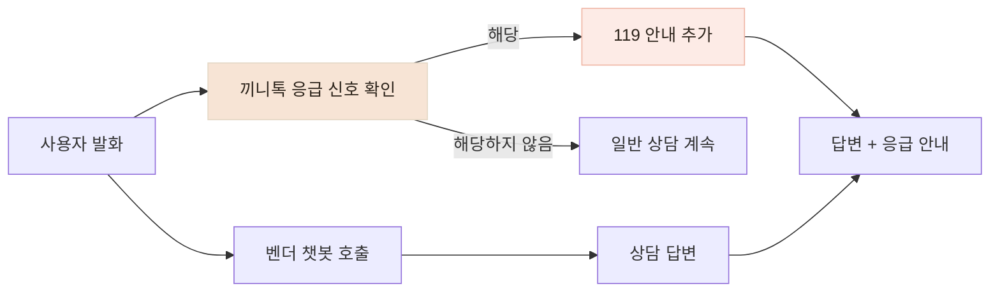
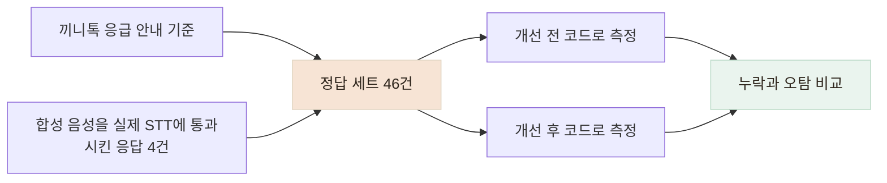

# 응급 발화 46건으로 안전장치가 놓치던 절반을 찾아 개선했습니다

> 타이핑한 예시만 통과하던 응급 안내를 실제 STT 응답과 일반 발화가 섞인 정답 세트로 다시 확인했습니다.

## 한눈에

| | |
|---|---|
| **문제** | 응급 상황을 말해도 벤더 챗봇이 즉시 119 안내를 하지 않는 경우가 있었습니다. |
| **첫 대응** | 벤더의 답변이 아니라 사용자가 말한 문장에서 위험 신호를 찾도록 했습니다. |
| **재검증** | 타이핑 테스트는 통과했지만, 합성 음성을 실제 STT에 통과시킨 문장 4건 중 3건을 놓쳤습니다. |
| **결과** | 양성 24건·음성 22건으로 다시 측정해 재현율을 45.8%에서 100%로 높였습니다. |

## 벤더 답변을 기다리지 않고 사용자 입력에서 판단했습니다

`지금 가슴이 너무 아프고 숨이 안 쉬어져요`라는 입력에 벤더는 증상이 계속되면 전문기관에 상담하라는 수준으로 답했습니다. 끼니톡의 응급 안내 기준과 맞지 않았지만, 벤더 계약에는 응급 상황 처리 방식이 명시돼 있지 않았습니다.

벤더 답변에서 `119` 같은 단어를 찾는 방식은 선택하지 않았습니다. LLM 답변은 같은 입력에도 달라질 수 있고, 벤더 호출이 실패하면 안전장치도 함께 사라지기 때문입니다. 대신 **사용자가 보낸 문장 자체에서 위험 신호를 먼저 확인한 뒤**, 조건에 해당하면 벤더 답변과 별개로 119 안내를 추가했습니다.

호흡곤란·의식 저하·편측 마비처럼 하나만으로도 위험한 신호와, 흉통·식은땀·심한 어지러움처럼 함께 나타날 때 안내할 신호를 나눴습니다. 일상적인 노쇠 표현까지 응급으로 처리하지 않도록 `한쪽·왼쪽·오른쪽` 같은 편측 표현도 함께 확인했습니다.

## 타이핑 테스트는 통과했지만 실제 음성 문장을 놓쳤습니다

처음 만든 단위 테스트 11개는 통과했습니다. 하지만 실제 사용 경로는 타이핑이 아니라 음성이므로, 한국어 문장을 합성한 뒤 실제 STT를 거쳐 반환된 문장을 안전장치에 넣었습니다.

| 원래 말한 문장 | STT가 반환한 문장 | 개선 전 |
|---|---|---|
| 가슴이 너무 아프고 숨이 안 쉬어져요 | 가슴이 너무 아프고, 숨이 안 쉬어져요. | 안내 |
| 한쪽 팔다리에 힘이 빠지고 말이 어눌해요 | …말이 **어느래요** | 누락 |
| 숨이 차서 말을 못 하겠어요 | **숨이 자서** 말을 못하겠어요 | 누락 |
| 정신이 자꾸 흐릿해지고 어지러워요 | 정확히 인식 | 누락 |

음성 인식 오류만이 원인은 아니었습니다. 정확히 인식된 네 번째 문장도 놓쳤고, `정신이`와 `흐릿해지고` 사이에 `자꾸` 같은 말이 들어오면 기존 패턴이 일치하지 않았습니다. 타이핑 예시는 안전장치가 알고 있는 표현만 확인하고 있었습니다.

## 코드와 분리한 정답 세트로 다시 측정했습니다

수정에 사용한 문장만 다시 확인하면 항상 좋은 결과가 나옵니다. 그래서 구현 코드를 보지 않고, 끼니톡의 응급 안내 기준에 따라 46개 문장에 정답을 붙였습니다.

- 응급 안내가 필요한 문장 24건
- 일상 상담·노쇠 표현·부정문 등 안내하지 않아야 할 문장 22건
- 합성 음성을 실제 STT에 통과시켜 얻은 문장 4건 포함

| | 재현율 | 정밀도 | 특이도 | 놓친 응급 문장 |
|---|---:|---:|---:|---:|
| 개선 전 | 45.8% | 100% | 100% | 13건 |
| 개선 후 | **100%** | 100% | 100% | **0건** |

개선 전에는 안내한 문장은 맞았지만, 응급 문장 24건 중 13건을 놓치고 있었습니다. 안전 기능에서는 전체 정확도보다 **실제 위험 신호를 얼마나 놓치지 않는지**를 우선해 재현율을 중심으로 확인했습니다.

정답 세트를 만드는 과정에서도 `입이 한쪽으로 돌아갔어요`처럼 기존 패턴이 잡지 못하는 문장을 추가로 발견했습니다. 한국어 활용형과 중간에 끼는 수식어를 반영하고, 회귀 테스트에서는 안내 여부뿐 아니라 어떤 신호가 감지됐는지도 확인하도록 바꿨습니다.

## 이 수치가 보장하는 범위

- 개선 후 100%는 **같은 46건에 대한 결과**입니다. 이 세트가 찾은 누락을 수정한 뒤 다시 측정했으므로 일반화 성능으로 볼 수 없습니다.
- 정답은 제가 직접 붙였고 의료진 검토를 받지 못했습니다. 46건만으로 통계적 신뢰도를 말하기도 어렵습니다.
- 실제 어르신 음성이 아니라 합성 음성 4건을 사용했습니다. 사투리·발음·주변 소음에서 발생하는 STT 오류는 더 확인해야 합니다.
- 문자열 규칙만으로 STT의 모든 오인식을 복구할 수는 없습니다. 현재 안전장치는 벤더의 응급 처리 기준이 보완되기 전까지 사용하는 추가 보호 장치입니다.
