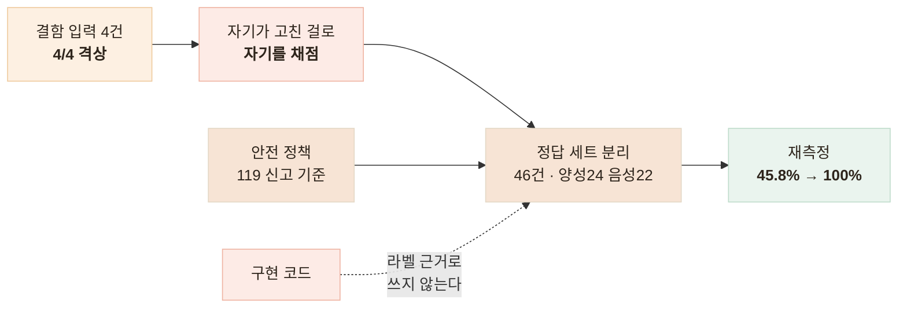

# 응급 신호 가드레일 — 정답 세트 46건으로 재현율 45.8%에서 100%로

> 자기가 고친 케이스로 자기를 채점하고 있었다는 것을 깨닫고, 정답 세트를 따로 만들어 지표로 다시 잰 기록

## 한눈에

| | |
|---|---|
| **문제** | 응급 발화에 벤더가 "계속되면 전문기관에 상담"으로 답했다 |
| **판단** | 벤더 응답이 아니라 **사용자 입력**에서 판정하는 가드를 넣었다 |
| **원인** | 그 가드의 성능을 결함을 찾을 때 쓴 입력 4건으로 채점했다 |
| **결과** | 정답 세트 46건으로 재측정해 재현율 45.8% → **100%** |

## 판정을 응답이 아니라 입력에서 한다

`"지금 가슴이 너무 아프고 숨이 안 쉬어져요"`에 벤더는 "불편이 계속되면 전문기관에 상담받아 보세요"로 답했다. **"계속되면"은 지연**을, **"전문기관"은 외래**를 가리킨다 — 응급은 지금이고 응급실이다. 계약에 응급 요구사항이 없어 벤더 잘못이라고만 할 수 없었지만, 협의가 끝날 때까지 어르신을 방치할 수 없었다.

응답을 스캔해 판정할 수는 없다. LLM 출력은 비결정적이라 같은 위험에서도 어떤 날은 안내하고 어떤 날은 안 한다. 입력에서 판정하면 **벤더 호출이 실패해도** 안내가 나간다.

| 구분 | 신호 |
|---|---|
| 치명 — 1개로 격상 | 호흡곤란 · 의식저하 · 편측 마비 · 언어장애 · 대량 출혈 |
| 복합 — 2개 이상 | 흉통 · 심한 어지러움 · 식은땀 · 구토 |

- 흉통 단독은 안 띄운다 — 소화불량도 "가슴이 아프다"로 나온다
- 편측을 요구하는 것도 같다 — 노쇠 표현에 119를 붙이면 오탐이 일상이 된다
- 그러면서 전체는 **오탐을 감수하는 쪽**으로 기울였다

## 자기가 고친 케이스로 채점하고 있었다

정답은 구현이 아니라 **정책**으로 정했다 — 코드를 보고 라벨링하면 검증이 아니라 코드를 베끼는 것이다. 기준은 끼니톡 안전 정책과 119 신고 기준(뇌졸중 FAST)이고, 46건 중 **운영 음성 인식이 실제로 돌려준 문장 4건**을 넣었다.

## 결과

| | 재현율 | 정밀도 | F1 | 특이도 | 정확도 |
|---|---|---|---|---|---|
| 개선 전 | 45.8% | 100.0% | 62.9% | 100.0% | 71.7% |
| 개선 후 | **100.0%** | 100.0% | 100.0% | 100.0% | 100.0% |

- 개선 전은 위음성 13 · 위양성 0 — 띄운 것은 다 맞았고 절반을 안 띄웠다
- 음성 인식 실측 문장만 보면 **1/4에서 4/4**로 올랐다
- 정확도 71.7%는 그럭저럭이지만 안전장치에서 **재현율 45.8%는 실패**다

세트를 만들다 결함 2건이 더 나왔다. `"입이 한쪽으로 돌아갔어요"`가 안 잡혔고(FAST의 얼굴 처짐 항목이다), 사전형으로 바꿔도 안 잡혔다 — 한국어는 어간 마지막 글자가 바뀌므로(돌아가 + 았 → 돌아갔) **활용이 붙는 지점 앞**에서 끊어야 한다. **지표를 재려고 만든 세트가 지표를 재기 전에 결함을 찾았다.**

## 남은 한계

| 항목 | 상태 |
|---|---|
| 개선 후 100% | **과적합**이다 — 이 세트가 찾은 결함을 고쳐 얻은 같은 세트 100%다 |
| 개선 전 45.8% | 패턴이 세트보다 먼저 작성됐으므로 **정직한 홀드아웃**이다 |
| 라벨 · 표본 | 혼자 붙였고 의료 검토가 없다. 46건은 신뢰구간을 못 말한다 |
| 음성 경로 | 주 입력인데 실측 4건뿐이고, 문자열 일치는 인식 오류를 못 덮는다 |

## 배운 점

- 자기가 고친 입력으로 잰 숫자는 지표가 아니라는 것
- 라벨은 코드가 아니라 **정책 문서**에서 나와야 한다는 것
- 안전장치에서는 정확도가 아니라 **재현율**을 봐야 한다는 것
