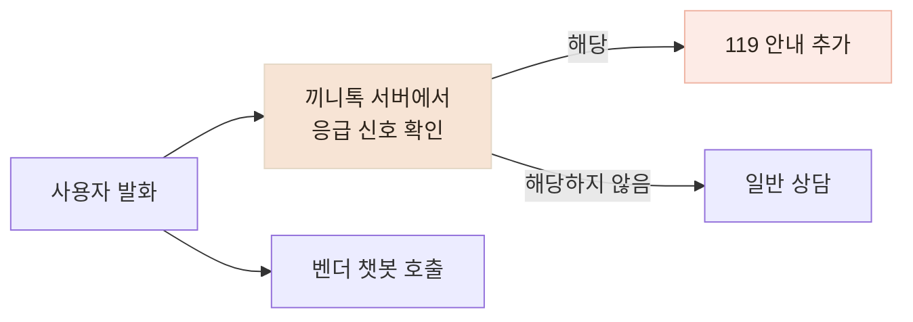

# 실제 STT 문장으로 응급 안내가 놓치는 표현을 찾아 보완했습니다

> 타이핑한 예시에서는 동작하던 응급 안내가 실제 음성 인식 결과를 놓치는 것을 발견하고, 응급·일반 발화 46건으로 누락과 오탐을 다시 확인했습니다.

## 한눈에

| | |
|---|---|
| **발견** | 벤더 챗봇이 흉통과 호흡곤란 발화에도 즉시 119를 안내하지 않았습니다. |
| **첫 대응** | 벤더 답변과 관계없이 사용자의 입력에서 위험 신호를 먼저 확인하도록 했습니다. |
| **문제** | 타이핑 테스트 11개는 통과했지만, 실제 STT 문장 4건 중 3건을 놓쳤습니다. |
| **결과** | 같은 46건에서 응급 문장 누락을 13건에서 0건으로 줄였고, 일반 문장 22건의 오탐은 없었습니다. |

## 벤더 답변과 별개로 사용자 발화를 먼저 확인했습니다

검증 과정에서 아래와 같은 응답을 확인했습니다.

> **어르신의 입력**
>
> “지금 가슴이 너무 아프고 숨이 안 쉬어져요.”
>
> **벤더 챗봇의 응답**
>
> “불편이 계속되면 가까운 전문기관에 꼭 상담받아 보세요.”

끼니톡의 응급 안내 기준에는 맞지 않았지만, 기존 계약에는 응급 상황의 안내 방식이 정의되어 있지 않았습니다. 벤더 응답에서 `119`라는 단어를 찾는 방식도 사용하지 않았습니다. LLM 답변은 매번 달라질 수 있고, 벤더 호출이 실패하면 안전장치까지 함께 사라지기 때문입니다.

대신 **사용자가 보낸 문장에서 위험 신호를 먼저 확인**하고, 조건에 해당하면 벤더 답변과 별개로 즉시 119 안내를 추가했습니다.

## 타이핑 테스트가 실제 음성 표현을 놓쳤습니다

처음 만든 단위 테스트 11개는 모두 통과했습니다. 하지만 실제 사용 경로는 음성이므로, 문장을 합성 음성으로 만든 뒤 실제 STT를 거쳐 반환된 문장을 안전장치에 넣었습니다.

| 원래 말한 문장 | STT가 반환한 문장 | 개선 전 |
|---|---|---|
| 가슴이 너무 아프고 숨이 안 쉬어져요 | 가슴이 너무 아프고, 숨이 안 쉬어져요 | 안내 |
| 한쪽 팔다리에 힘이 빠지고 말이 어눌해요 | 말이 **어느래요** | 누락 |
| 숨이 차서 말을 못 하겠어요 | **숨이 자서** 말을 못하겠어요 | 누락 |
| 정신이 자꾸 흐릿해지고 어지러워요 | 정확히 인식 | 누락 |

문제는 STT 오인식만이 아니었습니다. `정신이`와 `흐릿해지고` 사이에 `자꾸`가 들어오면 기존 패턴이 끊겼고, `숨이 차다`나 편측 위약처럼 실제 대화에서 자주 쓰는 표현도 부족했습니다.

그래서 문장 안에 수식어가 들어와도 신호를 찾도록 범위를 넓히고, 호흡곤란·의식 저하·편측 마비의 구어 표현을 추가했습니다. 테스트도 안내 여부만 보는 대신 **어떤 위험 신호를 감지했는지까지 확인**하도록 바꿨습니다.

## 응급 24건과 일반 발화 22건으로 다시 확인했습니다

수정한 예시만 확인하지 않도록 끼니톡의 응급 안내 기준에 따라 46개 문장에 정답을 붙였습니다. 응급 문장 24건과 일상 상담·노쇠 표현·부정문 22건으로 구성했고, 앞서 얻은 실제 STT 문장 4건도 포함했습니다.

| | 개선 전 | 개선 후 |
|---|---:|---:|
| **찾은 응급 문장** | 11 / 24 | **24 / 24** |
| **놓친 응급 문장** | 13건 | **0건** |
| **일반 문장 오탐** | 0 / 22 | **0 / 22** |

안전 기능에서는 전체 정확도보다 **실제 위험 신호를 얼마나 놓치지 않는지**를 우선했습니다. 이 결과는 같은 46건으로 누락을 찾고 수정한 뒤 다시 측정한 값이므로, 새로운 문장에서도 같은 결과를 보장하는 일반화 성능으로 사용하지 않았습니다.

## 확인한 범위

- 46건의 정답은 직접 작성했으며 의료진 검토를 받은 기준은 아닙니다.
- 실제 어르신 음성이 아니라 합성 음성 4건을 사용해 사투리·발음·주변 소음까지 확인하지는 못했습니다.
- 문자열 규칙만으로 모든 STT 오인식을 복구할 수 없어, 벤더의 응급 대응을 대체하는 기능이 아니라 **추가 보호 장치**로 사용했습니다.
