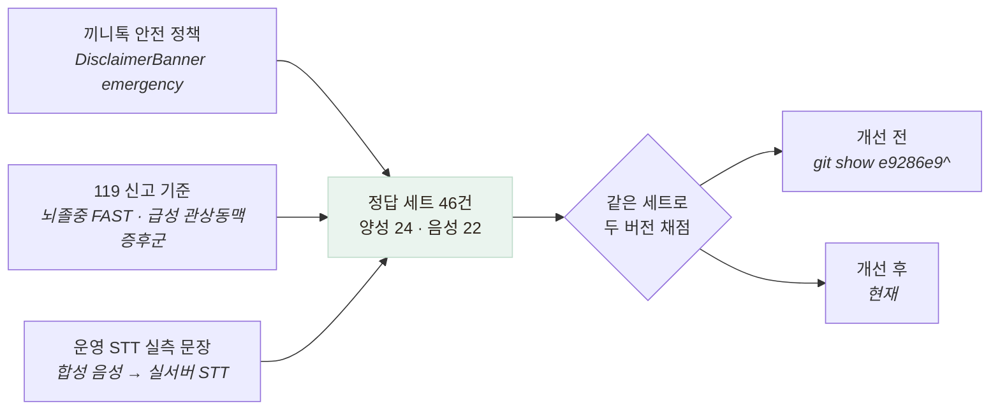

# 응급 가드 성능 지표 — precision · recall · F1

> "4개 중 4개 잡았다"를 지표로 바꾸고, 그 과정에서 결함 2건을 더 찾은 기록

## 왜 필요했나

가드를 고친 뒤 성능을 **"4개 중 4개 격상, 오탐 0"** 이라고 말해 왔다.
그런데 그 4개는 **결함을 찾을 때 쓴 입력 그 자체**다.

**자기가 고친 케이스로 자기를 채점하면 항상 만점이 나온다.**
표본이 6개고, 그중 4개가 수정의 근거였다. 이건 성능 측정이 아니다.

## 정답 세트를 어떻게 만들었나



**정답을 구현이 아니라 정책으로 정했다.** 코드를 보고 라벨링하면
검증하는 게 아니라 **코드를 베끼는 것**이다.

| 라벨 | 기준 |
|---|---|
| 양성 (격상해야 함) | 호흡곤란 / 의식저하 / 편측 마비·언어장애 / 대량 출혈 중 하나, 또는 흉통 + 다른 위험 신호 |
| 음성 (격상하면 안 됨) | 노쇠·만성 불편·일상 대화. 어르신이 늘 하는 말이라 **여기서 띄우면 안내가 일상이 되어 아무도 안 본다** |

**음성 세트에 공을 더 들였다.** 특히 세 종류가 위험하다.

- **노쇠 표현** — "요즘 다리에 힘이 없어요". 편측 위약과 표현이 거의 같다
- **부정형** — "가슴은 안 아파요", "숨은 잘 쉬어져요"
- **문장 경계** — "가슴은 괜찮아요. 손에 땀이 좀 나요" (흉통 + 식은땀으로 합쳐지면 안 된다)

**비교 대상은 코드로 박아 뒀다.** 옛 커밋(`git show e9286e9^`)의 패턴을 스크립트 안에 복사해
같은 세트로 두 버전을 채점한다. 체크아웃해서 돌리면 재현이 번거롭고,
나중에 스크립트만 봐서는 무엇과 비교한 건지 알 수 없다.

## 지표 선택 — 왜 accuracy가 아니라 recall인가

| 지표 | 이 문제에서의 의미 | 우선순위 |
|---|---|---|
| **recall** | 실제 응급 중 몇 %를 잡았나. **놓치면 응급 지연** | 1순위 |
| **specificity** | 일상 발화 중 몇 %를 안 띄웠나. 낮으면 **경고가 무시되어 결국 누락과 같아짐** | 2순위 |
| precision | 띄운 것 중 몇 %가 진짜였나 | 참고 |
| accuracy | 전체 정답률. **불균형 세트에서는 무의미** | 참고 |

**오탐의 비용은 안내 한 줄이고, 누락의 비용은 응급 지연이다.** 비교가 안 된다.
다만 오탐이 잦으면 경고 자체가 무시되므로 specificity를 함께 본다.

## 결과 — 측정으로 검증

```
정답 세트 46건 — 양성 24 · 음성 22 (그중 운영 STT 실측 문장 4건)

              recall precision     F1 specificity accuracy
개선 전         45.8%    100.0%  62.9%     100.0%    71.7%   TP 11 · FN 13 · FP 0 · TN 22
개선 후        100.0%    100.0% 100.0%     100.0%   100.0%   TP 24 · FN  0 · FP 0 · TN 22

── 음성(STT) 실측 문장만 ── 개선 전 1/4 → 개선 후 4/4
```

| | 개선 전 | 개선 후 |
|---|---|---|
| **recall** | **45.8%** (24건 중 13건 누락) | **100%** |
| **F1** | **62.9%** | **100%** |
| specificity | 100% | 100% — **오탐은 처음부터 0이었다** |

**개선 전 precision이 100%인 것이 이 결함의 성격을 말해 준다.**
띄운 것은 전부 맞았다. 문제는 **절반 이상을 아예 안 띄웠다**는 것이다.
"정확도 71.7%"만 보면 그럭저럭으로 보이지만, **안전장치에서 recall 45.8%는 실패**다.

## 이 측정이 결함 2건을 더 찾았다

정답 세트를 만드는 과정 자체가 검증이었다.

**① 안면마비 — 인접성 문제가 한 군데 남아 있었다**

```
"입이 한쪽으로 돌아갔어요"  →  안 잡힘
패턴: /입이?\s*돌아/     →  "입이" 바로 뒤에 "돌아"가 와야 하는데 "한쪽으로"가 낀다
```

앞서 인접성 문제를 고쳤다고 생각했는데 **이 패턴만 빠뜨렸다.**
뇌졸중 FAST의 **F(Face drooping)** 라 놓치면 안 되는 신호다.

**② 한국어 활용형 — 사전형만 넣으면 실제 발화를 못 잡는다**

①을 고치려고 `돌아가`로 바꿨는데 **여전히 안 잡혔다.**

```
어르신은 "돌아갔어요"라고 말한다
돌아가 + 았 → 돌아갔    ← 어간의 마지막 글자가 바뀐다
```

한국어는 활용에서 어간 끝 글자가 변하므로 **활용이 붙는 지점 앞에서 끊어야** 한다(`돌아`).
영어 정규식 감각으로 쓰면 이 종류의 구멍이 반복해서 생긴다.

> **지표를 재려고 만든 세트가, 지표를 재기 전에 결함을 찾았다.**
> 정답 세트를 만드는 일은 측정 준비가 아니라 검증 그 자체였다.

## 남은 한계 — 100%를 그대로 믿으면 안 된다

정직하게 적는다.

- **이 100%는 과적합이다.** 정답 세트를 내가 만들었고, 그 세트가 찾은 결함 2건을 고쳐서
  100%가 됐다. **같은 세트에 대한 100%**이지 일반화 성능이 아니다.
  진짜 성능은 **세트에 없던 표현**이 들어왔을 때 드러난다
- 반면 **개선 전 45.8%는 의미가 있다.** 그 패턴은 세트가 존재하기 전에 작성됐으므로
  이 세트에 대해 **정직한 홀드아웃**이다
- **표본 46건은 작다.** 통계적 신뢰구간을 말할 크기가 아니다
- **정답 라벨을 나 혼자 붙였다.** 의료 전문가 검토가 없다. "가슴이 조금 답답해요"를
  음성으로 둔 것이 옳은지 나는 확신할 수 없다
- **STT 실측 문장이 4건뿐이다.** 음성 경로가 주 입력인데 표본이 가장 적다.
  합성 음성이라 실제 어르신 발화(사투리·떨림·틀니)와도 다르다

## 배운 점

- **"몇 개 잡았다"는 성능이 아니라는 것.** 분모와 정답 세트의 출처를 함께 말해야 숫자가 의미를 갖는다
- **지표를 고를 때 비용 비대칭을 먼저 봐야 한다는 것.** 이 문제에서 accuracy는 거의 무의미하다
- **정답 세트를 만드는 일 자체가 검증이라는 것.** 케이스를 열거하다 보면
  구현이 커버 못 하는 표현이 드러난다
- **자기가 만든 세트로 낸 100%는 과적합이라고 말해야 한다는 것.**
  안 적으면 다음 사람이 그 숫자를 믿는다
